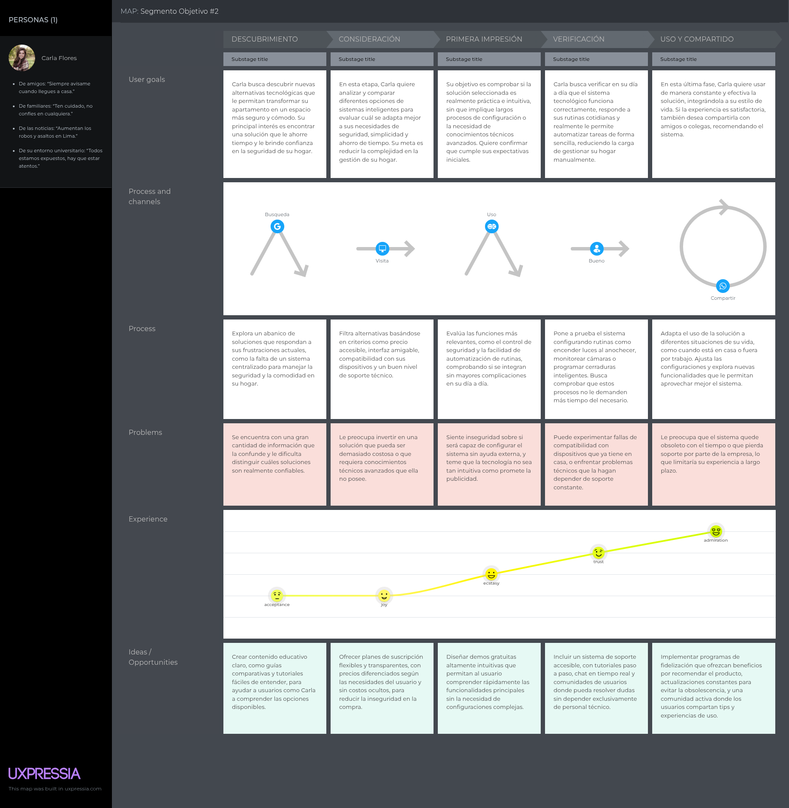

<p align="center">
    </img><br>
    <strong>Universidad Peruana de Ciencias Aplicadas</strong><br>
    <strong>Ingeniería de Software</strong><br>
    <strong>Periodo: 202610</strong><br>
    <strong>Aplicaciones para Dispositivos Móviles</strong><br>
    <strong>NRC: 3687</strong><br>
    <strong>Profesor: David Gerardo Quevedo Velasco </strong><br>
    <br>INFORME TRABAJO FINAL
</p>

<center>

#### Startup: **CcaritaTech**
#### Product: **IoBuild**

### Team Members

| Member                        | Code       |
|-------------------------------|------------|
| Barturen Panez, Iker Gabriel  | U202312629 |
| Ccarita Cruz, Brayan Roberto  | U2022ic218 |
| Loechle Arias, Mateo Italo    | U202215004 |
| Ordoñez Ricaldi, Axel Randall | U202216827 |
| Panta Castro, Fabrizio Martin | U20231a810 |


Abril 2026
</center>
# Registro de Versiones del Informe

| Version | Fecha | Autor | Descripcion de Modificacion |
| ----------- | ----------- | ----------- | ----------- |
| 0.0 | 25/08/2025 |CcaritaTech |Se crea el documento |  

# Project Report Collaboration Insights

Enlace del repositorio: https://github.com/CcaritaTech/Report


El desarrollo del informe fue producto de un trabajo colaborativo planificado y dividido en etapas progresivas. Cada integrante asumió responsabilidades específicas en función de sus fortalezas y del avance requerido en cada sprint, garantizando así la continuidad y coherencia del documento.

Barturen Panez, Iker Gabriel desempeñó un rol clave en las etapas iniciales. Fue responsable de construir los cimientos del informe, elaborando la estructura general, el apartado de objetivos y el perfil de la startup. Posteriormente, desarrolló el enfoque Lean UX, formulando los problem statements y diseñando el Lean UX Canvas, lo cual permitió definir de manera clara los segmentos objetivo y las hipótesis de solución. Asimismo, diseñó la metodología para la realización de entrevistas, elaborando las guías y recopilando los registros correspondientes, y colaboró de forma activa en la construcción de la especificación de requisitos junto al equipo.

Por su parte, Ccarita Cruz, Brayan Roberto inició el segundo capítulo con un análisis detallado del entorno competitivo, identificando plataformas similares y evaluando sus estrategias y debilidades. Más adelante, participó en la elaboración conjunta de la especificación de requisitos, el mapeo de impactos y la estructuración del product backlog, contribuyendo a alinear los objetivos del proyecto con las funcionalidades a implementar.

Loechle Arias, Mateo Italo lideró la fase de diseño estratégico del sistema mediante la aplicación de Domain-Driven Design (DDD), coordinando actividades de EventStorming para identificar dominios y flujos de mensajes, y elaborando los mapas de contexto y los diagramas de arquitectura de software a nivel de contexto, contenedor y despliegue. Luego, profundizó en el nivel táctico de DDD, definiendo bounded contexts, capas lógicas y diagramas técnicos detallados, y participó activamente en la revisión final e integración de todas las secciones del informe.

Ordoñez Ricaldi, Axel Randall se encargó de la etapa de Needfinding, creando las User Personas y la User Task Matrix que permitieron representar las motivaciones y tareas clave de los usuarios objetivo. Posteriormente, diseñó los User Journey Maps y Empathy Maps para identificar los puntos críticos de la experiencia actual de los estudiantes, y estableció el Ubiquitous Language, contribuyendo a la claridad terminológica del proyecto.

Finalmente, Panta Castro, Fabrizio Martin colaboró en la elaboración de la especificación de requisitos, participando en la redacción de las User Stories, la organización del backlog inicial y la definición de criterios de aceptación. Asimismo, formó parte del proceso de revisión final del informe, asegurando la coherencia y calidad de los entregables.

# Contenido
- [Registro de Versiones del Informe](#registro-de-versiones-del-informe)
- [Project Report Collaboration Insights](#project-report-collaboration-insights)
- [Student Outcome](#student-outcome)
- [Objetivos SMART](#objetivos-smart)
- [Capítulo I: Presentación](#capítulo-i-presentación)
- [Capítulo II: Requirements Elicitation & Analysis](#capítulo-ii-requirements-elicitation--analysis)
- [Capítulo III: Requirements Specification](#capítulo-iii-requirements-specification)
- [Capítulo IV: Solution Software Design](#capítulo-iv-solution-software-design)
- [Capítulo V: Solution UI/UX Design](#capítulo-v-solution-uiux-design)
- [Capítulo VI: Product Implementation, Validation & Deployment](#capítulo-vi-product-implementation-validation--deployment)
- [Conclusiones](#conclusiones)
- [Conclusiones y recomendaciones](#conclusiones-y-recomendaciones)
- [Video About-the-Team](#video-about-the-team)
- [Bibliografía](#bibliografía)
- [Anexos](#anexos)
# Student Outcome
|Criterio Especifico|Acciones Realizadas|Conclusiones|
|-|-|-|
|Actualiza conceptos y conocimientos necesarios para su desarrollo profesional y, en especial, para su proyecto en soluciones de software.|Axel Randall Ordoñez Ricaldi:<br>*AV1:* Colaboré con Fabrizio en EventStorming (Candidate Context Discovery, Domain Message Flows Modeling y Bounded Context Canvases), elaboré Context Mapping y Software Architecture Deployment Diagrams; este trabajo me permitió profundizar en DDD estratégico aplicado al proyecto.<br><br>Ccarita Cruz, Brayan Roberto:<br>*AV1:* Colaboré con Mateo e Iker en Domain, Interface, Application e Infrastructure Layer, y elaboré los Bounded Context Software Architecture Code Level Diagrams; esto me permitió fortalecer el diseño táctico y su trazabilidad con el código.<br><br>Panta Castro, Fabrizio Martin:<br>*AV1:* Colaboré con Axel en EventStorming (Candidate Context Discovery, Domain Message Flows Modeling y Bounded Context Canvases), elaboré Context Mapping y Software Architecture Deployment Diagrams; ello me permitió consolidar conocimientos de modelado de dominio estratégico.<br><br>Barturen Panez, Iker Gabriel:<br>*AV1:* Colaboré con Mateo en el Tactical-Level DDD del Bounded Context (Domain Layer, Interface Layer, Application Layer e Infrastructure Layer); este desarrollo me permitió profundizar en arquitectura por capas y responsabilidades del dominio.<br><br>Loechle Arias, Mateo Italo:<br>*AV1:* Colaboré con Iker en el Tactical-Level DDD del Bounded Context (Domain Layer, Interface Layer, Application Layer e Infrastructure Layer); este trabajo me permitió reforzar la definición de capas y reglas de negocio del contexto.<br>|En AV1, el equipo evidenció actualización de conocimientos al aplicar DDD estratégico y táctico, integrando modelado de dominio y arquitectura de software en entregables concretos del proyecto.|
|Reconoce la necesidad del aprendizaje permanente para el desempeño profesional y el desarrollo de proyectos en soluciones de software.|Axel Randall Ordoñez Ricaldi:<br>*AV1:* Investigué y apliqué nuevas técnicas de EventStorming, Context Mapping y Deployment Diagrams junto a Fabrizio, incorporando buenas prácticas de DDD para fortalecer la arquitectura del proyecto.<br><br>Ccarita Cruz, Brayan Roberto:<br>*AV1:* Aprendí y apliqué criterios de arquitectura a nivel código mientras colaboraba con Mateo e Iker en las capas tácticas del Bounded Context, reforzando mi aprendizaje continuo.<br><br>Panta Castro, Fabrizio Martin:<br>*AV1:* Investigué y apliqué nuevas técnicas de EventStorming, Context Mapping y Deployment Diagrams junto a Axel, validando decisiones de diseño con enfoque de mejora continua.<br><br>Barturen Panez, Iker Gabriel:<br>*AV1:* Profundicé junto a Mateo en DDD táctico (Domain Layer, Interface Layer, Application Layer e Infrastructure Layer), incorporando nuevos criterios técnicos para mejorar de forma continua el diseño del Bounded Context.<br><br>Loechle Arias, Mateo Italo:<br>*AV1:* Profundicé junto a Iker en DDD táctico (Domain Layer, Interface Layer, Application Layer e Infrastructure Layer), fortaleciendo mis competencias en separación de responsabilidades y evolución del diseño del dominio.<br>|En AV1, el grupo demostró aprendizaje permanente al investigar y adoptar nuevas técnicas de DDD y arquitectura, transfiriendo conocimiento entre integrantes y elevando la calidad técnica del trabajo colaborativo.|

# Objetivos SMART
Esta sección presenta el plan de crecimiento profesional postgrado de cada integrante, con dos objetivos SMART por persona.

## 1. Axel Randall Ordoñez Ricaldi (U202216827)

### 1.1. Especialización en Desarrollo Móvil Nativo Android
- **Specific:** Dominar el desarrollo de aplicaciones nativas para Android utilizando Kotlin y Jetpack Compose.
- **Measurable:** Obtener la certificación Associate Android Developer y publicar al menos 2 aplicaciones propias en Google Play Store.
- **Achievable:** Dedicar 8 horas semanales al estudio y práctica, utilizando recursos como Android Developers y Kotlin Docs.
- **Relevant:** Para acceder a posiciones como Android Developer en startups o empresas tech en Latinoamérica.
- **Time-bound:** Lograr la certificación y publicar la primera app en los primeros 6 meses tras graduarse.

### 1.2. Liderazgo Técnico en Proyectos Móviles
- **Specific:** Adquirir las habilidades necesarias para liderar técnicamente equipos de desarrollo móvil.
- **Measurable:** Aspirar a un puesto de Tech Lead o Mobile Development Manager en un plazo de 5 años.
- **Achievable:** Buscar mentoría, tomar cursos de gestión ágil de proyectos y liderar iniciativas dentro de la empresa donde trabaje.
- **Relevant:** Para dirigir la creación de productos móviles de alto impacto y guiar a desarrolladores junior.
- **Time-bound:** Ocupar un puesto de liderazgo intermedio en 3 años y uno senior en 5 años.

## 2. Ccarita Cruz, Brayan Roberto (U20221C218)

### 2.1. Maestría en Ingeniería de Software con mención en Arquitectura
- **Specific:** Realizar una maestría que profundice en arquitecturas de software escalables y cloud computing.
- **Measurable:** Ser admitido y completar el programa de maestría con un promedio mayor a 16/20.
- **Achievable:** Ahorrar un porcentaje del salario y postular a becas internacionales para financiar los estudios.
- **Relevant:** Para diseñar sistemas backend robustos que soporten aplicaciones móviles a gran escala.
- **Time-bound:** Iniciar la maestría en el segundo año post-graduación y finalizarla en 2 años.

### 2.2. Contribuir a Proyectos Open Source de Impacto
- **Specific:** Convertirse en un contribuidor activo de proyectos open source relacionados con el ecosistema Kotlin/Spring.
- **Measurable:** Realizar al menos 50 contribuciones (commits, issues, PRs) a proyectos reconocidos en un año.
- **Achievable:** Dedicar 5 horas semanales a explorar, documentar y contribuir código en GitHub.
- **Relevant:** Para ganar reputación en la comunidad técnica, aprender de los mejores y mejorar las habilidades de coding.
- **Time-bound:** Lograr el primer PR aceptado en los primeros 3 meses y mantener contribuciones consistentes por 12 meses.

## 3. Panta Castro, Fabrizio Martin (U20231A810)

### 3.1. Dominio del Desarrollo Backend con Spring Boot
- **Specific:** Especializarme en el desarrollo de APIs RESTful robustas y escalables utilizando Spring Boot y Java.
- **Measurable:** Diseñar e implementar 3 APIs complejas con autenticación JWT, manejo de errores y documentación Swagger/OpenAPI.
- **Achievable:** Dedicar 10 horas semanales a practicar con proyectos personales y seguir tutoriales avanzados de Spring.
- **Relevant:** Para trabajar como Backend Developer en empresas que requieran servicios web para aplicaciones móviles.
- **Time-bound:** Completar la primera API en 3 meses y las tres en 9 meses.

### 3.2. Certificación en Cloud AWS para Developers
- **Specific:** Adquirir conocimientos prácticos en servicios AWS esenciales para deployment y escalabilidad de aplicaciones.
- **Measurable:** Obtener la certificación AWS Certified Developer - Associate.
- **Achievable:** Completar el curso "AWS Essentials" y practicar con los servicios de free tier.
- **Relevant:** Para mejorar la empleabilidad y capacidad de desplegar aplicaciones en la nube.
- **Time-bound:** Aprobar el examen de certificación en los primeros 8 meses tras graduarse.

## 4. Barturen Panez, Iker Gabriel (U201919096)

### 4.1. Especialización en Bases de Datos y Optimización
- **Specific:** Profundizar en el diseño, implementación y optimización de bases de datos relacionales y no relacionales.
- **Measurable:** Diseñar el esquema de base de datos para 2 aplicaciones reales y optimizar consultas complejas.
- **Achievable:** Practicar con PostgreSQL y MongoDB, y realizar cursos avanzados de SQL y performance tuning.
- **Relevant:** Para garantizar el rendimiento y la confiabilidad de las aplicaciones que desarrolle.
- **Time-bound:** Dominar los conceptos avanzados en 6 meses y aplicar las optimizaciones en un proyecto real en 12 meses.

### 4.2. Certificación en Metodologías Ágiles (Scrum)
- **Specific:** Adquirir un conocimiento formal y práctico de las metodologías ágiles para mejorar la gestión de proyectos.
- **Measurable:** Obtener la certificación Professional Scrum Master I (PSM I).
- **Achievable:** Estudiar la guía de Scrum y realizar exámenes de práctica.
- **Relevant:** Para trabajar eficientemente en equipos ágiles y aspirar a roles de liderazgo.
- **Time-bound:** Obtener la certificación en los primeros 4 meses post-graduación.

## 5. Loechle Arias, Mateo Italo (U202215004)

### 5.1. Desarrollo Full Stack con Enfoque en Mobile Backend
- **Specific:** Convertirme en un desarrollador full stack, con habilidades tanto en frontend móvil (Kotlin) como en backend (Spring Boot).
- **Measurable:** Construir una aplicación completa (frontend y backend) con al menos 5 funcionalidades principales.
- **Achievable:** Dedicar 12 horas semanales a aprender y practicar integración frontend-backend.
- **Relevant:** Para tener una visión completa del ciclo de desarrollo y ser más versátil en el mercado laboral.
- **Time-bound:** Completar la aplicación en 6 meses.

### 5.2. Certificación en Kotlin Avanzado
- **Specific:** Dominar aspectos avanzados de Kotlin para desarrollo móvil y backend.
- **Measurable:** Obtener la certificación "Kotlin Certified Developer" de JetBrains.
- **Achievable:** Realizar el curso oficial de Kotlin y practicar con ejercicios avanzados.
- **Relevant:** Para demostrar expertise en el lenguaje principal utilizado en el proyecto Centralis.
- **Time-bound:** Aprobar el examen de certificación en los primeros 5 meses tras graduarse.

# Capítulo I: Presentación
## 1.1. Startup Profile
### 1.1.1. Descripción de la Startup

IoBuild nace con un propósito claro: transformar los edificios y espacios inmobiliarios en entornos inteligentes, accesibles y altamente personalizables. Creemos que los espacios donde vivimos y trabajamos no deben ser estáticos, sino dinámicos, adaptándose a las necesidades de quienes los habitan y a la visión de quienes los construyen.

Nuestra plataforma digital ofrece herramientas intuitivas que permiten a empresas constructoras, ingenieros y arquitectos integrar fácilmente funcionalidades inteligentes en sus proyectos, como el control de iluminación, la automatización de ventanas, la programación de riego en áreas verdes o la gestión de energía en tiempo real. Al mismo tiempo, los propietarios pueden personalizar la experiencia de su hogar o edificio con ajustes simples y sin necesidad de conocimientos técnicos avanzados.

IoBuild se dirige a dos segmentos clave:

Empresas constructoras, arquitectos e ingenieros, que buscan diferenciar sus proyectos con propuestas de valor innovadoras y adaptadas a las nuevas tendencias de espacios inteligentes.

Propietarios e inquilinos, que desean disfrutar de mayor confort, eficiencia y personalización en sus viviendas o espacios de trabajo.

Nuestra propuesta de valor combina simplicidad, innovación y personalización. Queremos que la gestión de un espacio inteligente sea tan fácil como usar una aplicación móvil, eliminando barreras técnicas y potenciando tanto la habitabilidad como la eficiencia.

**Misión:** Democratizar el acceso a la tecnología para edificios inteligentes, brindando a constructoras y propietarios herramientas accesibles y prácticas que mejoren la experiencia de los espacios y optimicen su funcionamiento.

**Visión:** Construir una comunidad en la que cada espacio cuente con identidad propia, promoviendo ciudades más inteligentes, sostenibles y centradas en las personas.

Más que facilitar la automatización, en IoBuild buscamos que cada espacio cobre vida y refleje el estilo de quienes lo habitan. Queremos ser el puente entre la innovación tecnológica y el confort humano, impulsando una nueva era en el sector inmobiliario.


#### 1.1.2. Perfiles de integrantes del equipo

| Miembros del equipo                                                                                                                                                                    | Codigo Estudiante | Carrera                 | Descripción                                                                                                                                                                                                                                                                                                                                                                                                                                                                                                                                                                                                               |
|----------------------------------------------------------------------------------------------------------------------------------------------------------------------------------------|-------------------|-------------------------|---------------------------------------------------------------------------------------------------------------------------------------------------------------------------------------------------------------------------------------------------------------------------------------------------------------------------------------------------------------------------------------------------------------------------------------------------------------------------------------------------------------------------------------------------------------------------------------------------------------------------|
| Axel Randall Ordoñez Ricaldi <br>        | U202216827        | Ingenieria de software  | Mi nombre es Axel, tengo 21 años, estoy cursando el 7mo ciclo de la carrera de Ingeniería de Software en la UPC. Me considero una persona con paciencia y buen trabajo en equipo, lo cual ayuda mucho cuando las tareas se acumulan. Tengo conocimientos bastante útiles para el desarrollo de este proyecto como tal, y espero llevarme bien con mi equipo y hacer un buen trabajo. Mis conocimientos y habilidades se centran en C# y Python principalmente, acompañado de diversos frameworks como React, Vue y Angular, de la misma forma me llevo de mejor forma con lo que son dbs, SQL y MongoDB, entre otros más. |
| Ccarita Cruz, Brayan Roberto  <br>                           | U20221C218        | Ingeniería de Software  | Mi nombre es Brayan, estoy cursando el 7mo ciclo de la carrera de Ingeniería de Software en la UPC. Me considero una persona perseverante y puntual, siempre tratando de cumplir con lo que me corresponde a tiempo. Tengo conocimientos bastante útiles para el desarrollo de este proyecto como tal, y espero llevarme bien con mi equipo y hacer un buen trabajo. Mis conocimientos y habilidades se centran en lenguajes como Golang y herramientas como Astro.js y Svelte, de la misma forma me llevo de mejor forma con metodologías de diseño como Design Sprint, entre otros más.                                 |
| Panta Castro, Fabrizio Martin  <br>  | U20231A810        | Ingeniería de Software  | Mi nombre es Fabrizio, tengo 23 años, estoy cursando el 7mo ciclo de la carrera de Ingeniería de Software en la UPC. Me considero una persona con compañerismo y responsable con las entregas, enfocándome en que el equipo avance unido. Tengo conocimientos bastante útiles para el desarrollo de este proyecto como tal, y espero llevarme bien con mi equipo y hacer un buen trabajo. Mis conocimientos y habilidades se centran en C++ y Python principalmente, acompañado de frameworks para móviles como Flutter y Vue, de la misma forma me llevo de mejor forma con lo que son dbs como SQL, entre otros más.    |
| Barturen Panez, Iker Gabriel <br>                | U201919096        | Ingeniería de software  | Mi nombre es Iker, tengo 19 años y actualmente estoy cursando el 7to ciclo de la carrera Ingeniería de Software en la Universidad Peruana de Ciencias Aplicadas. Considero que soy alguien responsable, cumple con los trabajos que se me encargan a tiempo y se tengo la posibilidad apoyo a mis compañeros con sus trabajos, trabajó bien en equipo y puedo aportar mis conocimientos con el lenguaje de programación C++, C# y conocimientos basicos de python, también sobre los frameworks de Javascript react, astro y angular.                                                                                     |
| Loechle Arias, Mateo Italo <br>                 | U202215004        | Ingenieria de software  | Mi nombre es Mateo , tengo 21 años , estoy cursando el 7to ciclo de la carrera de Ingenieria de Software en la UPC. Me considero una persona responsable ocasionalmente , dependiendo de cuantas cosas tenga por hacer . Tengo conocimientos bastante utiles para el desarrollo de este proyecto como tal , y espero llevarme bien con mi equipo y hacer un buen trabajo. Mis conocimientos y habilidades se centran en Java principalmente acompañado de diversos frameworks como angular y react , de la misma forma me llevo de mejor forma con lo que son dbs , mongodb, sql , sqlite, entre otros mas.               |

## 1.2. Solution Profile
### 1.2.1 Antecedentes y problemática

En los últimos años, el sector inmobiliario y de la construcción ha experimentado una transformación impulsada por la creciente demanda de espacios inteligentes, sostenibles y personalizables. Las tendencias globales en domótica, IoT (Internet of Things) y eficiencia energética han comenzado a redefinir la forma en que las personas interactúan con sus viviendas y lugares de trabajo. Sin embargo, en gran parte de Latinoamérica y específicamente en el Perú, la adopción de estas tecnologías sigue siendo limitada debido a altos costos de implementación, falta de estandarización y ausencia de soluciones accesibles para el usuario final.

Actualmente, la mayoría de proyectos inmobiliarios no incorpora de manera nativa funcionalidades inteligentes como control automatizado de iluminación, climatización, seguridad o gestión energética en tiempo real. Cuando estas soluciones se incluyen, suelen estar restringidas a segmentos de alto poder adquisitivo, generando una brecha de accesibilidad entre quienes pueden disfrutar de la tecnología y quienes no.

Por otro lado, los propietarios e inquilinos enfrentan problemas al intentar personalizar sus espacios: las opciones suelen ser costosas, requieren conocimientos técnicos avanzados o dependen de la contratación de múltiples proveedores sin integración entre sistemas. Esto genera experiencias fragmentadas y reduce el valor percibido de la inversión.

En el caso de las constructoras, arquitectos e ingenieros, la problemática se centra en la necesidad de diferenciar sus proyectos en un mercado altamente competitivo. Si bien existe interés en ofrecer soluciones innovadoras, los equipos de construcción se enfrentan a falta de plataformas unificadas que simplifiquen la integración de tecnología inteligente en sus edificaciones, lo que dificulta la planificación y eleva los costos de implementación.

La problemática puede resumirse en los siguientes puntos:
- **Accesibilidad limitada:** la mayoría de soluciones de automatización están dirigidas a mercados premium, dejando de lado a gran parte de la población.

- **Falta de estandarización:** los sistemas actuales suelen ser propietarios y poco compatibles, lo que genera barreras técnicas.

- **Costos elevados:** implementar tecnologías inteligentes requiere inversiones iniciales altas, lo que desalienta a constructoras y propietarios.

- **Complejidad técnica:** los usuarios finales carecen de herramientas intuitivas para personalizar y gestionar sus espacios de manera autónoma.

- **Baja diferenciación en proyectos inmobiliarios:** las constructoras tienen dificultades para ofrecer un valor agregado innovador frente a la competencia.

En este contexto, IoBuild surge como respuesta a la necesidad de democratizar el acceso a los espacios inteligentes, ofreciendo una plataforma que facilita la integración tecnológica desde la etapa de construcción hasta la personalización por parte del usuario final.<br><br>

**1. What (¿Qué?)**

La mayoría de proyectos inmobiliarios no incorporan de manera integral soluciones inteligentes desde su diseño, lo que provoca que los espacios continúen siendo rígidos y poco adaptables a las necesidades de los usuarios. Las opciones que existen en el mercado suelen estar enfocadas en segmentos de alto costo, como consecuencia, los usuarios finales terminan recurriendo a dispositivos aislados, como focos inteligentes o asistentes de voz, que no siempre son compatibles entre sí.

**2. Why (¿Por qué?)**

Porque las tecnologías de domótica e IoT han sido diseñadas de forma fragmentada, con estándares poco unificados que dificultan la integración entre sistemas. Además, el costo de implementación es elevado, ya que no solo implica la adquisición de hardware, sino también licencias y soporte especializado. A ello se suma la complejidad tecnológica, pues la configuración y mantenimiento de estos sistemas requieren conocimientos avanzados que no todos los usuarios poseen.

**3. Who (¿Quién?)**

Impacta principalmente en empresas constructoras, arquitectos e ingenieros que buscan diferenciar sus proyectos, pero no encuentran soluciones accesibles que les permitan añadir valor con espacios inteligentes. También, afecta a los propietarios e inquilinos, quienes experimentan frustración al no poder personalizar fácilmente sus viviendas u oficinas y ven reducido su nivel de confort.

**4. Where (¿Dónde?)**

Se manifiesta tanto en proyectos de construcción urbana como en remodelaciones de viviendas y oficinas. En el primer caso, los edificios se levantan bajo modelos tradicionales, con muy poca o nula integración de sistemas inteligentes, lo que limita el atractivo de las propuestas inmobiliarias. En el segundo, los propietarios interesados en modernizar sus espacios encuentran barreras técnicas y económicas que dificultan la incorporación de funcionalidades de automatización.

**5. When (¿Cuándo?)**

Se presenta en la actualidad, en un momento en que la digitalización y la sostenibilidad se han convertido en factores clave de competitividad. La demanda de espacios inteligentes es cada vez más alta, especialmente entre nuevas generaciones que valoran la tecnología como parte de su estilo de vida.

**6. How (¿Cómo?)**

Se refleja en la dificultad de las constructoras y arquitectos para ofrecer proyectos innovadores sin depender de sistemas costosos y difíciles de implementar. Para los propietarios e inquilinos, se traduce en experiencias limitadas, ya que deben conformarse con dispositivos sueltos que no logran integrarse en un ecosistema coherente.

**7. How much (¿Cuánto?)**

El costo de implementar tecnologías inteligentes en espacios inmobiliarios tradicionales suele ser elevado, no solo por el precio de los dispositivos, sino también por la necesidad de contratar integradores especializados y adquirir licencias propietarias. Para una empresa constructora, la integración de soluciones de automatización puede representar entre un 10 % y un 20 % adicional sobre el presupuesto inicial de un proyecto, lo que limita su adopción en desarrollos de bajo o mediano costo. Para un propietario, la inversión inicial en sistemas fragmentados puede superar varios miles de dólares, sin garantizar una experiencia unificada ni la posibilidad de escalar a nuevas funcionalidades.

### 1.2.2 Lean UX Process.
#### 1.2.2.1. Lean UX Problem Statements.

Nuestro servicio, IoBuild, ofrece una plataforma digital que conecta a empresas constructoras, arquitectos e ingenieros con propietarios para transformar edificios en entornos inteligentes y personalizables. A través de nuestro ecosistema, los profesionales inmobiliarios pueden integrar fácilmente funcionalidades de domótica en sus proyectos, mientras que los usuarios finales obtienen la capacidad de gestionar su experiencia de habitabilidad sin necesidad de conocimientos técnicos avanzados.

Hemos observado que un factor crítico que afecta la adopción de estas tecnologías y la satisfacción de los usuarios es la alta fricción técnica y operativa. Actualmente, las constructoras enfrentan grandes barreras para implementar estas soluciones debido a la complejidad y la falta de integración, mientras que los propietarios experimentan frustración al carecer de una herramienta centralizada y sencilla para controlar sus espacios, lo que reduce drásticamente el valor agregado percibido en las viviendas.

¿Cómo podríamos simplificar la integración y gestión de tecnologías inteligentes en proyectos inmobiliarios, logrando que tanto constructoras como propietarios superen las barreras técnicas, adopten estas soluciones con facilidad y se encuentren satisfechos con espacios más valiosos y eficientes?

#### 1.2.2.2. Lean UX Assumptions.

En la fase inicial de desarrollo de la plataforma IoBuild, hemos identificado y articulado una serie de supuestos fundamentales siguiendo los principios de la metodología Lean UX. Estos supuestos son nuestras hipótesis iniciales sobre quiénes son nuestros usuarios, qué beneficios esperan, cómo operará el negocio, el impacto que anticipamos generar y las características clave que necesitamos para lograrlo. Formalizar estas creencias nos permite enfocar el desarrollo del producto en la validación temprana, la minimización de riesgos y la toma de decisiones estratégicas basada en datos.

Los supuestos se han clasificado en cinco categorías principales para una estructuración clara:

- **User Assumptions**: Nuestras creencias sobre las necesidades, comportamientos y motivaciones de las empresas constructoras, arquitectos y propietarios.
- **User Outcome Assumptions**: Los resultados positivos y las ganancias de eficiencia que esperamos que nuestros usuarios experimenten al interactuar con IoBuild.
- **Business Assumptions**: Hipótesis sobre la viabilidad de nuestro modelo de negocio y el contexto del mercado inmobiliario.
- **Business Outcome Assumptions**: Los impactos mensurables que esperamos que la plataforma genere en la empresa, como crecimiento de ingresos y reducción de costos.
- **Feature Assumptions**: Nuestras creencias sobre cómo funcionalidades específicas resolverán los problemas de los usuarios y validarán los supuestos de negocio.

Estos supuestos formarán la estructura de nuestra estrategia de diseño y proporcionarán un marco para la validación continua.

- **User Assumptions** 
   - **Creemos que el 65 % de las empresas constructoras y arquitectos buscan soluciones de automatización de edificios que no requieran una integración compleja y costosa**, ya que las barreras tecnológicas y económicas actuales limitan la adopción de la domótica en sus proyectos.

   - **Creemos que el 90 % de los propietarios y arrendatarios valoran una interfaz de control unificada para sus hogares inteligentes**, porque la fragmentación de aplicaciones y dispositivos genera una experiencia frustrante e ineficiente.

   - **Creemos que el 80 % de los propietarios desea personalizar su entorno doméstico (iluminación, temperatura, seguridad) sin necesidad de conocimientos técnicos**, debido a que la personalización es un factor clave en la satisfacción residencial moderna.

   - **Creemos que el 75 % de los ingenieros y técnicos de la construcción desean herramientas que les permitan configurar y desplegar sistemas inteligentes de forma remota y sin interrupciones**, porque la gestión de proyectos a gran escala demanda flexibilidad y control en tiempo real.

   - **Creemos que el 55 % de los promotores inmobiliarios priorizarán la integración de tecnologías inteligentes si estas les permiten ofrecer un valor distintivo en el mercado**, ya que la innovación tecnológica se está convirtiendo en un factor decisivo de compra y arrendamiento.
<br>

- **User Outcome Assumptions**
   - **Creemos que si las constructoras pueden integrar nuestra solución con un proceso simplificado y modular, entonces reducirán el tiempo de implementación de tecnologías inteligentes en al menos un 40 %**, lo que les permitirá finalizar proyectos más rápido y de manera más competitiva.

    - **Creemos que si los propietarios tienen una herramienta accesible para controlar sus espacios, entonces su calificación de satisfacción con la experiencia de habitar será un 25 % superior** en encuestas de salida o de satisfacción anual.

    - **Creemos que si nuestra plataforma permite la gestión centralizada de múltiples funciones (seguridad, energía, confort), entonces el 60 % de los usuarios reportará una reducción significativa de la frustración** asociada al uso de múltiples aplicaciones dispares.

    - **Creemos que si los arquitectos y diseñadores pueden visualizar y simular la integración de nuestros sistemas en sus modelos BIM, entonces acelerarán su fase de diseño conceptual en un 30 %,** mejorando la eficiencia de sus flujos de trabajo.
<br>

- **Business Assumptions**
   - **Creemos que el 70 % de nuestros ingresos provendrá de la venta de licencias de proyecto (B2B)** a constructoras y arquitectos, y el 30 % restante de suscripciones y servicios de gestión para propietarios finales (B2C), ya que el sector de la construcción se digitaliza a un ritmo acelerado.

    - **Creemos que el 15 % de los proyectos registrados en la plataforma en el primer año superará los 100 usuarios activos**, lo que nos permitirá generar ingresos adicionales por el escalado de licencias.

    - **Creemos que mantendremos un margen bruto del 60 %**, ya que nuestro modelo de negocio de software y la producción bajo demanda evitan los costos de inventario.

    - **Creemos que cerraremos al menos 10 alianzas estratégicas con fabricantes de hardware y domótica**, lo que solidificará nuestra propuesta de valor y atraerá a un 20 % de clientes que prefieren ecosistemas de productos definidos.

    - **Creemos que al ofrecer una prueba de concepto gratuita para proyectos pequeños, lograremos convertir al 25 % de esos usuarios en clientes de pago en los primeros seis meses**, validando así la efectividad de nuestro embudo de ventas.

    - **Creemos que el 50 % de nuestras nuevas adquisiciones de clientes provendrá de marketing de contenido y alianzas con influenciadores de la industria inmobiliaria**, porque la confianza y las referencias son cruciales en este sector.
<br>

- **Business Outcome Assumptions**
    - **Creemos que si los propietarios adoptan y utilizan la plataforma con regularidad, entonces lograremos una tasa de retención de licencias B2C del 75 % en el primer año**, lo que generará un flujo de ingresos recurrente.
    - **Creemos que si la plataforma ofrece una experiencia de usuario fluida y sin complicaciones, entonces reduciremos los costos de soporte y atención al cliente en un 30 %** durante los primeros seis meses, mejorando la rentabilidad operativa.
    - **Creemos que si los ingenieros pueden configurar los sistemas de forma remota, entonces se reducirá en un 40 %** el tiempo y los costos de implementación en sitio, permitiéndonos escalar nuestra operación a más proyectos simultáneamente.
    - **Creemos que si fortalecemos las alianzas estratégicas, entonces conseguiremos una reducción del 15 % en los costos de adquisición de clientes (CAC)**, ya que las recomendaciones de nuestros socios nos proporcionarán nuevos clientes de forma más eficiente.
    - **Creemos que si las empresas constructoras pueden integrar nuestra plataforma fácilmente, entonces incrementaremos la tasa de conversión de proyectos de prueba a clientes de pago en un 25 %** durante el primer semestre, aumentando los ingresos directos.
<br>

- **Feature Assumptions**
    - **Creemos que la funcionalidad de un constructor de espacios inteligentes permitirá a los arquitectos e ingenieros diseñar layouts arrastrando y soltando dispositivos IoT**, de modo que el 60 % de ellos lo utilice para planificar sus proyectos en la plataforma.
    - **Creemos que el simulador en tiempo real de flujos de automatización permitirá a las constructoras validar la lógica de sus sistemas antes de la instalación**, de forma que el 90 % lo utilice para testear sus configuraciones.
    - **Creemos que el panel de control unificado permitirá a los propietarios gestionar su espacio desde una sola interfaz**, consiguiendo que el 80 % lo use como su herramienta principal de control diario.
    - **Creemos que la integración con marcas de hardware permitirá a los usuarios conectar sus dispositivos existentes a la plataforma**, logrando que el 70 % de los clientes B2C lo use en su primera semana de activación.
    - **Creemos que las notificaciones y alertas personalizables permitirán a los usuarios estar al tanto de la seguridad y el consumo de energía en sus propiedades**, de forma que el 50 % de ellos configure al menos 3 alertas en los primeros 30 días.
    - **Creemos que la funcionalidad de acceso remoto permitirá a los ingenieros y propietarios gestionar sus espacios desde cualquier lugar**, alcanzando que el 75 % de las gestiones fuera de la oficina se realicen en dispositivos móviles.
    - **Creemos que el sistema de reportes de consumo de energía permitirá a los usuarios tomar decisiones para optimizar sus gastos**, logrando una disminución del 20 % en el consumo energético reportado en el primer año.
    - **Creemos que la funcionalidad de creación de "escenas" o ambientes (ej. "Modo cine") simplificará la vida de los propietarios**, con el 60 % de ellos creando al menos una escena en el primer mes de uso.
    - **Creemos que la integración con asistentes de voz (ej. Alexa, Google Home) mejorará la experiencia del usuario**, consiguiendo que el 40 % de los usuarios de hogares inteligentes conecte su cuenta en los primeros tres meses.
    - **Creemos que un sistema de permisos y roles permitirá a los administradores de proyectos controlar quién puede acceder a qué funciones**, logrando una reducción del 95 % en los problemas de seguridad o acceso no autorizado reportados.
<br>

#### 1.2.2.3. Lean UX Hypothesis Statements.

- **Creemos que lograremos** una tasa de retención de licencias B2C del 75% en el primer año<br>
  **Si** propietarios y arrendatarios<br>
  **Obtienen** una calificación de satisfacción un 25% superior en la experiencia de habitar<br>
  **Con** el panel de control unificado de la plataforma.<br>

- **Creemos** que lograremos reducir los costos de soporte y atención al cliente en un 30% en seis meses <br>
  **Si** usuarios finales (propietarios) <br>
  **Obtienen** una reducción significativa de la frustración al gestionar múltiples funciones <br>
  **Con** la funcionalidad de gestión centralizada de seguridad, energía y confort.<br>

- **Creemos** que lograremos reducir en un 40% los costos de implementación en sitio <br>
  **Si** ingenieros y técnicos de la construcción <br>
  **Obtienen** la posibilidad de configurar y desplegar sistemas de forma remota y sin interrupciones <br>
  **Con** la funcionalidad de acceso remoto para proyectos inteligentes.<br>

- **Creemos** que lograremos una reducción del 15% en el CAC gracias a alianzas estratégicas <br>
  **Si** constructoras y arquitectos <br>
  **Obtienen** un 30% de aceleración en la fase de diseño conceptual <br>
  **Con** el constructor de espacios inteligentes y la simulación en modelos BIM.<br>

- **Creemos** que lograremos incrementar la tasa de conversión de proyectos de prueba a clientes de pago en un 25% durante el primer semestre <br>
  **Si** empresas constructoras <br>
  **Obtienen** una reducción del 40% en el tiempo de implementación de tecnologías inteligentes <br>
  **Con** el simulador en tiempo real de flujos de automatización.<br>

- **Creemos** que lograremos un flujo de ingresos recurrente gracias a una tasa de retención B2C del 75% <br>
  **Si** propietarios <br>
  **Obtienen** una gestión centralizada que reduce en un 60% la frustración de usar múltiples aplicaciones <br>
  **Con** la integración con asistentes de voz y el panel unificado de IoBuild.<br>
  
- **Creemos** que lograremos reducir los costos de soporte en un 30% en los primeros seis meses <br>
  **Si** propietarios de viviendas inteligentes <br>
  **Obtienen** un aumento del 25% en su satisfacción con la experiencia de habitar <br>
  **Con** la funcionalidad de personalización de escenas como “Modo cine”<br>
  
- **Creemos** que lograremos escalar nuestra operación a más proyectos simultáneamente reduciendo en un 40% los costos de implementación <br>
  **Si** ingenieros y técnicos de construcción <br>
  **Obtienen** mayor flexibilidad y control remoto de los sistemas inteligentes <br>
  **Con** el sistema de gestión remota y reportes energéticos en la plataforma.<br>
  
- **Creemos** que lograremos incrementar los ingresos directos en un 25% al convertir proyectos de prueba en clientes de pago <br>
  **Si** constructoras y promotores inmobiliarios <br>
  **Obtienen** una reducción del 40% en el tiempo de integración de tecnologías inteligentes en sus proyectos <br>
  **Con** la prueba de concepto gratuita y el simulador en tiempo real de automatización.<br>
  
- **Creemos** que lograremos reducir en un 40% los costos y tiempos de implementación en sitio <br>
  **Si** ingenieros de proyectos <br>
  **Obtienen** una aceleración del 30% en la fase de diseño conceptual <br>
  **Con** el simulador en tiempo real y la integración con modelos BIM.<br>
  
- **Creemos** que lograremos una reducción del 15% en el CAC gracias a recomendaciones de socios estratégicos <br>
  **Si** promotores inmobiliarios <br>
  **Obtienen** una experiencia de integración simplificada y modular que disminuye el tiempo de implementación en un 40% <br>
  **Con** la integración directa con marcas de hardware compatibles.<br>
  
- **Creemos** que lograremos incrementar los ingresos directos en un 25% durante el primer semestre <br>
  **Si** constructoras <br>
  **Obtienen** una disminución del 60% en la frustración por la fragmentación de aplicaciones <br>
  **Con** la gestión centralizada de funciones en un solo panel de control.<br>
  
- **Creemos** que lograremos un flujo de ingresos recurrente mediante la retención del 75% de usuarios B2C <br>
  **Si** propietarios y arrendatarios <br>
  **Obtienen** un 20% de reducción en su consumo energético anual <br>
  **Con** el sistema de reportes y análisis de consumo de energía.<br>
  
- **Creemos** que lograremos reducir los costos de soporte en un 30% en seis meses <br>
  **Si** usuarios residenciales <br>
  **Obtienen** una experiencia personalizada sin necesidad de conocimientos técnicos <br>
  **Con** la funcionalidad de creación de escenas y automatizaciones adaptadas al usuario.<br>

#### 1.2.2.4. Lean UX Canvas.


## 1.3. Segmentos objetivo.

| | Segmento 1 | Segmento 2 |
| - | - | - |
| **Variables** | **Arquitectos e Ingenieros Civiles** | **Dueños de apartamentos (usuarios finales)** |
| **Geográfica** | Principalmente en áreas urbanas de **alto crecimiento inmobiliario** en Latinoamérica, como ciudades capitales (Bogotá, Lima, Ciudad de México), donde la demanda de proyectos de construcción, como torres de apartamentos, es intensiva. | Residentes en zonas urbanas densamente pobladas, como **distritos centrales o suburbanos** de grandes ciudades. Priorizan la accesibilidad a servicios y transporte en regiones con un mercado inmobiliario activo. |
| **Demográfica** | **Edad:** 30-55 años; **Género:** Predominantemente masculino, pero con creciente participación femenina; **Educación:** Título universitario en arquitectura, ingeniería civil o afines; **Ingresos:** Medio-alto (profesionales independientes o empleados en firmas); **Estado civil:** Mayoría casados o en unión libre, con o sin hijos. | **Edad:** 25-45 años; **Género:** Mixto; **Educación:** Nivel universitario o técnico; **Ingresos:** Medio a medio-alto; **Estado civil:** Solteros, parejas jóvenes o familias pequeñas; **Ocupación:** Profesionales urbanos, empleados o emprendedores. |
| **Psicológica** | Orientados a la **innovación y sostenibilidad**, valoran la eficiencia, la **funcionalidad estructural** y la diferenciación competitiva. Personalidad meticulosa y colaborativa, motivados por el impacto en el mercado y la adopción de tendencias tecnológicas para mejorar diseños y la viabilidad del proyecto. | Buscadores de **comodidad y seguridad**. Tienen una actitud práctica hacia la tecnología (desde entusiastas a cautelosos). Valoran la conveniencia diaria y la privacidad. Su estilo de vida es urbano y dinámico, con énfasis en el equilibrio entre trabajo y vida personal, así como el ahorro de tiempo. |
| **Función de comportamiento** | Alta frecuencia en la integración de tendencias tecnológicas en diseños y estructuras. Lealtad a herramientas y marcas que faciliten la **colaboración entre diseño y cálculo estructural** (software BIM, CAD, etc.). Buscan soluciones que optimicen costos, mantenimiento y la **seguridad de la construcción**. Se frustran por barreras regulatorias o la falta de compatibilidad tecnológica. Su objetivo es diferenciar proyectos y asegurar la **viabilidad técnica y estructural**. | Uso ocasional a diario de apps para el hogar. La adopción se basa en la **facilidad de uso y la seguridad**. Son leales a marcas intuitivas. Se frustran por la complejidad técnica o problemas de privacidad. Sus objetivos son automatizar rutinas, mejorar la seguridad y la eficiencia energética en su apartamento. |

---
<div style="page-break-before: always;"></div>

---
# Capítulo II: Requirements Elicitation & Analysis
## 2.1. Competidores.
### 2.1.1. Análisis competitivo.
| Competitive Analysis Landscape                          |   |
| ------------------------------------------------------- | - |
| ¿Por qué llevar a cabo este análisis?                   | El objetivo es identificar oportunidades de mejora y diferenciación frente a los principales competidores en el ecosistema de soluciones orientadas al monitoreo y optimización del consumo energético en el hogar, considerando tecnologías de hardware inteligente, plataformas digitales y servicios de automatización. |

|  |  | IoBuild (Nosotros)   | MWF Solutions  | Orvibo Perú  | Domotec Perú  |
| - | - | - | - | - | - |
| PERFIL | Overview | Startup que transforma edificios y espacios en entornos inteligentes, accesibles y personalizables. Ofrece una plataforma digital sencilla para constructoras, arquitectos y propietarios, facilitando la integración de soluciones smart. | Empresa líder en soluciones multitécnicas. Especialistas en diseño, ejecución y mantenimiento de proyectos de ingeniería. | Empresa dedicada a soluciones de domótica y automatización de hogares. | Especialistas en convertir hogares y edificios en Smart Home, ofreciendo control desde dispositivos móviles y asistentes de voz. |
|  | Ventaja competitiva ¿Qué valor ofrece a los clientes? | Enfoque low-barrier: integración simplificada, costos accesibles y experiencia de usuario unificada. Prioriza la personalización, escalabilidad y eficiencia energética. | Equipo de ingenieros altamente capacitados. Experiencia comprobada en proyectos exitosos. Alta calidad, eficiencia energética y estándares internacionales. Partner estratégico en todas las fases del proyecto (diseño, ejecución, mantenimiento). | Ofrecen soluciones completas de domótica personalizadas para hogares y empresas. Control y monitoreo fácil desde app, voz y diversos equipos smart. | Soluciones profesionales, completas y fáciles de usar. Integración con asistentes de voz (Apple, Alexa, Google). Garantizan la ciberseguridad y control centralizado de todos los dispositivos. |
| Perfil de marketing | Mercado Objetivo | Constructoras que buscan diferenciarse con proyectos inteligentes sin complejidad tecnológica. Propietarios que desean personalizar y gestionar sus hogares de manera práctica y accesible. | Empresas constructoras de oficinas, edificaciones industriales, comerciales y residenciales que necesiten ingeniería multitécnica. | Oficinas y hogares interesados en automatización y domótica. | Hogares, edificios, hoteles y oficinas interesados en automatización y modernización smart. |
|  | Estrategia de Marketing | Redes sociales (Facebook, Instagram, Youtube, Linkedin). Marketing de contenidos (demos). | Activos en Facebook, Linkedin, Instagram y Youtube. Promoción de servicios, casos de éxito, y artículos de ingeniería. | Redes sociales (Facebook, Instagram, Youtube). Promocionan productos y nuevas tecnologías en publicaciones. | Redes sociales (Facebook, Instagram, Linkedin). Enfocados en la experiencia de usuario y difusión de soluciones smart. |
| Perfil del producto | Productos y servicios | Control unificado de iluminación, clima, seguridad, riego y energía. Funcionalidades avanzadas: escenas personalizadas, reportes de consumo, permisos multiusuario, integración con Alexa/Google Home. | Aire acondicionado, ventilación, clima, seguridad electrónica, domótica, automatización, energía, instalación eléctrica, sistemas contra incendio, refrigeración, mantenimiento. | Smart film, cortinas inteligentes, gestión y ahorro de energía, seguridad smart, equipos Sonoff, luces smart, audio y jardín smart. | Cerraduras inteligentes, cortinas inteligentes, iluminación inteligente, seguridad, redes unificadas, interfaces y soluciones de automatización personalizadas. |
|  | Precios y costos | B2B: licencias por proyecto + servicios de integración. Instalación inicial con costo fijo ajustado al proyecto. B2C: suscripción mensual/anual según tamaño del espacio. | Cotización personalizada, generalmente modelo de proyecto a medida (no disponible en línea). | Servicios personalizados. Contacto para cotización (no disponible en línea), según la selección del cliente. | Servicios personalizados. Contacto para cotización. Ventas por proyecto, cada solución es a medida. |
|  | Canales de distribución (Web y/o Móvil) | Plataforma web y aplicación móvil. Contacto directo vía sitio web, WhatsApp, correo y redes sociales. | Web, contacto vía sitio, redes sociales, WhatsApp, correo y móvil para atención y soporte. | Web, contacto por teléfono, correo, WhatsApp y redes sociales. | Web, WhatsApp, contacto por teléfono y atención presencial. |
### 2.1.2. Estrategias y tácticas frente a competidores.
| Competidores |  | Nosotros | MWF Solutions | Orvibo Perú | Domotec Perú |
| - | - | - | - | - | - |
| Análisis SWOT | Fortalezas | Modelo de negocio por suscripción (ingresos recurrentes). Alianza directa con constructoras. Servicio integral que incluye instalación, soporte de cableado y plataforma centralizada. Doble interfaz para administradores y residentes. | Experiencia multisectorial y enfoque integral en proyectos. Alta capacidad técnica y cumplimiento de estándares. Amplio portafolio de ingeniería multitécnica. | Propuesta innovadora con soluciones llave en mano para hogares inteligentes. Fácil integración y foco en simplificar la tecnología para el usuario doméstico. | Especialistas en experiencia de cliente smart y conectividad centralizada. Trabajan múltiples verticales (hogares, hoteles, edificios). Alto nivel de integración. |
|  | Debilidades | Alta dependencia del sector construcción e inmobiliario. Ciclo de ventas potencialmente largo con constructoras. Requiere inversión inicial fuerte en tecnología y personal técnico especializado. | Dependencia de proyectos grandes y relaciones comerciales de largo plazo. Escalabilidad condicionada por la naturaleza personalizada de los servicios. | Menor penetración en segmento corporativo. Posible dependencia de marcas externas/globales para domótica. Segmentación principalmente residencial. | Foco avanzado puede limitar llegada a usuarios menos familiarizados. Requiere asesoría y soporte muy personalizado para escalar. |
|  | Oportunidades | Auge de edificios inteligentes como estándar en nuevos proyectos inmobiliarios. Potencial para servicios de valor añadido (mantenimiento predictivo, analítica de datos). Expansión a otros mercados verticales. | Crecimiento de la demanda en modernización de infraestructura y eficiencia energética. Oportunidad de fortalecer soluciones propias de gestión y control. | Tendencia de adopción masiva de IoT y hogares inteligentes en Latinoamérica. Posibilidad de alianzas con desarrolladoras inmobiliarias. Ampliación de servicios postventa y soporte. | Hoteles y edificios buscan modernización. Auge de viviendas premium smart. Potencial de expansión internacional y alianzas con marcas globales. |
|  | Amenazas | Resistencia de constructoras a adoptar modelo por suscripción. Ciberseguridad como riesgo crítico al centralizar el control del edificio. Evolución rápida de estándares/protocolos IoT que exige actualización constante. | Competencia de multinacionales e integradores globales. Cambios regulatorios del sector técnico. Riesgo de obsolescencia rápida de equipos o sistemas. | Entrada de nuevas startups globales con soluciones más económicas o DIY. Cambio rápido de estándares (protocolos, compatibilidad). Piratería tecnológica. | Vulnerabilidad a cambios en protocolos de asistentes de voz o plataformas smart. Volatilidad del mercado inmobiliario. Ciberseguridad como preocupación creciente. |
## 2.2. Entrevistas.

Para comprender a fondo las necesidades, expectativas y frustraciones de nuestros segmentos clave ingenieros y arquitectos de constructoras y propietarios de viviendas o espacios inmobiliarios realizamos entrevistas estructuradas con formularios diseñados específicamente para cada grupo. Las preguntas abiertas permitieron explorar su experiencia en el uso de tecnologías inteligentes, sus prioridades al diseñar o habitar un espacio, y sus percepciones sobre personalización, accesibilidad y eficiencia.

Las entrevistas fueron registradas, resumidas y posteriormente analizadas para identificar patrones de comportamiento y criterios de decisión. Los resultados sirvieron de base para elaborar User Personas, Empathy Maps y User Task Matrices, herramientas que nos permitieron captar con mayor claridad los puntos clave de cada segmento.

Las entrevistas realizadas aportaron información clave para definir los requisitos y guiar el diseño de IoBuild, asegurando que la plataforma responda a las expectativas de constructores y propietarios en la gestión de espacios inteligentes.


### 2.2.1. Diseño de entrevistas.

En esta sección se define la información a recolectar de los segmentos objetivos.

   **Entrevistas Arquitectos/Ingenieros segmento 1**
1. ¿Puede contarme un poco sobre su background profesional, como cuántos años lleva en la arquitectura/ingeniería y qué tipos de proyectos ha liderado?
2. ¿Cuál es su ocupación principal actual y qué habilidades clave utiliza en su rol (por ejemplo, software de diseño como AutoCAD o Revit)?
3. ¿Cuáles son sus objetivos profesionales a corto y largo plazo en el campo de la arquitectura residencial?
4. ¿Cuáles son las mayores frustraciones que enfrenta en su rol actual, y cómo las maneja?
5. ¿Con qué frecuencia incorpora nuevas tendencias tecnológicas en sus diseños arquitectónicos para proyectos residenciales?
6. ¿Cuáles son los factores principales que considera al diseñar torres de apartamentos para satisfacer las demandas actuales del mercado inmobiliario?
7. ¿Cómo equilibra las expectativas de los clientes con los desafíos técnicos y presupuestarios en la planificación de un proyecto residencial?
8. ¿Ha trabajado en proyectos donde los compradores finales hayan solicitado características específicas relacionadas con la automatización del hogar?
9. ¿Qué papel juega la sostenibilidad o la eficiencia energética en sus decisiones de diseño para torres de apartamentos, y cómo priorizar estas características frente a otros elementos?
10. ¿Ha incorporado dispositivos inteligentes en el diseño de torres de apartamentos en los últimos 5 años?
11. ¿Cuáles son los principales desafíos que enfrenta al integrar tecnologías inteligentes en la fase de planificación y diseño de construcciones residenciales?
12. En una escala del 1 al 10, ¿cuánto valor cree que agregaría una integración de tecnologías inteligentes al atractivo general de un proyecto de torre de apartamentos?
13. ¿Cómo imagina que una app web para el control de dispositivos inteligentes podría influir en el proceso de diseño inicial y en la colaboración con otros equipos de la constructora?
14. ¿Consideraría esencial incluir compatibilidad con tecnologías inteligentes en los planos arquitectónicos futuros para diferenciarse de la competencia?
15. ¿Qué consideraciones regulatorias o normativas le preocupan más al planear la incorporación de tecnologías inteligentes en torres de apartamentos?
16. ¿Ha enfrentado problemas de compatibilidad entre sistemas inteligentes y la infraestructura existente en proyectos anteriores?
17. ¿De qué manera cree que una suscripción a una app web para tecnologías inteligentes podría optimizar el mantenimiento post-construcción y la entrega de proyectos a los clientes?
18. En una escala del 1 al 10, ¿cuán factible ve la integración de tecnologías inteligentes en el diseño sin aumentar significativamente los costos de construcción?
19. ¿Qué características específicas de diseño recomendaría para facilitar la adopción de tecnologías inteligentes en torres de apartamentos modernas?

**Entrevistas Propietarios segmento 2**
1. ¿Puede compartir un poco sobre su background, como cuánto tiempo lleva viviendo en apartamentos y qué le motivó a elegir su hogar actual?
2. ¿Cuáles son sus objetivos principales al vivir en un apartamento?
3. ¿Cuáles son las mayores frustraciones con su hogar actual, y cómo las resuelve?
4. ¿Cómo describiría su rutina diaria en su apartamento y qué aspectos de su vida en el hogar le gustaría hacer más fáciles o cómodos?
5. ¿Utiliza actualmente algún dispositivo en su apartamento que se controle desde su teléfono, como luces inteligentes, termostatos o cámaras de seguridad?
6. ¿Ha tenido problemas en el pasado con dispositivos o aplicaciones tecnológicas en su hogar, como dificultades para configurarlos o usarlos?
7. Si pudiera controlar cosas en su apartamento desde una app en su teléfono, ¿qué le gustaría poder hacer y por qué cree que eso mejoraría su día a día?
8. Si su apartamento incluyera una app para controlar dispositivos como luces o seguridad sin costo adicional, ¿la usaría?
9. En una escala del 1 al 10, ¿cuánto influiría la posibilidad de controlar cosas como luces, temperatura o seguridad desde su teléfono en su decisión de comprar un apartamento nuevo?
10. ¿En qué momentos de su día a día le sería más útil controlar cosas de su apartamento desde su teléfono, y por qué?
11. ¿Qué características o funciones le gustaría que tuviera una app para controlar cosas en su apartamento, como alertas, facilidad de uso o conexión con otros servicios?
12. ¿Qué preocupaciones tendría al usar una app para controlar dispositivos en su apartamento, como la privacidad de sus datos, la seguridad o la facilidad para usarla?
13. Si los dispositivos inteligentes ya están instalados en su apartamento, ¿estaría dispuesto a pagar una suscripción mensual por funciones avanzadas en la app, como alertas personalizadas o reportes de energía?

### 2.2.2. Registro de entrevistas.

En este apartado se debe documentar detalladamente cada entrevista realizada a los distintos segmentos
objetivo. Se debe incluir información relevante como el perfil del entrevistado, sus respuestas y los principales
hallazgos obtenidos.

URL de las entrevistas:

**Segmento 1: Arquitectos e Ingenieros Civiles**

| Segmento objetivo #1: Arquitectos/Ingenieros                                                                                                                                                                                                                                                                                                                                                                                                                                                                                                                                                                                                                                                                                                                                                                                                                                                                                                                                                                                                                                                                                                                                                                                                                                                                                                                                                                                                                                                                                                                                                                                                                                                                                                                                                                                                                                                                                                                                                                                                                                                                                                                                                                                                                                                                                                                                                                                                                                                                                                                                                                                                                                                                                                                                                                                                                      |                                       |
|-------------------------------------------------------------------------------------------------------------------------------------------------------------------------------------------------------------------------------------------------------------------------------------------------------------------------------------------------------------------------------------------------------------------------------------------------------------------------------------------------------------------------------------------------------------------------------------------------------------------------------------------------------------------------------------------------------------------------------------------------------------------------------------------------------------------------------------------------------------------------------------------------------------------------------------------------------------------------------------------------------------------------------------------------------------------------------------------------------------------------------------------------------------------------------------------------------------------------------------------------------------------------------------------------------------------------------------------------------------------------------------------------------------------------------------------------------------------------------------------------------------------------------------------------------------------------------------------------------------------------------------------------------------------------------------------------------------------------------------------------------------------------------------------------------------------------------------------------------------------------------------------------------------------------------------------------------------------------------------------------------------------------------------------------------------------------------------------------------------------------------------------------------------------------------------------------------------------------------------------------------------------------------------------------------------------------------------------------------------------------------------------------------------------------------------------------------------------------------------------------------------------------------------------------------------------------------------------------------------------------------------------------------------------------------------------------------------------------------------------------------------------------------------------------------------------------------------------------------------------|---------------------------------------|
| **Entrevista 1:** Javier Maximo Ordoñez Cordova                                                                                                                                                                                                                                                                                                                                                                                                                                                                                                                                                                                                                                                                                                                                                                                                                                                                                                                                                                                                                                                                                                                                                                                                                                                                                                                                                                                                                                                                                                                                                                                                                                                                                                                                                                                                                                                                                                                                                                                                                                                                                                                                                                                                                                                                                                                                                                                                                                                                                                                                                                                                                                                                                                                                                                                                                   |                                       |
| **Sexo:** Masculino                                                                                                                                                                                                                                                                                                                                                                                                                                                                                                                                                                                                                                                                                                                                                                                                                                                                                                                                                                                                                                                                                                                                                                                                                                                                                                                                                                                                                                                                                                                                                                                                                                                                                                                                                                                                                                                                                                                                                                                                                                                                                                                                                                                                                                                                                                                                                                                                                                                                                                                                                                                                                                                                                                                                                                                                                                               | **Edad**: 59                          |
| **Instante en el que inicia:**              0 minutos y 0 segundos                                                                                                                                                                                                                                                                                                                                                                                                                                                                                                                                                                                                                                                                                                                                                                                                                                                                                                                                                                                                                                                                                                                                                                                                                                                                                                                                                                                                                                                                                                                                                                                                                                                                                                                                                                                                                                                                                                                                                                                                                                                                                                                                                                                                                                                                                                                                                                                                                                                                                                                                                                                                                                                                                                                                                                                                | **Duración:** 5 minutos y 7 segundos  |
| **Imagen del entrevistado:**<br>                                                                                                                                                                                                                                                                                                                                                                                                                                                                                                                                                                                                                                                                                                                                                                                                                                                                                                                                                                                                                                                                                                                                                                                                                                                                                                                                                                                                                                                                                                                                                                                                                                                                                                                                                                                                                                                                                                                                                                                                                                                                                                                                                                                                                                                                                                                                                                                                                                                                                                                                                                                                                                                                             |                                       |
| **Resumen de la entrevista:**<br>Javier Ordóñez Córdoba es arquitecto con 30 años de experiencia en el sector. A lo largo de su trayectoria ha ejercido como docente en construcción civil, perito judicial en obras públicas, funcionario en municipalidades en áreas de desarrollo urbano y obras, además de supervisor y residente de proyectos arquitectónicos. Su trabajo está centrado en el diseño de viviendas, departamentos y otras edificaciones, siempre buscando garantizar buenas condiciones de ventilación, iluminación natural y distribución de espacios que favorezcan el bienestar de los usuarios.<br>Considera esencial mantenerse actualizado en el uso de software y herramientas tecnológicas como Revit, que simplifican procesos constructivos y permiten una mejor colaboración. Está abierto a la integración de tecnologías inteligentes en viviendas, como sistemas de iluminación automatizada, accesos inteligentes y control inalámbrico de dispositivos, aunque reconoce que esto incrementa ligeramente los costos de construcción. En cuanto a sostenibilidad, enfatiza la necesidad de priorizar energías renovables, como la solar y la eólica, para reducir la dependencia de fuentes contaminantes y costosas.<br>Entre sus frustraciones destaca la falta de apoyo gubernamental al desarrollo de la arquitectura y los bajos sueldos en comparación con el aporte profesional que se brinda. Pese a ello, se mantiene enfocado en incorporar innovaciones que satisfagan a los usuarios y en fomentar edificaciones modernas, sostenibles y adaptadas a las tendencias actuales del mercado inmobiliario.<br><br>**Datos adicionales del entrevistado:**<br>**Navegador preferido:** Google Chrome<br>**Sistema operativo de preferencia:** Windows <br>**Dispositivo usado con mas frecuencia:** Computadora estacionaria, Laptop, Smartphone<br>**Dispositivo movil prefereido:** Android<br>**Principal medio de contacto:** Apps de colaboración<br>**Herramientas utilizadas:** Revit y software de diseño arquitectónico.<br>**Enfoque de diseño:** Distribución eficiente de espacios, ventilación e iluminación natural.<br>**Tecnologías inteligentes incorporadas:** Iluminación automatizada, accesos inteligentes, control inalámbrico de agua, desagüe y comunicación.<br>**Factores clave en diseño residencial:** Necesidades del usuario, satisfacción del cliente final y adaptación a tendencias tecnológicas.<br>**Motivaciones:** Crear edificaciones sostenibles y modernas, incorporar tecnologías inteligentes, mejorar procesos constructivos con software especializado.<br>**Frustraciones:** Falta de apoyo gubernamental, bajos sueldos en el sector, limitaciones presupuestarias de los clientes.                                                                                        |                                       |
|                                                                                                                                                                                                                                                                                                                                                                                                                                                                                                                                                                                                                                                                                                                                                                                                                                                                                                                                                                                                                                                                                                                                                                                                                                                                                                                                                                                                                                                                                                                                                                                                                                                                                                                                                                                                                                                                                                                                                                                                                                                                                                                                                                                                                                                                                                                                                                                                                                                                                                                                                                                                                                                                                                                                                                                                                                                                   |                                       |
| **Entrevista 2:** Arturo Velazco                                                                                                                                                                                                                                                                                                                                                                                                                                                                                                                                                                                                                                                                                                                                                                                                                                                                                                                                                                                                                                                                                                                                                                                                                                                                                                                                                                                                                                                                                                                                                                                                                                                                                                                                                                                                                                                                                                                                                                                                                                                                                                                                                                                                                                                                                                                                                                                                                                                                                                                                                                                                                                                                                                                                                                                                                                  |                                       |
| **Sexo:** Masculino                                                                                                                                                                                                                                                                                                                                                                                                                                                                                                                                                                                                                                                                                                                                                                                                                                                                                                                                                                                                                                                                                                                                                                                                                                                                                                                                                                                                                                                                                                                                                                                                                                                                                                                                                                                                                                                                                                                                                                                                                                                                                                                                                                                                                                                                                                                                                                                                                                                                                                                                                                                                                                                                                                                                                                                                                                               | **Edad:** 57                          |
| **Instante en el que inicia:** 11 minutos y 6 segundos                                                                                                                                                                                                                                                                                                                                                                                                                                                                                                                                                                                                                                                                                                                                                                                                                                                                                                                                                                                                                                                                                                                                                                                                                                                                                                                                                                                                                                                                                                                                                                                                                                                                                                                                                                                                                                                                                                                                                                                                                                                                                                                                                                                                                                                                                                                                                                                                                                                                                                                                                                                                                                                                                                                                                                                                            | **Duración:** 4 minutos y 59 segundos |
| **Imagen del entrevistado:**<br>                                                                                                                                                                                                                                                                                                                                                                                                                                                                                                                                                                                                                                                                                                                                                                                                                                                                                                                                                                                                                                                                                                                                                                                                                                                                                                                                                                                                                                                                                                                                                                                                                                                                                                                                                                                                                                                                                                                                                                                                                                                                                                                                                                                                                                                                                                                                                                                                                                                                                                                                                                                                                                                                             |                                       |
| **Resumen de la entrevista:**<br>Arturo Velasco es ingeniero civil colegiado desde 1994, con más de 30 años de experiencia en el sector construcción, especialmente en proyectos inmobiliarios y multifamiliares. Ha participado en obras de gran envergadura, como la ciudad de Nueva Cuerabamba, una central termoeléctrica y diversos edificios residenciales. Actualmente se desempeña como jefe de producción en una empresa inmobiliaria, donde prioriza la eficiencia en la gestión de obra, la coordinación de planos y tableros eléctricos, así como la integración de sistemas de automatización. En su labor enfatiza la comodidad del cliente, la eficiencia en las instalaciones y la coordinación entre especialidades. Sus objetivos incluyen escalar a puestos de mayor responsabilidad, fundar su propia constructora y aplicar su experiencia en proyectos modernos y altamente competitivos.<br>Entre los principales retos que identifica se encuentran la incompatibilidad de planos, las limitaciones técnicas de contratistas y el incremento de costos al integrar nuevas tecnologías. Reconoce que la automatización de luminarias, audio, cortinas, tomas eléctricas y electrodomésticos aporta un valor agregado de 7 a 8 en el mercado, aunque su adopción en el Perú aún es limitada. Considera viable una implementación progresiva con factibilidad de 6 sobre 10, siempre que no incremente significativamente los costos, y resalta que la clave está en alinear a clientes, constructores y autoridades. Además, señala como factores clave en el diseño residencial la adaptación a las necesidades del cliente, la integración tecnológica, la sostenibilidad y la eficiencia energética, recomendando que toda innovación se implemente de forma práctica y enfocada en la confianza y la eficiencia para los usuarios finales. <br><br>**Datos adicionales del entrevistado:**<br>**Navegador preferido:** Google Chrome<br>**Sistema operativo de preferencia:** Windows  <br>**Dispositivo usado con mas frecuencia:** Laptop  <br>**Dispositivo movil prefereido:** IOS<br>**Principal medio de contacto:** Linkedin <br>**Herramientas utilizadas:** Revit.<br>**Enfoque de diseño:** Optimiza procesos, unifica sistemas y prioriza la eficiencia y satisfacción del cliente. <br>**Tecnologías inteligentes incorporadas:** Uso de BIM (Revit) y automatización en puertas y semáforos, con visión de integración futura. <br>**Factores clave en diseño residencial:** Demanda del mercado, eficiencia energética, seguimiento postventa e innovación progresiva. <br>**Motivaciones:** Centralizar herramientas, mantener competitividad y modernizar la gestión con nuevas tecnologías. <br>**Frustraciones:** Resistencia tecnológica, burocracia estatal, tecnologías inestables y falta de apoyo institucional. |                                       |
|                                                                                                                                                                                                                                                                                                                                                                                                                                                                                                                                                                                                                                                                                                                                                                                                                                                                                                                                                                                                                                                                                                                                                                                                                                                                                                                                                                                                                                                                                                                                                                                                                                                                                                                                                                                                                                                                                                                                                                                                                                                                                                                                                                                                                                                                                                                                                                                                                                                                                                                                                                                                                                                                                                                                                                                                                                                                   |                                       |
| **Entrevista 3:** Miguel Díaz                                                                                                                                                                                                                                                                                                                                                                                                                                                                                                                                                                                                                                                                                                                                                                                                                                                                                                                                                                                                                                                                                                                                                                                                                                                                                                                                                                                                                                                                                                                                                                                                                                                                                                                                                                                                                                                                                                                                                                                                                                                                                                                                                                                                                                                                                                                                                                                                                                                                                                                                                                                                                                                                                                                                                                                                                                     |                                       |
| **Sexo:** Masculino                                                                                                                                                                                                                                                                                                                                                                                                                                                                                                                                                                                                                                                                                                                                                                                                                                                                                                                                                                                                                                                                                                                                                                                                                                                                                                                                                                                                                                                                                                                                                                                                                                                                                                                                                                                                                                                                                                                                                                                                                                                                                                                                                                                                                                                                                                                                                                                                                                                                                                                                                                                                                                                                                                                                                                                                                                               | **Error:** 31                         |
| **Instante en el que inicia:** 16 minutos y 5 segundos                                                                                                                                                                                                                                                                                                                                                                                                                                                                                                                                                                                                                                                                                                                                                                                                                                                                                                                                                                                                                                                                                                                                                                                                                                                                                                                                                                                                                                                                                                                                                                                                                                                                                                                                                                                                                                                                                                                                                                                                                                                                                                                                                                                                                                                                                                                                                                                                                                                                                                                                                                                                                                                                                                                                                                                                            | **Duración:** 6 minutos y 18 segundos |
| **Imagen del entrevistado:**<br>                                                                                                                                                                                                                                                                                                                                                                                                                                                                                                                                                                                                                                                                                                                                                                                                                                                                                                                                                                                                                                                                                                                                                                                                                                                                                                                                                                                                                                                                                                                                                                                                                                                                                                                                                                                                                                                                                                                                                                                                                                                                                                                                                                                                                                                                                                                                                                                                                                                                                                                                                                                                                                                                             |                                       |
| **Resumen de la entrevista:**<br>Miguel es ingeniero civil con aproximadamente 10 años de experiencia profesional, 3 de ellos en Venezuela y 7 en Perú. Actualmente se desempeña como ingeniero residente en Nexo Ingeniería, empresa enfocada en la construcción de edificios multifamiliares. A lo largo de su trayectoria ha participado en proyectos de remodelaciones residenciales, habilitaciones urbanas, viviendas unifamiliares y plantas industriales. Su labor está centrada en el control de obra, asegurando que los proyectos se ejecuten conforme a los planos aprobados y a los presupuestos establecidos.<br>Considera esencial regirse por el Reglamento Nacional de Edificaciones, que constituye la base normativa para cualquier proyecto, y trabajar en conjunto con arquitectos y desarrolladores inmobiliarios para alinear las tendencias del mercado con las necesidades de los usuarios. Está abierto a la integración de tecnologías inteligentes en departamentos, como sistemas de control de iluminación o seguridad, a los que asigna un alto valor en términos de atractivo comercial. Sin embargo, reconoce que su implementación incrementa inevitablemente los costos, por lo que estima su viabilidad en un nivel medio. Recomienda que los planos que integren estas tecnologías sigan la claridad de los planos eléctricos, de modo que sean comprensibles para diferentes especialistas en obra.<br>Entre las principales dificultades de su rol actual, destaca los procesos burocráticos que surgen cuando se presentan modificaciones en los proyectos, ya que implican nuevos trámites y aprobaciones municipales. A pesar de ello, sostiene que una buena planificación y programación de obra reduce los contratiempos y permite ejecutar proyectos con eficiencia.<br><br>**Datos adicionales:**<br>**Navegador preferido:** Google Chrome<br>**Sistema operativo de preferencia:** Windows <br>**Dispositivo usado con mas frecuencia:** Laptop<br>**Dispositivo movil prefereido:** Android<br>**Principal medio de contacto:** Email <br>**Herramientas utilizadas:** AutoCAD, Excel, Project, Mathcad.<br>**Ocupación actual:** Ingeniero residente en Nexo Ingeniería.<br>**Enfoque de diseño:** Cumplimiento del Reglamento Nacional de Edificaciones, alineación con tendencias del mercado y satisfacción del cliente final.<br>**Tecnologías inteligentes incorporadas:** Control de iluminación y seguridad.<br>**Motivaciones:** Garantizar calidad y rentabilidad en los proyectos, mantenerse abierto a la innovación tecnológica, mejorar procesos constructivos.<br>**Frustraciones:** Burocracia en modificaciones de obra y lentitud en aprobaciones municipales.                                                                                                                                |                                       |
|                                                                                                                                                                                                                                                                                                                                                                                                                                                                                                                                                                                                                                                                                                                                                                                                                                                                                                                                                                                                                                                                                                                                                                                                                                                                                                                                                                                                                                                                                                                                                                                                                                                                                                                                                                                                                                                                                                                                                                                                                                                                                                                                                                                                                                                                                                                                                                                                                                                                                                                                                                                                                                                                                                                                                                                                                                                                   |                                       |
| **Entrevista 4:** Jorge Gomez                                                                                                                                                                                                                                                                                                                                                                                                                                                                                                                                                                                                                                                                                                                                                                                                                                                                                                                                                                                                                                                                                                                                                                                                                                                                                                                                                                                                                                                                                                                                                                                                                                                                                                                                                                                                                                                                                                                                                                                                                                                                                                                                                                                                                                                                                                                                                                                                                                                                                                                                                                                                                                                                                                                                                                                                                                     |                                       |
| **Sexo:** Masculino                                                                                                                                                                                                                                                                                                                                                                                                                                                                                                                                                                                                                                                                                                                                                                                                                                                                                                                                                                                                                                                                                                                                                                                                                                                                                                                                                                                                                                                                                                                                                                                                                                                                                                                                                                                                                                                                                                                                                                                                                                                                                                                                                                                                                                                                                                                                                                                                                                                                                                                                                                                                                                                                                                                                                                                                                                               | **Error:** 31                         |
| **Instante en el que inicia:** 16 minutos y 5 segundos                                                                                                                                                                                                                                                                                                                                                                                                                                                                                                                                                                                                                                                                                                                                                                                                                                                                                                                                                                                                                                                                                                                                                                                                                                                                                                                                                                                                                                                                                                                                                                                                                                                                                                                                                                                                                                                                                                                                                                                                                                                                                                                                                                                                                                                                                                                                                                                                                                                                                                                                                                                                                                                                                                                                                                                                            | **Duración:** 6 minutos y 18 segundos |
| **Imagen del entrevistado:**<br>                                                                                                                                                                                                                                                                                                                                                                                                                                                                                                                                                                                                                                                                                                                                                                                                                                                                                                                                                                                                                                                                                                                                                                                                                                                                                                                                                                                                                                                                                                                                                                                                                                                                                                                                                                                                                                                                                                                                                                                                                                                                                                                                                                                                                                                                                                                                                                                                                                                                                                                                                                                                                                                                                                                                                                                                       |                                       |
| **Resumen de la entrevista:**<br>Jorge Gómez es arquitecto con 4 años de experiencia en proyectos residenciales. Actualmente apoya en el desarrollo, coordinación y revisión de diseños en una constructora. Su labor se centra en asegurar que los planos sean funcionales y ejecutables.<br>Considera vital el equilibrio entre estética, funcionalidad y presupuesto. Valora altamente la integración de domótica (iluminación, cerraduras, seguridad) por la modernidad que aportan, pero estima su viabilidad en un nivel medio (5/10) por altos costos y falta de especialistas. Recomienda dejar preparadas las bases de conectividad desde la fase inicial.<br>Entre sus principales frustraciones están los cambios de último momento y la información poco clara, además de la incompatibilidad entre sistemas domóticos. Afronta esto con orden y coordinación constante.<br><br>**Datos adicionales:**<br>**Navegador preferido:** No especificado<br>**Sistema operativo de preferencia:** No especificado<br>**Dispositivo usado con mas frecuencia:** No especificado<br>**Dispositivo movil prefereido:** No especificado<br>**Principal medio de contacto:** No especificado<br>**Herramientas utilizadas:** AutoCAD, Revit, SketchUp.<br>**Ocupación actual:** Arquitecto de apoyo en constructora.<br>**Enfoque de diseño:** Funcionalidad, estética moderna y viabilidad presupuestaria.<br>**Tecnologías inteligentes incorporadas:** Cerraduras, iluminación y seguridad básicas.<br>**Motivaciones:** Ganar experiencia para liderar proyectos multifamiliares a futuro.<br>**Frustraciones:** Cambios de diseño tardíos e incompatibilidad técnica entre sistemas.                                                                                                                                                                                                                                                                                                                                                                                                                                                                                                                                                                                                                                                                                                                                                                                                                                                                                                                                                                                                                                                                                                                                                                        |                                       |

**Segmento 2: Dueños de apartamentos**

| Campo                                                                                                                                                                                                                                                                                                                                                                                                                                                                                                                                                                                                                                                                                                                                                                                                                                                                                                                                                                                                                                                                                                                                                                                                                                                                                                                                                                                                                                                                                                                                                                                                                                                                                                                                                                                                                                                                                                                                                                                                                                                                                                                                                                                                                                                                                                                                                                                                                                                                                                                                                                                                                                                                                                                                                                                                                                 | Registro                                                                                                                                                                                                                                                                                                                                                                                                                                                                                                                                                                                                                                    |
|---------------------------------------------------------------------------------------------------------------------------------------------------------------------------------------------------------------------------------------------------------------------------------------------------------------------------------------------------------------------------------------------------------------------------------------------------------------------------------------------------------------------------------------------------------------------------------------------------------------------------------------------------------------------------------------------------------------------------------------------------------------------------------------------------------------------------------------------------------------------------------------------------------------------------------------------------------------------------------------------------------------------------------------------------------------------------------------------------------------------------------------------------------------------------------------------------------------------------------------------------------------------------------------------------------------------------------------------------------------------------------------------------------------------------------------------------------------------------------------------------------------------------------------------------------------------------------------------------------------------------------------------------------------------------------------------------------------------------------------------------------------------------------------------------------------------------------------------------------------------------------------------------------------------------------------------------------------------------------------------------------------------------------------------------------------------------------------------------------------------------------------------------------------------------------------------------------------------------------------------------------------------------------------------------------------------------------------------------------------------------------------------------------------------------------------------------------------------------------------------------------------------------------------------------------------------------------------------------------------------------------------------------------------------------------------------------------------------------------------------------------------------------------------------------------------------------------------|---------------------------------------------------------------------------------------------------------------------------------------------------------------------------------------------------------------------------------------------------------------------------------------------------------------------------------------------------------------------------------------------------------------------------------------------------------------------------------------------------------------------------------------------------------------------------------------------------------------------------------------------|
| **Entrevista 1:**                                                                                                                                                                                                                                                                                                                                                                                                                                                                                                                                                                                                                                                                                                                                                                                                                                                                                                                                                                                                                                                                                                                                                                                                                                                                                                                                                                                                                                                                                                                                                                                                                                                                                                                                                                                                                                                                                                                                                                                                                                                                                                                                                                                                                                                                                                                                                                                                                                                                                                                                                                                                                                                                                                                                                                                       Andres Torres Lavandera       |                                                                                                                                                                                                                                                                                                                                                                                                                                                                                                                                                                                                                                             |
| **Sexo:**                                                                                                                                                                                                                                                                                                                                                                                                                                                                                                                                                                                                                                                                                                                                                                                                                                                                                                                                                                                                                                                                                                                                                                                                                                                                                                                                                                                                                                                                                                                                                                                                                                                                                                                                                                                                                                                                                                                                                                                                                                                                                                                                                                                                                                                                                                                                                                                                                                                                                                                                                                                                                                                                                                                                                                                                Masculino                    |                                                                                                                                                                                                                                                                                                                                                                                                                                                                                                                                                                                                                  |
| **Edad:**                                                                                                                                                                                                                                                                                                                                                                                                                                                                                                                                                                                                                                                                                                                                                                                                                                                                                                                                                                                                                                                                                                                                                                                                                                                                                                                                                                                                                                                                                                                                                                                                                                                                                                                                                                                                                                                                                                                                                                                                                                                                                                                                                                                                                                                                                                                                                                                                                                                                                                                                                                                                                                                                                                                                                                                                    19 años                  |                                                                                                                                                                                                                                                                                                                                                                                                                                                                                                                                                                                                                                  |
| **Ocupación:**                                                                                                                                                                                                                                                                                                                                                                                                                                                                                                                                                                                                                                                                                                                                                                                                                                                                                                                                                                                                                                                                                                                                                                                                                                                                                                                                                                                                                                                                                                                                                                                                                                                                                                                                                                                                                                                                                                                                                                                                                                                                                                                                                                                                                                                                                                                                                                                                                                                                                                                                                                                                                                                                                                                                                                                               Estudiante Universitario |                                                                                                                                                                                                                                                                                                                                                                                                                                                                                                                                                                                                                |
| **Imagen de entrevista:** <br>                                                                                                                                                                                                                                                                                                                                                                                                                                                                                                                                                                                                                                                                                                                                                                                                                                                                                                                                                                                                                                                                                                                                                                                                                                                                                                                                                                                                                                                                                                                                                                                                                                                                                                                                                                                                                                                                                                                                                                                                                                                                                                                                                                                                                                                                                                                                                                                                                                                                                                                                                                                                                                                             |                                                                                                                                                                                                                                                                                                                                                                                                                                                                                                                                                                                                                                             |
| **Resumen de la entrevista** <br> Andres es un estudiante de la UPC de la carrera de Ingenieria de Software, el nos comento que se hace poco a un departamento para poder tener un poco mas de independencia y por motivos de estudio, tambien le gustaria automatizar ciertos dispositivos que usa en su dia a dia para mayor facilidad, a el le gustaria controlar las luces de su casa, verificar si dejo algun dispositivo encendido y saber el consumo energetico que produce. Tambien le gustaria una app que facilite su dia a dia ya que facilitaria muchos aspectos de su rutina y la automatizacion de los dispositivos que usa le ayudaria a estar mas organizado.                                                                                                                                                                                                                                                                                                                                                                                                                                                                                                                                                                                                                                                                                                                                                                                                                                                                                                                                                                                                                                                                                                                                                                                                                                                                                                                                                                                                                                                                                                                                                                                                                                                                                                                                                                                                                                                                                                                                                                                                                                                                                                                                                         | |
| **Entrevista 2:** Angela Alvara1do Ordóñez                                                                                                                                                                                                                                                                                                                                                                                                                                                                                                                                                                                                                                                                                                                                                                                                                                                                                                                                                                                                                                                                                                                                                                                                                                                                                                                                                                                                                                                                                                                                                                                                                                                                                                                                                                                                                                                                                                                                                                                                                                                                                                                                                                                                                                                                                                                                                                                                                                                                                                                                                                                                                                                                                                                                                                                            |                                        |
| **Sexo:** Femenino                                                                                                                                                                                                                                                                                                                                                                                                                                                                                                                                                                                                                                                                                                                                                                                                                                                                                                                                                                                                                                                                                                                                                                                                                                                                                                                                                                                                                                                                                                                                                                                                                                                                                                                                                                                                                                                                                                                                                                                                                                                                                                                                                                                                                                                                                                                                                                                                                                                                                                                                                                                                                                                                                                                                                                                                                    | **Edad:** 35                           |
| **Instante en el que inicia:** 27 minutos y 19 segundos                                                                                                                                                                                                                                                                                                                                                                                                                                                                                                                                                                                                                                                                                                                                                                                                                                                                                                                                                                                                                                                                                                                                                                                                                                                                                                                                                                                                                                                                                                                                                                                                                                                                                                                                                                                                                                                                                                                                                                                                                                                                                                                                                                                                                                                                                                                                                                                                                                                                                                                                                                                                                                                                                                                                                                               | **Duración:** 5 minutos y 18 segundos  |
| **Imagen del entrevistado**:<br>                                                                                                                                                                                                                                                                                                                                                                                                                                                                                                                                                                                                                                                                                                                                                                                                                                                                                                                                                                                                                                                                                                                                                                                                                                                                                                                                                                                                                                                                                                                                                                                                                                                                                                                                                                                                                                                                                                                                                                                                                                                                                                                                                                                                                                                                                                                                                                                                                                                                                                                                                                                                                                                 |                                        |
| **Resumen de la entrevista:**<br>Ángela Alvarado Ordóñez es abogada de 35 años y reside desde el 2022 en un departamento en Jesús María, adquirido en 2021 por su ubicación céntrica y el precio accesible. Sus principales objetivos al vivir en un departamento son la comodidad, la seguridad y el acceso a una vivienda que se ajuste a su presupuesto. Su rutina diaria transcurre principalmente fuera de casa debido a su trabajo, por lo que utiliza el departamento sobre todo para descansar, aunque dedica tiempo a actividades como correr por las mañanas. Entre sus frustraciones actuales menciona la falta de consideración de algunos vecinos en la limpieza y uso de áreas comunes, el olor a cigarro en pasillos, la saturación de ascensores en horas pico y la percepción de un control insuficiente por parte del personal de seguridad.<br>Aunque no utiliza dispositivos inteligentes en su hogar, muestra interés en soluciones de domótica orientadas a la seguridad, como cerraduras electrónicas y cámaras en pasillos, así como en el control remoto de luces y electrodomésticos para evitar olvidos. Considera que una aplicación que integre estas funciones sería de gran utilidad, especialmente en las noches y al salir de casa, y asegura que la disponibilidad de esta tecnología influiría significativamente en su decisión de compra de un nuevo departamento. No obstante, expresa preocupaciones en torno a la privacidad, el manejo de datos y los posibles sobrecostos en electricidad, aunque estaría dispuesta a pagar una suscripción mensual si incluye funciones avanzadas como reportes de energía y alertas personalizadas, siempre que su costo guarde relación con la utilidad percibida.<br><br>**Datos adicionales:**<br>**Navegador preferido:** Brave <br>**Sistema operativo de preferencia:** Windows <br>**Dispositivo usado con mas frecuencia:** Laptop <br>**Dispositivo movil prefereido:** Android<br>**Principal medio de contacto:** Email<br>**Personalidad tecnológica:** Cautelosa, interesada en tecnología práctica y segura.<br>**Objetivos principales:** Comodidad, seguridad y precio accesible.<br>**Tecnologías inteligentes de interés:** Cerraduras inteligentes, cámaras en pasillos, control remotode luces y electrodomésticos.<br>**Motivaciones:** Garantizar seguridad, comodidad y evitar preocupaciones por olvidos o accesos nocontrolados.<br>**Frustraciones:** Vecinos poco considerados, olor a cigarro, saturación de ascensores, falta decontrol en seguridad y desorden en áreas comunes.<br>**Preocupaciones:** Privacidad de datos, control de imágenes y posibles sobrecostos de electricidad.<br>**Disposición de pago:** Sí, por suscripción mensual si aporta funciones útiles como reportes de energía y alertas.             |                                        |
|                                                                                                                                                                                                                                                                                                                                                                                                                                                                                                                                                                                                                                                                                                                                                                                                                                                                                                                                                                                                                                                                                                                                                                                                                                                                                                                                                                                                                                                                                                                                                                                                                                                                                                                                                                                                                                                                                                                                                                                                                                                                                                                                                                                                                                                                                                                                                                                                                                                                                                                                                                                                                                                                                                                                                                                                                                       |                                        |
| **Entrevista 3:** Christy Karen Callata Alvarez                                                                                                                                                                                                                                                                                                                                                                                                                                                                                                                                                                                                                                                                                                                                                                                                                                                                                                                                                                                                                                                                                                                                                                                                                                                                                                                                                                                                                                                                                                                                                                                                                                                                                                                                                                                                                                                                                                                                                                                                                                                                                                                                                                                                                                                                                                                                                                                                                                                                                                                                                                                                                                                                                                                                                                                       |                                        |
| **Sexo:** Femenino                                                                                                                                                                                                                                                                                                                                                                                                                                                                                                                                                                                                                                                                                                                                                                                                                                                                                                                                                                                                                                                                                                                                                                                                                                                                                                                                                                                                                                                                                                                                                                                                                                                                                                                                                                                                                                                                                                                                                                                                                                                                                                                                                                                                                                                                                                                                                                                                                                                                                                                                                                                                                                                                                                                                                                                                                    | **Edad:** 24                           |
| **Instante en el que inicia:**  32 minutos y 37 segundos                                                                                                                                                                                                                                                                                                                                                                                                                                                                                                                                                                                                                                                                                                                                                                                                                                                                                                                                                                                                                                                                                                                                                                                                                                                                                                                                                                                                                                                                                                                                                                                                                                                                                                                                                                                                                                                                                                                                                                                                                                                                                                                                                                                                                                                                                                                                                                                                                                                                                                                                                                                                                                                                                                                                                                              | **Duración:**  4 minutos y 56 segundos |
| **Imagen del entrevistado:**<br>                                                                                                                                                                                                                                                                                                                                                                                                                                                                                                                                                                                                                                                                                                                                                                                                                                                                                                                                                                                                                                                                                                                                                                                                                                                                                                                                                                                                                                                                                                                                                                                                                                                                                                                                                                                                                                                                                                                                                                                                                                                                                                                                                                                                                                                                                                                                                                                                                                                                                                                                                                                                                                                 |                                        |
| **Resumen de la entrevista:**<br>Cristi Karen Callata Álvarez vive desde hace menos de un año en un departamento, elegido por el espacio y la cantidad de habitaciones necesarias para compartir. Valora principalmente la tranquilidad de la zona, lo que le permite descansar, aunque reconoce como principal frustración la distancia hacia su centro laboral, que le implica viajes de hasta una hora y veinte minutos. Su rutina diaria transcurre mayormente fuera de casa, por lo que busca que ciertas tareas domésticas se realicen de forma más automática y práctica, como el encendido y apagado de luces. Actualmente no cuenta con dispositivos inteligentes, pero muestra interés en incorporarlos para simplificar su día a día y mejorar la seguridad.<br>Callata considera útil una aplicación que permita controlar luces, cámaras y accesos de manera remota, ya que mejoraría su comodidad y seguridad dentro del hogar. Valora especialmente que la app sea fácil de usar, intuitiva y accesible. Puntúa con un 6 o 7 sobre 10 la influencia de estas funcionalidades en la decisión de adquirir un nuevo apartamento. Reconoce que la principal preocupación sería la seguridad de sus datos personales al usar una aplicación de este tipo. Además, estaría dispuesta a pagar una suscripción mensual por funciones avanzadas, siempre que estas ofrezcan mayores facilidades y control en su vivienda.<br><br>**Datos adicionales:**<br>**Navegador preferido:** Google Chrome<br>**Sistema operativo de preferencia:** Windows <br>**Dispositivo usado con mas frecuencia:** Laptop<br>**Dispositivo movil prefereido:** Android<br>**Principal medio de contacto:** Apps de colaboración <br>**Personalidad tecnológica:** Interesada, pero aún sin adopción.<br>**Objetivos principales:** Tranquilidad, comodidad y seguridad en el hogar.<br>**Tecnologías inteligentes de interés:** Automatización de luces, cámaras de seguridad conectadas al celular, control de accesos.<br>**Motivaciones:** Ahorrar tiempo, simplificar tareas y reforzar seguridad.<br>**Frustraciones:** Larga distancia al trabajo y tiempo de traslado.<br>**Preocupaciones:** Seguridad y privacidad de datos personales.<br>**Disposición de pago:** Sí, suscripción mensual por funciones avanzadas.                                                                                                                                                                                                                                                                                                                                                                                                                                                                                                                     |                                        |


### 2.2.3. Análisis de entrevistas.

|Segemento|Caracteristicas|Objetivos comunes|Caracteristicas subjetivas comunes|
|-|-|-|-|
|Segmento #1: Ingenieros/Arquitectos|**Sexo:** Masculino<br>**Edad:** 29-59 años<br>**Dispositivos:** Laptop/PC con software especializado<br>**Programas:** Revit, AutoCAD, software de diseño arquitectónico, coordinación de planos eléctricos<br>**Canales de información:** Actualización constante en tendencias tecnológicas, uso de correo de forma empresarial<br>**Canales de trabajo:** Colaboración con equipos multidisciplinarios, comunicación y liderazgo|Garantizar eficiencia y calidad en el diseño y ejecución de proyectos residenciales<br><br>Incorporar tecnologías inteligentes y sostenibles en sus proyectos<br><br> Adaptarse a las tendencias del mercado y necesidades del usuario final<br><br>Mejorar procesos constructivos mediante software especializado<br><br>Escalar profesionalmente y/o fundar su propia empresa<br><br> Superar retos técnicos y de coordinación entre especialidades|**Motivación:** Usar tecnología para optimizar proyectos, mostrarlos a más público, personalizar funciones y recibir retroalimentación.<br>**Frustración:** Falta de plataformas flexibles, baja exposición de diseños y trabas técnicas que dificultan la integración tecnológica.|
|Segmento #2: Propietarios de apartamentos|**Sexo:** Mixto <br>**Edad:** 24-63 años <br>**Dispositivos:** Laptop, smartphone, televisores, computadoras<br>**Programas:** Apps de noticias, organización y movilidad , no uso de software profesional<br>**Canales de información:** Redes sociales, aplicaciones móviles, medios digitales<br>**Marcas preferidas:** Samsung, HP, Lenovo, Android, Apple|Priorizar comodidad y seguridad en el hogar<br><br>Optimizar el uso de tecnología para facilitar la vida diaria<br><br>Garantizar privacidad y control de datos personales<br><br>Disposición a pagar por suscripción si aporta valor <br><br>Mejorar la eficiencia y el control de dispositivos en el hogar|**Motivación:** Mejorar la experiencia en el hogar con tecnología interactiva, gestionar dispositivos de forma personalizada, optimizar comodidad y seguridad, y recibir retroalimentación por el uso eficiente.<br>**Frustración:** Carencia de plataformas atractivas y flexibles, limitaciones en dispositivos inteligentes, dificultad de adaptación a cada hogar y barreras técnicas que complican su integración.|


## 2.3. Needfinding.

El Needfinding, como proceso de investigación, se enfocó en descubrir las necesidades y frustraciones subyacentes de dos segmentos de usuario clave: arquitectos e ingenieros civiles, representados por Miguel Veramendi; y dueños de apartamentos, representados por Carla Flores. A través de entrevistas cualitativas, se identificaron patrones comunes y específicos que revelaron la necesidad de herramientas tecnológicas para optimizar la colaboración y la gestión de proyectos en el sector de la construcción, así como la demanda de control intuitivo y centralizado en el hogar, priorizando la seguridad y la funcionalidad para el usuario final. Este entendimiento profundo de los deseos y expectativas de los usuarios fue fundamental para sentar las bases de una solución que responda genuinamente a sus requerimientos.

### 2.3.1. User Personas.

En esta sección se elaboraron perfiles representativos, denominados "User Personas", que compilan los rasgos esenciales de los usuarios a partir del estudio cualitativo de entrevistas. Este recurso permite transformar los datos de los individuos en arquetipos comprensibles que guían la estrategia de diseño, facilitando decisiones clave sobre funcionalidades y experiencia de usuario. Se crearon dos perfiles principales para el proyecto: uno correspondiente a arquitectos e ingenieros civiles, y otro vinculado a los dueños de apartamentos.

**Segmento 1: Arquitectos e Ingenieros Civiles**  


**Segmento 2: Dueños de apartamentos**


### 2.3.2. User Task Matrix.

A continuación se presenta el User Task Matrix, elaborado a partir del análisis de las entrevistas realizadas a los dos segmentos clave para el proyecto. Este artefacto permite visualizar las actividades principales que realiza cada tipo de usuario, así como entender la frecuencia con la que las llevan a cabo y el valor que les otorgan. La información obtenida en este análisis resulta fundamental para priorizar las funcionalidades en el desarrollo de la solución digital, garantizando que el diseño responda a las necesidades genuinas de quienes la utilizarán.

| N° | Tarea (Task) | Segmento 1 | Miguel Veramendi | Segmento 2 | Carla Flores |
| --- | ------ | ----------- | ------------ | ----------- | ------------ |
| | Titulo | Importancia | Frecuencia | Importancia | Frecuencia |
| U01 | Revisar el consumo eléctrico en recibos mensuales | Alta | Mensual | Alta | Mensual |
| U02 | Estimar el gasto de dispositivos y equipos utilizados | Alta | Semanal | Media | Ocasionalmente |
| U03 | Coordinar con proveedores o servicios de mantenimiento | Alta | Mensual | Media | Mensual |
| U04 | Supervisar el uso responsable de equipos y recursos | Alta | Semanal | Media | Semanal |
| U05 | Identificar picos de consumo y momentos de mayor gasto | Alta | Semanal | Alta | Semanal |
| U06 | Buscar alternativas de sostenibilidad y eficiencia | Alta | Semanal | Alta | Semanal |
| U07 | Establecer metas de ahorro | Alta | A veces | Alta | Siempre |
| U08 | Comparar consumo entre periodos | Alta | A veces | Media | A veces |
| U09 | Revisar gastos generales del hogar o del proyecto | Alta | Mensual | Alta | Mensual |
| U10 | Asistir a capacitaciones o talleres de actualización | Media | Trimestral | Media | Trimestral |

### 2.3.3. User Journey Mapping.
Con el propósito de obtener una comprensión integral de las necesidades, comportamientos, emociones y principales dificultades de nuestros segmentos de usuario, elaboramos un User Journey Map empleando la herramienta especializada UXPressia. Este ejercicio facilitó la representación clara y empática del recorrido que cada perfil de usuario experimenta, desde la detección de una necesidad inicial hasta la interacción final con el producto o servicio, permitiéndonos identificar oportunidades de mejora y optimización en su experiencia.

La actividad se centró en dos segmentos clave:

1. **Miguel Veramendi:** Arquitecto e ingeniero civil que busca garantizar la viabilidad técnica de los proyectos mediante la integración de tecnologías para lograr diseños más innovadores.
2. **Carla Flores:** Dueña de apartamento que busca soluciones que le permitan automatizar sus rutinas y tener un control sencillo y centralizado sobre sus dispositivos.

Para ambos perfiles se diseñó un mapa que incluye:

- Las fases del proceso.
- Los objetivos del usuario en cada etapa.
- El detalle de acciones realizadas, canales utilizados y emociones experimentadas.
- Los problemas identificados y las oportunidades de mejora a lo largo del recorrido.

Mediante el uso de UXPressia se obtuvo una representación visual clara y dinámica que favorece la toma de decisiones con un enfoque centrado en el usuario. Este proceso no solo profundiza en la comprensión de sus motivaciones y retos, sino que también orienta el diseño de soluciones más pertinentes, empáticas y funcionales para cada perfil identificado.


**Segmento Objetivo #1: Arquitectos e Ingenieros Civiles**  


**Segmento Objetivo #2: Dueños de apartamentos**  

### 2.3.4. Empathy Mapping.

Como parte del enfoque de diseño centrado en el usuario, se desarrollaron mapas de empatía (Empathy Maps) para los dos segmentos principales identificados: Propietarios y Constructoras. Esta técnica, introducida por Dave Gray, permite plasmar de manera visual lo que los usuarios piensan, sienten, expresan y hacen en relación con el producto o servicio, facilitando una comprensión más profunda de su experiencia tanto emocional como cognitiva.

Objetivo del Empathy Mapping
El mapa de empatía tiene como finalidad ampliar la visión sobre el usuario más allá de sus conductas observables, explorando sus motivaciones, temores, frustraciones y aspiraciones implícitas. Se trata de una herramienta clave para identificar oportunidades de mejora desde un enfoque cualitativo, complementando los hallazgos obtenidos a través de entrevistas, observaciones y análisis de comportamientos.

**Segmento 1:**

Desglose del Empathy Map 1
Piensa: “Quiero que mis proyectos sean innovadores, pero muchas tecnologías son demasiado costosas.”

Siente: “Me frustra que las regulaciones retrasen la implementación de soluciones sostenibles.”

Dice: “Quiero ofrecer espacios innovadores, sostenibles y seguros.”

Hace: Investiga constantemente nuevas tecnologías y tendencias del mercado.
**Segmento 2:**


Desglose del Empathy Map 2

Piensa: “Si esta solución es confiable, podría integrarla sin problema en mi rutina diaria.”

Siente: “Me frustra cuando una aplicación promete mucho y no cumple con lo que necesito.”

Dice: “Necesito algo fácil de usar, que no me complique más de lo que ya estoy.”

Hace: Prueba aplicaciones o servicios digitales para evaluar su utilidad.

### 2.3.5. Big Picture Event Storming.


### 2.3.6. Ubiquitous Language.


| Ubiquitous Term | Definición del Dominio Funcional |
| -------- | --------- |
| Client | Empresa constructora o inmobiliaria que contrata la suscripción SaaS para gestionar propiedades y dispositivos. |
| Property Manager | Usuario con rol de administrador de una o varias edificaciones, responsable de la configuración general y supervisión. |
| Resident | Usuario final (dueño o inquilino) que interactúa y controla los dispositivos IoT asignados a su unidad o cuarto específico. |
| Platform Administrator | Operador interno del SaaS, responsable del mantenimiento del sistema, gestión de clientes y configuraciones globales. |
| Property / Building | Edificación física (ej. edificio de apartamentos, condominio) que agrupa múltiples unidades y dispositivos gestionados. |
| Unit | Espacio individual dentro de una propiedad (ej. apartamento, oficina) al cual se le asignan dispositivos y residentes. |
| Device | Cualquier dispositivo físico IoT (termostato, cerradura, sensor) instalado en una unidad y conectado a la plataforma. |
| Device Profile | Plantilla de configuración predefinida para un tipo de dispositivo, que facilita su instalación y aprovisionamiento en masa. |
| Subscription | El plan de servicio contratado por el Cliente que define el acceso a funcionalidades, número de propiedades y dispositivos. |
| Provisioning | Proceso de registrar, configurar y activar un nuevo dispositivo en la plataforma para que sea operativo. |
| Alert | Notificación automática generada por un dispositivo ante un evento predefinido (ej. batería baja, puerta abierta, etc.). |
| Command | Instrucción enviada desde la plataforma a un dispositivo para ejecutar una acción específica (ej. "apagar luz", "ajustar T°"). |
| Telemetry | Flujo de datos y mediciones (ej. temperatura, consumo energético) enviado por un dispositivo hacia la plataforma. |
| Scene / Routine | Conjunto de comandos preconfigurados que se ejecutan sobre uno o varios dispositivos de forma simultánea o programada. |
| Dashboard | Interfaz visual principal que muestra el estado en tiempo real de los dispositivos, alertas y datos relevantes. |
| Device State | El estado operativo actual de un dispositivo, como 'En línea', 'Fuera de línea', 'Batería baja' o 'Error'. |
| Billing Cycle | Periodo recurrente en el que se factura al Cliente por el servicio de la suscripción. |

---
## 2.4. Requirements Specification
### 2.4.1. User Stories.

#### 2.4.1.1. Epics

| Epic ID | Título | Descripción |
|---|---|---|
| EP01 | Landing page informativa | Como visitante del sitio, quiero tener acceso a una plataforma web, para conocer los servicios que brinda la aplicación. |
| EP02 | Gestión de cuentas y acceso | Como ingeniero quiero crear una cuenta para acceder a las funcionalidades de la aplicación |
| EP03 | Internacionalización de la plataforma | Como arquitecto, quiero que la aplicación esté disponible en más de un idioma para seleccionar el idioma de mi preferencia. |
| EP04 | Personalización de espacios inteligentes | Como propietario, quiero personalizar la configuración de mi vivienda y/o edificio, para adaptar el espacio a mis necesidades. |
| EP05 | Gestión de notificaciones | Como propietario, quiero recibir notificaciones relevantes sobre mis proyectos o configuraciones, para mantenerme informado en tiempo real. |
| EP06 | Gestión de perfil de usuario | Como usuario propietario, quiero actualizar la información de mi perfil, para personalizar mi experiencia en la plataforma. |
| EP07 | Dashboard de personalización del espacio | Como propietario, quiero acceder a un dashboard, para supervisar los dispositivos de mi departamento. |
| EP08 | Gestión de clientes y entregables | Como ingeniero, quiero gestionar la información de mis clientes, para mantener un control organizado de los proyectos. |
| EP09 | Gestión de proyectos inteligentes | Como arquitecto, quiero gestionar proyectos de construcción en la plataforma, para integrar funcionalidades inteligentes desde la planificación. |
| EP10 | Seguridad y Privacidad de Datos | Como desarrollador, quiero implementar protocolos de seguridad y privacidad de datos, para proteger la información de los usuarios. |
| EP11 | Gestión de dispositivos inteligentes | Como Desarrollador, quiero implementar un sistema de gestión de dispositivos inteligentes, para que permita registrar, modificar y asignar dispositivos disponibles dentro de un espacio. |
| EP12 | Gestión de energía en tiempo real | Como Desarrollador, quiero implementar un sistema de monitoreo energético, para que los usuarios puedan consultar el uso de energía en sus espacios. |
| EP13 | Gestión de usuarios | Como desarrollador, quiero gestionar a los usuarios de la plataforma, para asegurar un control adecuado de accesos, roles y permisos |
| EP14 | Asistente Inteligente | Como usuario, quiero acceder a un chatbot impulsado por IA para resolver dudas y obtener asistencia sobre la plataforma IoBuild. |
| EP15 | Integración con IA para Dispositivos | Como usuario, quiero utilizar herramientas de IA para facilitar la gestión y optimización de dispositivos conectados, incluyendo escaneo y automatización. |

#### 2.4.1.2. User Stories

<table>
    <tr><th>Story ID</th><th>User</th><th>Priority</th><th>Epic</th></tr>
    <tr><td>US01</td><td>visitante del sitio</td><td>Alta</td><td>EP01</td></tr>
    <tr><th>Title</th><td colspan="3">Sección "Sobre Nosotros"</td></tr>
    <tr><th colspan="4">Description</th></tr>
    <tr><td colspan="4">Como visitante del sitio, quiero conocer la historia y valores de la aplicación, para tener mayor conexión y confianza con la empresa.</td></tr>
    <tr><th colspan="4">Acceptance Criteria</th></tr>
    <tr><td colspan="4"><strong>Escenario 1:</strong><br>Dado que el visitante está explorando la landing page,<br> Cuando llega a la sección “Sobre Nosotros”, <br>Entonces debe visualizar una descripción breve de la historia de IoBuild, su equipo y valores, acompañada de imágenes.</td></tr>
</table>

---

<table>
    <tr><th>Story ID</th><th>User</th><th>Priority</th><th>Epic</th></tr>
    <tr><td>US02</td><td>visitante del sitio</td><td>Media</td><td>EP01</td></tr>
    <tr><th>Title</th><td colspan="3">Sección testimonios del cliente</td></tr>
    <tr><th colspan="4">Description</th></tr>
    <tr><td colspan="4">Como visitante del sitio, quiero consultar testimonios de otros clientes, para generar confianza en la propuesta de valor de la start up</td></tr>
    <tr><th colspan="4">Acceptance Criteria</th></tr>
    <tr><td colspan="4"><strong>Escenario 1:</strong><br>Dado que el visitante accede al sitio web<br>Cuando consulta la sección de testimonios<br>Entonces visualiza opiniones de clientes<br>Y percibe la experiencia de otros usuarios.<br><br><strong>Escenario 2:</strong><br>Dado que existen varios testimonios disponibles<br>Cuando el visitante desea revisar más testimonios<br>Entonces el sistema le muestra todos los testimonios</td></tr>
</table>

---

<table>
    <tr><th>Story ID</th><th>User</th><th>Priority</th><th>Epic</th></tr>
    <tr><td>US03</td><td>visitante del sitio</td><td>Alta</td><td>EP01</td></tr>
    <tr><th>Title</th><td colspan="3">Acceso a información de contacto</td></tr>
    <tr><th colspan="4">Description</th></tr>
    <tr><td colspan="4">Como visitante del sitio, quiero acceder fácilmente a la información de contacto de IoBuild, para comunicarme en caso de dudas</td></tr>
    <tr><th colspan="4">Acceptance Criteria</th></tr>
    <tr><td colspan="4"><strong>Escenario 1:</strong><br>Dado que el visitante accede a la landing page<br>Cuando consulta la sección de contacto<br>Entonces visualiza información clara como correo y teléfono <br>Y puede identificar rápidamente los medios de comunicación disponibles.</td></tr>
</table>

---

<table>
    <tr><th>Story ID</th><th>User</th><th>Priority</th><th>Epic</th></tr>
    <tr><td>US04</td><td>visitante del sitio</td><td>Alta</td><td>EP01</td></tr>
    <tr><th>Title</th><td colspan="3">Visualización de servicios principales</td></tr>
    <tr><th colspan="4">Description</th></tr>
    <tr><td colspan="4">Como visitante del sitio, quiero conocer los servicios que ofrece IoBuild, para entender su propuesta de valor.</td></tr>
    <tr><th colspan="4">Acceptance Criteria</th></tr>
    <tr><td colspan="4"><strong>Escenario 1:</strong><br>Dado que el visitante accede a la landing page<br>Cuando navega a la sección de servicios<br>Entonces visualiza una lista de los servicios principales<br><br><strong>Escenario 2:</strong><br>Dado que el visitante accede a la landing page <br>Cuando quiere conocer más sobre un servicio de su interés<br>Entonces selecciona la opción de “ver más”<br>Y se muestra un texto más completo sobre el servicio seleccionado</td></tr>
</table>

---

<table>
    <tr><th>Story ID</th><th>User</th><th>Priority</th><th>Epic</th></tr>
    <tr><td>US05</td><td>visitante del sitio</td><td>Alta</td><td>EP02</td></tr>
    <tr><th>Title</th><td colspan="3">Opción de registro</td></tr>
    <tr><th colspan="4">Description</th></tr>
    <tr><td colspan="4">Como visitante del sitio, quiero registrarme en la aplicación, para tener acceso a las funcionalidades de la aplicación</td></tr>
    <tr><th colspan="4">Acceptance Criteria</th></tr>
    <tr><td colspan="4"><strong>Escenario 1:</strong><br>Dado que el visitante accede a la landing page<br>Cuando se dirige a la parte superior de la página<br>Y selecciona la opción registrarse<br>Entonces la aplicación lo redirige al formulario de registro</td></tr>
</table>

---

<table>
    <tr><th>Story ID</th><th>User</th><th>Priority</th><th>Epic</th></tr>
    <tr><td>US06</td><td>visitante del sitio</td><td>Media</td><td>EP01</td></tr>
    <tr><th>Title</th><td colspan="3">Preguntas frecuentes</td></tr>
    <tr><th colspan="4">Description</th></tr>
    <tr><td colspan="4">Como visitante del sitio, quiero consultar una sección de preguntas frecuentes, para resolver dudas comunes sin necesidad de contactar a la start up</td></tr>
    <tr><th colspan="4">Acceptance Criteria</th></tr>
    <tr><td colspan="4"><strong>Escenario 1:</strong><br>Dado que el visitante accede a la landing page<br>Cuando entra a la sección de preguntas frecuentes<br>Entonces puede desplegar las respuestas a cada pregunta común<br>Y encuentra información organizada y clara.<br><br><strong>Escenario 2:</strong><br>Dado que el visitante accede a la sección de preguntas frecuentes<br>Cuando revisa la lista de preguntas disponibles<br>Entonces el sistema debe mostrar múltiples preguntas frecuentes <br>Y cada pregunta debe poder expandirse para visualizar su respuesta correspondiente.</td></tr>
</table>

---

<table>
    <tr><th>Story ID</th><th>User</th><th>Priority</th><th>Epic</th></tr>
    <tr><td>US07</td><td>visitante del sitio</td><td>Media</td><td>EP03</td></tr>
    <tr><th>Title</th><td colspan="3">Internacionalización de la landing page</td></tr>
    <tr><th colspan="4">Description</th></tr>
    <tr><td colspan="4">Como visitante del sitio, quiero poder encontrar más de un idioma disponible, para poder elegir el idioma de mi preferencia.</td></tr>
    <tr><th colspan="4">Acceptance Criteria</th></tr>
    <tr><td colspan="4"><strong>Escenario 1:</strong><br>Dado que el visitante accede a la landing page<br>Cuando selecciona un idioma distinto<br>Entonces todo el contenido de la landing page debe mostrarse automáticamente en el idioma seleccionado.<br><br><strong>Escenario 2:</strong><br>Dado que el visitante seleccionó un idioma previamente<br>Cuando vuelve a ingresar al sitio<br>Entonces la landing page debe mostrarse en el último idioma elegido, sin necesidad de volver a configurarlo.</td></tr>
</table>

---

<table>
    <tr><th>Story ID</th><th>User</th><th>Priority</th><th>Epic</th></tr>
    <tr><td>US08</td><td>usuario</td><td>Alta</td><td>EP07</td></tr>
    <tr><th>Title</th><td colspan="3">Dashboard Personalizado</td></tr>
    <tr><th colspan="4">Description</th></tr>
    <tr><td colspan="4">Como usuario, quiero tener un dashboard personalizado, para visualizar la información relevante de manera rápida y eficiente.</td></tr>
    <tr><th colspan="4">Acceptance Criteria</th></tr>
    <tr><td colspan="4"><strong>Escenario 1:</strong><br>Dado que el usuario accede al sistema,<br>Cuando el dashboard se carga,<br>Entonces verá una interfaz con widgets configurables (gráficos, estadísticas, alertas) según sus preferencias.<br><br><strong>Escenario 2:</strong><br>Dado que el usuario tiene acceso a múltiples secciones,<br>Cuando elige personalizar su dashboard,<br>Entonces podrá agregar, eliminar o reorganizar los widgets.<br><br><strong>Escenario 3:</strong><br>Dado que el usuario guarda los cambios en su dashboard,<br>Cuando vuelva a acceder,<br>Entonces verá el dashboard con las configuraciones guardadas.</td></tr>
</table>

---

<table>
    <tr><th>Story ID</th><th>User</th><th>Priority</th><th>Epic</th></tr>
    <tr><td>US09</td><td>ingeniero</td><td>Alta</td><td>EP09</td></tr>
    <tr><th>Title</th><td colspan="3">Acceso a Proyectos Activos</td></tr>
    <tr><th colspan="4">Description</th></tr>
    <tr><td colspan="4">Como ingeniero, quiero tener acceso a los proyectos que se encuentran activos, para poder realizar un seguimiento de su progreso y gestionar los recursos necesarios.</td></tr>
    <tr><th colspan="4">Acceptance Criteria</th></tr>
    <tr><td colspan="4"><strong>Escenario 1:</strong><br>Dado que el ingeniero accede al sistema,<br>Cuando consulta la lista de proyectos,<br>Entonces verá solo los proyectos con estado "activo".<br><br><strong>Escenario 2:</strong><br>Dado que el ingeniero tiene acceso a los proyectos activos,<br>Cuando selecciona un proyecto,<br>Entonces puede acceder a detalles como el progreso, recursos y métricas del proyecto.<br><br><strong>Escenario 3:</strong><br>Dado que el ingeniero está visualizando proyectos activos,<br>Cuando hay cambios en el estado de algún proyecto (e.g., transición a "completado"),<br>Entonces la lista se actualiza automáticamente.</td></tr>
</table>

---

<table>
    <tr><th>Story ID</th><th>User</th><th>Priority</th><th>Epic</th></tr>
    <tr><td>US10</td><td>usuario</td><td>Alta</td><td>EP11</td></tr>
    <tr><th>Title</th><td colspan="3">Acceso a Dispositivos Conectados</td></tr>
    <tr><th colspan="4">Description</th></tr>
    <tr><td colspan="4">Como usuario, quiero tener acceso a los dispositivos conectados, para poder monitorear su estado y uso.</td></tr>
    <tr><th colspan="4">Acceptance Criteria</th></tr>
    <tr><td colspan="4"><strong>Escenario 1:</strong><br>Dado que el usuario accede a la aplicación,<br>Cuando consulta los dispositivos conectados,<br>Entonces verá una lista de dispositivos con su estado actual (activo, inactivo, etc.).<br><br><strong>Escenario 2:</strong><br>Dado que el usuario tiene acceso a los dispositivos,<br>Cuando selecciona un dispositivo,<br>Entonces puede ver información detallada sobre su configuración, tipo y uso.<br><br><strong>Escenario 3:</strong><br>Dado que hay dispositivos conectados,<br>Cuando un dispositivo cambia su estado,<br>Entonces la interfaz se actualiza automáticamente.</td></tr>
</table>

---

<table>
    <tr><th>Story ID</th><th>User</th><th>Priority</th><th>Epic</th></tr>
    <tr><td>US11</td><td>ingeniero</td><td>Media</td><td>EP12</td></tr>
    <tr><th>Title</th><td colspan="3">Acceso a la Capacidad de Ocupación de Cada Proyecto</td></tr>
    <tr><th colspan="4">Description</th></tr>
    <tr><td colspan="4">Como ingeniero, quiero tener acceso a la capacidad de ocupación de cada proyecto, para poder analizar el uso de los recursos y planificar de manera eficiente.</td></tr>
    <tr><th colspan="4">Acceptance Criteria</th></tr>
    <tr><td colspan="4"><strong>Escenario 1:</strong><br>Dado que el ingeniero accede al sistema,<br>Cuando consulta la información de ocupación,<br>Entonces verá la capacidad de ocupación de cada proyecto, expresada como porcentaje o número de espacios ocupados.<br><br><strong>Escenario 2:</strong><br>Dado que el ingeniero tiene acceso a los proyectos,<br>Cuando selecciona un proyecto,<br>Entonces puede ver su capacidad de ocupación histórica y proyectada.<br><br><strong>Escenario 3:</strong><br>Dado que un proyecto tiene capacidad de ocupación variable,<br>Cuando cambia su ocupación,<br>Entonces la información se actualiza en tiempo real.</td></tr>
</table>

---

<table>
    <tr><th>Story ID</th><th>User</th><th>Priority</th><th>Epic</th></tr>
    <tr><td>US12</td><td>ingeniero</td><td>Media</td><td>EP12</td></tr>
    <tr><th>Title</th><td colspan="3">Gráfico de Consumo de Energía por Hora</td></tr>
    <tr><th colspan="4">Description</th></tr>
    <tr><td colspan="4">Como ingeniero, quiero ver un gráfico sobre la energía que se consume por hora, para poder evaluar el rendimiento energético de los proyectos en tiempo real.</td></tr>
    <tr><th colspan="4">Acceptance Criteria</th></tr>
    <tr><td colspan="4"><strong>Escenario 1:</strong><br>Dado que el ingeniero accede a la sección de consumo energético,<br>Cuando visualiza los datos,<br>Entonces verá un gráfico que muestra el consumo de energía de cada proyecto por hora.<br><br><strong>Escenario 2:</strong><br>Dado que el gráfico muestra el consumo energético,<br>Cuando se actualizan los datos de consumo,<br>Entonces el gráfico se refresca en tiempo real.<br><br><strong>Escenario 3:</strong><br>Dado que el ingeniero necesita analizar tendencias,<br>Cuando selecciona un rango de tiempo específico,<br>Entonces el gráfico ajusta el intervalo de horas.</td></tr>
</table>

---

<table>
    <tr><th>Story ID</th><th>User</th><th>Priority</th><th>Epic</th></tr>
    <tr><td>US13</td><td>ingeniero</td><td>Media</td><td>EP12</td></tr>
    <tr><th>Title</th><td colspan="3">Gráfico de Registro de Ocupación</td></tr>
    <tr><th colspan="4">Description</th></tr>
    <tr><td colspan="4">Como ingeniero, quiero ver un gráfico sobre el registro de ocupación, para poder analizar la evolución de la ocupación a lo largo del tiempo.</td></tr>
    <tr><th colspan="4">Acceptance Criteria</th></tr>
    <tr><td colspan="4"><strong>Escenario 1:</strong><br>Dado que el ingeniero accede a la sección de ocupación,<br>Cuando consulta los datos históricos,<br>Entonces verá un gráfico que representa la evolución de la ocupación de los proyectos a lo largo del tiempo.<br><br><strong>Escenario 2:</strong><br>Dado que el gráfico de ocupación está disponible,<br>Cuando el ingeniero selecciona diferentes proyectos,<br>Entonces puede visualizar la ocupación de cada uno por separado.<br><br><strong>Escenario 3:</strong><br>Dado que los datos de ocupación se actualizan con frecuencia,<br>Cuando se produce un cambio en la ocupación,<br>Entonces el gráfico se actualiza automáticamente.</td></tr>
</table>

---

<table>
    <tr><th>Story ID</th><th>User</th><th>Priority</th><th>Epic</th></tr>
    <tr><td>US14</td><td>ingeniero</td><td>Media</td><td>EP09</td></tr>
    <tr><th>Title</th><td colspan="3">Resumen de Proyecto</td></tr>
    <tr><th colspan="4">Description</th></tr>
    <tr><td colspan="4">Como ingeniero, quiero ver un resumen sobre cada proyecto, para saber si está activo, su ubicación y cuántos departamentos están ocupados.</td></tr>
    <tr><th colspan="4">Acceptance Criteria</th></tr>
    <tr><td colspan="4"><strong>Escenario 1:</strong><br>Dado que el ingeniero accede a los proyectos,<br>Cuando selecciona un proyecto,<br>Entonces verá un resumen con la información clave: estado (activo/inactivo), ubicación y número de departamentos ocupados.<br><br><strong>Escenario 2:</strong><br>Dado que el ingeniero puede ver el resumen,<br>Cuando se actualiza algún dato clave del proyecto (e.g., cambio de ubicación o estado),<br>Entonces el resumen se actualiza automáticamente.<br><br><strong>Escenario 3:</strong><br>Dado que el ingeniero tiene acceso a múltiples proyectos,<br>Cuando consulta la lista,<br>Entonces puede ver una visión general de todos los proyectos activos con esta información resumida.</td></tr>
</table>

---

<table>
    <tr><th>Story ID</th><th>User</th><th>Priority</th><th>Epic</th></tr>
    <tr><td>US15</td><td>ingeniero</td><td>Media</td><td>EP11</td></tr>
    <tr><th>Title</th><td colspan="3">Visualización de Dispositivos y Distribución por Tipo</td></tr>
    <tr><th colspan="4">Description</th></tr>
    <tr><td colspan="4">Como ingeniero, quiero ver cuáles son los dispositivos y cómo están distribuidos por tipo, para realizar un análisis más detallado de los recursos disponibles.</td></tr>
    <tr><th colspan="4">Acceptance Criteria</th></tr>
    <tr><td colspan="4"><strong>Escenario 1:</strong><br>Dado que el ingeniero accede a la sección de dispositivos,<br>Cuando consulta los dispositivos,<br>Entonces verá una lista detallada de todos los dispositivos conectados, clasificados por tipo.<br><br><strong>Escenario 2:</strong><br>Dado que los dispositivos están clasificados por tipo,<br>Cuando selecciona un tipo específico,<br>Entonces verá solo los dispositivos de ese tipo.<br><br><strong>Escenario 3:</strong><br>Dado que el ingeniero puede ver la distribución de dispositivos,<br>Cuando se agrega o elimina un dispositivo,<br>Entonces la distribución se actualiza automáticamente.</td></tr>
</table>

---

<table>
    <tr><th>Story ID</th><th>User</th><th>Priority</th><th>Epic</th></tr>
    <tr><td>US16</td><td>usuario</td><td>Media</td><td>EP06</td></tr>
    <tr><th>Title</th><td colspan="3">Acceso a Perfil del Usuario</td></tr>
    <tr><th colspan="4">Description</th></tr>
    <tr><td colspan="4">Como usuario, quiero tener acceso a mi perfil, para ver datos como mi nombre, email, número de teléfono y mi dirección.</td></tr>
    <tr><th colspan="4">Acceptance Criteria</th></tr>
    <tr><td colspan="4"><strong>Escenario 1:</strong><br>Dado que el usuario accede a la aplicación,<br>Cuando consulta su perfil,<br>Entonces verá una página o sección con la siguiente información: nombre, email, número de teléfono y dirección.<br><br><strong>Escenario 2:</strong><br>Dado que el usuario está visualizando su perfil,<br>Cuando la información de contacto está desactualizada,<br>Entonces puede identificar qué datos están desactualizados (si es el caso).<br><br><strong>Escenario 3:</strong><br>Dado que el usuario accede a su perfil,<br>Cuando realiza un cambio en la información personal,<br>Entonces la información se guarda correctamente y se actualiza en la base de datos.</td></tr>
</table>

---

<table>
    <tr><th>Story ID</th><th>User</th><th>Priority</th><th>Epic</th></tr>
    <tr><td>US17</td><td>usuario</td><td>Alta</td><td>EP06</td></tr>
    <tr><th>Title</th><td colspan="3">Edición de Información del Perfil</td></tr>
    <tr><th colspan="4">Description</th></tr>
    <tr><td colspan="4">Como usuario, quiero poder editar alguna parte de mi información, como mi email, número de teléfono o dirección, para mantener mis datos actualizados.</td></tr>
    <tr><th colspan="4">Acceptance Criteria</th></tr>
    <tr><td colspan="4"><strong>Escenario 1:</strong><br>Dado que el usuario accede a su perfil,<br>Cuando selecciona la opción para editar su información,<br>Entonces podrá modificar los siguientes campos: email, número de teléfono y dirección.<br><br><strong>Escenario 2:</strong><br>Dado que el usuario está editando su información,<br>Cuando hace un cambio en uno de estos campos,<br>Entonces la aplicación valida que el formato del email y número de teléfono sea correcto antes de guardar los cambios.<br><br><strong>Escenario 3:</strong><br>Dado que el usuario ha editado la información,<br>Cuando guarda los cambios,<br>Entonces recibirá una confirmación de que los datos fueron actualizados exitosamente.<br><br>**Escenario 4:**<br>Dado que el usuario intenta editar un campo,<br>Cuando el campo es obligatorio (por ejemplo, dirección),<br>Entonces se mostrará un mensaje de error si el campo está vacío.</td></tr>
</table>

---

<table>
    <tr><th>Story ID</th><th>User</th><th>Priority</th><th>Epic</th></tr>
    <tr><td>US18</td><td>usuario</td><td>Baja</td><td>EP06</td></tr>
    <tr><th>Title</th><td colspan="3">Ver Imagen que Representa al Usuario</td></tr>
    <tr><th colspan="4">Description</th></tr>
    <tr><td colspan="4">Como usuario, quiero poder ver una imagen que me represente, para tener una experiencia más personalizada.</td></tr>
    <tr><th colspan="4">Acceptance Criteria</th></tr>
    <tr><td colspan="4"><strong>Escenario 1:</strong><br>Dado que el usuario accede a su perfil,<br>Cuando visualiza la información personal,<br>Entonces verá una imagen o avatar asociado a su cuenta (si está disponible).<br><br><strong>Escenario 2:</strong><br>Dado que el usuario desea cambiar su imagen,<br>Cuando selecciona la opción para editar la foto de perfil,<br>Entonces podrá cargar una nueva imagen desde su dispositivo.<br><br><strong>Escenario 3:</strong><br>Dado que el usuario cambia su imagen de perfil,<br>Cuando la nueva imagen se guarda,<br>Entonces se actualiza correctamente en el perfil y se refleja en todas las pantallas donde se visualiza el avatar del usuario.<br><br>**Escenario 4:**<br>Dado que el usuario no ha subido una imagen de perfil,<br>Cuando no se encuentra una imagen,<br>Entonces se muestra una imagen predeterminada (por ejemplo, un ícono de usuario genérico).</td></tr>
</table>

---

<table>
    <tr><th>Story ID</th><th>User</th><th>Priority</th><th>Epic</th></tr>
    <tr><td>US19</td><td>usuario</td><td>Media</td><td>EP13</td></tr>
    <tr><th>Title</th><td colspan="3">Ver el Rol de la Cuenta</td></tr>
    <tr><th colspan="4">Description</th></tr>
    <tr><td colspan="4">Como usuario, quiero poder ver el rol de mi cuenta, para entender qué permisos tengo dentro de la aplicación.</td></tr>
    <tr><th colspan="4">Acceptance Criteria</th></tr>
    <tr><td colspan="4"><strong>Escenario 1:</strong><br>Dado que el usuario accede a su perfil,<br>Cuando consulta los detalles de su cuenta,<br>Entonces verá un campo que indica su rol (por ejemplo: "Administrador", "Usuario", "Invitado").<br><br><strong>Escenario 2:</strong><br>Dado que el usuario tiene un rol específico,<br>Cuando el sistema identifica un cambio en el rol,<br>Entonces actualizará la información visible en el perfil en tiempo real.<br><br><strong>Escenario 3:</strong><br>Dado que el usuario ve su rol,<br>Cuando accede a secciones de la aplicación,<br>Entonces verá solo las opciones que correspondan a su nivel de acceso (por ejemplo, un "Administrador" verá opciones de configuración, mientras que un "Usuario" verá solo las opciones básicas).<br><br>**Escenario 4:**<br>Dado que el rol puede cambiar,<br>Cuando un administrador o un usuario con permisos lo actualiza,<br>Entonces la modificación se refleja inmediatamente en el perfil del usuario.</td></tr>
</table>

---

<table>
    <tr><th>Story ID</th><th>User</th><th>Priority</th><th>Epic</th></tr>
    <tr><td>US20</td><td>ingeniero</td><td>Alta</td><td>EP09</td></tr>
    <tr><th>Title</th><td colspan="3">Ver lista de proyectos</td></tr>
    <tr><th colspan="4">Description</th></tr>
    <tr><td colspan="4">Como ingeniero, quiero ver una lista de todos mis proyectos para poder conocer el estado y detalles de cada uno.</td></tr>
    <tr><th colspan="4">Acceptance Criteria</th></tr>
    <tr><td colspan="4"><strong>Escenario 1:</strong><br>Dado que existen proyectos registrados para el constructor,<br>Cuando el constructor accede a la vista de “Proyectos”,<br>Entonces el sistema muestra una lista con todos los proyectos incluyendo imagen, nombre, estado, tasa de ocupación y fecha de creación.<br><br><strong>Escenario 2:</strong><br>Dado que no existen proyectos registrados para el constructor,<br>Cuando el constructor accede a la vista de “Proyectos”,<br>Entonces el sistema muestra un mensaje indicando que no hay proyectos disponibles.</td></tr>
</table>

---

<table>
    <tr><th>Story ID</th><th>User</th><th>Priority</th><th>Epic</th></tr>
    <tr><td>US21</td><td>arquitecto</td><td>Alta</td><td>EP09</td></tr>
    <tr><th>Title</th><td colspan="3">Agregar un nuevo proyecto</td></tr>
    <tr><th colspan="4">Description</th></tr>
    <tr><td colspan="4">Como arquitecto, quiero agregar un nuevo proyecto para poder registrar nuevos desarrollos inmobiliarios.</td></tr>
    <tr><th colspan="4">Acceptance Criteria</th></tr>
    <tr><td colspan="4"><strong>Escenario 1:</strong><br>Dado que el constructor proporciona datos válidos (nombre, imagen, estado, unidades totales, fecha de creación, etc.),<br>Cuando el constructor envía la solicitud para agregar el proyecto,<br>Entonces el sistema crea el proyecto y lo muestra en la lista de proyectos.<br><br><strong>Escenario 2:</strong><br>Dado que el constructor proporciona datos inválidos (por ejemplo, nombre vacío o formato incorrecto),<br>Cuando el constructor envía la solicitud para agregar el proyecto,<br>Entonces el sistema rechaza la creación y muestra un mensaje de error.</td></tr>
</table>

---

<table>
    <tr><th>Story ID</th><th>User</th><th>Priority</th><th>Epic</th></tr>
    <tr><td>US22</td><td>arquitecto</td><td>Alta</td><td>EP09</td></tr>
    <tr><th>Title</th><td colspan="3">Ver detalles de un proyecto</td></tr>
    <tr><th colspan="4">Description</th></tr>
    <tr><td colspan="4">Como arquitecto, quiero ver los detalles de un proyecto específico para poder revisar su información completa.</td></tr>
    <tr><th colspan="4">Acceptance Criteria</th></tr>
    <tr><td colspan="4"><strong>Escenario 1:</strong><br>Dado que el proyecto existe en el sistema,<br>Cuando el constructor selecciona la opción “Ver Detalles” de ese proyecto,<br>Entonces el sistema muestra la información completa del proyecto seleccionado.<br><br><strong>Escenario 2:</strong><br>Dado que el proyecto no existe en el sistema,<br>Cuando el constructor intenta acceder a los detalles del proyecto,<br>Entonces el sistema muestra un mensaje de error indicando que el proyecto no se encuentra disponible.</td></tr>
</table>

---

<table>
    <tr><th>Story ID</th><th>User</th><th>Priority</th><th>Epic</th></tr>
    <tr><td>US23</td><td>Arquitecto</td><td>Alta</td><td>EP08</td></tr>
    <tr><th>Title</th><td colspan="3">Ver Lista de Clientes</td></tr>
    <tr><th colspan="4">Description</th></tr>
    <tr><td colspan="4">Como Arquitecto, quiero ver una lista de todos los clientes para poder gestionar sus proyectos asociados y el estado de su cuenta.</td></tr>
    <tr><th colspan="4">Acceptance Criteria</th></tr>
    <tr><td colspan="4"><strong>Escenario 1:</strong><br>Dado que hay clientes en el sistema,<br>Cuando el Arquitecto solicita la lista de clientes,<br>Entonces el sistema devuelve todos los clientes con su Nombre Completo, Proyecto Asociado y Estado de Cuenta,<br>Y el sistema muestra las Acciones disponibles (Ver Perfil e ícono de Configuración/Engranaje).<br><br><strong>Escenario 2:</strong><br>Dado que no hay clientes en el sistema,<br>Cuando el Arquitecto solicita la lista de clientes,<br>Entonces el sistema devuelve una lista vacía (o un mensaje indicando "No se encontraron clientes").<br><br><strong>Escenario 3:</strong><br>Dado que hay más clientes que el límite de visualización (ej., 10),<br>Cuando el Arquitecto ve la lista,<br>Entonces el sistema muestra los controles de paginación (número de página, botones siguiente/anterior).</td></tr>
</table>

---

<table>
    <tr><th>Story ID</th><th>User</th><th>Priority</th><th>Epic</th></tr>
    <tr><td>US24</td><td>Ingeniero</td><td>Media</td><td>EP08</td></tr>
    <tr><th>Title</th><td colspan="3">Buscar/Ordenar Clientes</td></tr>
    <tr><th colspan="4">Description</th></tr>
    <tr><td colspan="4">Como Ingeniero, quiero poder ordenar la lista de clientes por columnas (Nombre Completo, Proyecto Asociado, Estado de Cuenta) para poder encontrar u organizar clientes rápidamente según criterios específicos.</td></tr>
    <tr><th colspan="4">Acceptance Criteria</th></tr>
    <tr><td colspan="4"><strong>Escenario 1:</strong><br>Dado que se muestra la lista de clientes,<br>Cuando el Ingeniero hace clic en el ícono de ordenar junto a Nombre Completo,<br>Entonces el sistema ordena la lista alfabéticamente por nombre del cliente (ascendente o descendente).<br><br><strong>Escenario 2:</strong><br>Dado que se muestra la lista de clientes,<br>Cuando el Ingeniero hace clic en el ícono de ordenar junto a Proyecto Asociado,<br>Entonces el sistema ordena la lista por el nombre del proyecto asociado (ascendente o descendente).<br><br><strong>Escenario 3:</strong><br>Dado que se muestra la lista de clientes,<br>Cuando el Ingeniero hace clic en el ícono de ordenar junto a Estado de Cuenta,<br>Entonces el sistema ordena la lista por el estado de la cuenta (ej., Activo, Stand by, Suspendido).</td></tr>
</table>

---

<table>
    <tr><th>Story ID</th><th>User</th><th>Priority</th><th>Epic</th></tr>
    <tr><td>US25</td><td>Arquitecto</td><td>Alta</td><td>EP08</td></tr>
    <tr><th>Title</th><td colspan="3">Agregar un Nuevo Cliente</td></tr>
    <tr><th colspan="4">Description</th></tr>
    <tr><td colspan="4">Como Arquitecto, quiero poder agregar un nuevo cliente para poder registrarlo en el sistema.</td></tr>
    <tr><th colspan="4">Acceptance Criteria</th></tr>
    <tr><td colspan="4"><strong>Escenario 1:</strong><br>Dado que el Arquitecto hace clic en el botón + Add Client (Agregar Cliente),<br>Cuando el Arquitecto proporciona los datos válidos requeridos (ej., Nombre Completo),<br>Entonces el sistema crea el nuevo cliente y lo muestra en la lista.<br><br><strong>Escenario 2:</strong><br>Dado que el Arquitecto hace clic en el botón + Add Client (Agregar Cliente),<br>Cuando el Arquitecto envía el formulario con datos obligatorios faltantes o inválidos,<br>Entonces el sistema rechaza la creación y proporciona un mensaje de error.</td></tr>
</table>

---

<table>
    <tr><th>Story ID</th><th>User</th><th>Priority</th><th>Epic</th></tr>
    <tr><td>US26</td><td>Ingeniero</td><td>Media</td><td>EP08</td></tr>
    <tr><th>Title</th><td colspan="3">Ver Perfil del Cliente</td></tr>
    <tr><th colspan="4">Description</th></tr>
    <tr><td colspan="4">Como Ingeniero, quiero ver el perfil detallado de un cliente para poder acceder a toda su información y opciones de gestión.</td></tr>
    <tr><th colspan="4">Acceptance Criteria</th></tr>
    <tr><td colspan="4"><strong>Escenario 1:</strong><br>Dado que un cliente existente se muestra en la lista,<br>Cuando el Ingeniero hace clic en el botón de acción View Profile (Ver Perfil),<br>Entonces el sistema navega a la vista detallada del perfil para ese cliente específico.</td></tr>
</table>

---

<table>
    <tr><th>Story ID</th><th>User</th><th>Priority</th><th>Epic</th></tr>
    <tr><td>US27</td><td>Arquitecto</td><td>Media</td><td>EP08</td></tr>
    <tr><th>Title</th><td colspan="3">Acceder a la Configuración del Cliente</td></tr>
    <tr><th colspan="4">Description</th></tr>
    <tr><td colspan="4">Como Arquitecto, quiero acceder a la configuración específica de un cliente para poder realizar acciones de gestión como editar o gestionar el estado de su cuenta.</td></tr>
    <tr><th colspan="4">Acceptance Criteria</th></tr>
    <tr><td colspan="4"><strong>Escenario 1:</strong><br>Dado que un cliente existente se muestra en la lista,<br>Cuando el Arquitecto hace clic en el botón de acción ícono de Configuración/Engranaje,<br>Entonces el sistema muestra un menú o navega a una pantalla con opciones de gestión para ese cliente (ej., Editar, Suspender, Activar, Eliminar).</td></tr>
</table>

---

<table>
    <tr><th>Story ID</th><th>User</th><th>Priority</th><th>Epic</th></tr>
    <tr><td>US28</td><td>ingeniero</td><td>Media</td><td>EP13</td></tr>
    <tr><th>Title</th><td colspan="3">Ver Plan de Suscripción Actual</td></tr>
    <tr><th colspan="4">Description</th></tr>
    <tr><td colspan="4">Como ingeniero, quiero ver mi plan de suscripción actual y su estado para confirmar los beneficios que tengo y el costo mensual.</td></tr>
    <tr><th colspan="4">Acceptance Criteria</th></tr>
    <tr><td colspan="4"><strong>Escenario 1:</strong><br>Dado que el ingeniero accede a la sección de suscripción,<br>Cuando el sistema carga la vista,<br>Entonces el sistema muestra el nombre del plan actual (Enterprise), su costo total, el estado de la suscripción (Active) y una lista detallada de todos los beneficios incluidos.</td></tr>
</table>

---

<table>
    <tr><th>Story ID</th><th>User</th><th>Priority</th><th>Epic</th></tr>
    <tr><td>US29</td><td>ingeniero</td><td>Baja</td><td>EP13</td></tr>
    <tr><th>Title</th><td colspan="3">Ver Planes de Suscripción Alternativos</td></tr>
    <tr><th colspan="4">Description</th></tr>
    <tr><td colspan="4">Como ingeniero, quiero ver planes de suscripción alternativos (Professional y Starter) para poder comparar sus precios y beneficios con mi plan actual.</td></tr>
    <tr><th colspan="4">Acceptance Criteria</th></tr>
    <tr><td colspan="4"><strong>Escenario 1:</strong><br>Dado que el ingeniero accede a la sección de suscripción,<br>Cuando el sistema carga la vista,<br>Entonces el sistema muestra, junto al plan actual, las tarjetas informativas de los planes Professional y Starter, incluyendo sus costos y sus listas de beneficios específicos.</td></tr>
</table>

---

<table>
    <tr><th>Story ID</th><th>User</th><th>Priority</th><th>Epic</th></tr>
    <tr><td>US30</td><td>arquitecto</td><td>Media</td><td>EP13</td></tr>
    <tr><th>Title</th><td colspan="3">Iniciar Cambio de Plan</td></tr>
    <tr><th colspan="4">Description</th></tr>
    <tr><td colspan="4">Como arquitecto, quiero iniciar el proceso de cambio de plan para poder seleccionar un nivel de servicio diferente que se ajuste mejor a mis necesidades.</td></tr>
    <tr><th colspan="4">Acceptance Criteria</th></tr>
    <tr><td colspan="4"><strong>Escenario 1:</strong><br>Dado que el arquitecto se encuentra en la sección de suscripción,<br>Cuando el arquitecto hace clic en el botón Change Plan (Cambiar Plan),<br>Entonces el sistema inicia el flujo para seleccionar un nuevo plan (ej., navegando a una nueva página o mostrando un modal de selección).</td></tr>
</table>

---

<table>
    <tr><th>Story ID</th><th>User</th><th>Priority</th><th>Epic</th></tr>
    <tr><td>US31</td><td>arquitecto</td><td>Media</td><td>EP13</td></tr>
    <tr><th>Title</th><td colspan="3">Renovar Plan Activo</td></tr>
    <tr><th colspan="4">Description</th></tr>
    <tr><td colspan="4">Como arquitecto, quiero renovar mi plan actual para asegurar la continuidad del servicio si estoy cerca de la fecha de expiración o si mi plan no está configurado para renovación automática.</td></tr>
    <tr><th colspan="4">Acceptance Criteria</th></tr>
    <tr><td colspan="4"><strong>Escenario 1:</strong><br>Dado que el arquitecto tiene un plan activo,<br>Cuando el arquitecto hace clic en el botón Renew Plan (Renovar Plan),<br>Entonces el sistema inicia el proceso de renovación del plan actual (ej., mostrando un resumen de la transacción o confirmando la fecha de renovación).</td></tr>
</table>

---

<table>
    <tr><th>Story ID</th><th>User</th><th>Priority</th><th>Epic</th></tr>
    <tr><td>US32</td><td>ingeniero</td><td>Media</td><td>EP13</td></tr>
    <tr><th>Title</th><td colspan="3">Cancelar Plan Actual</td></tr>
    <tr><th colspan="4">Description</th></tr>
    <tr><td colspan="4">Como ingeniero, quiero cancelar mi plan actual para finalizar mi suscripción al término del ciclo de facturación.</td></tr>
    <tr><th colspan="4">Acceptance Criteria</th></tr>
    <tr><td colspan="4"><strong>Escenario 1:</strong><br>Dado que el ingeniero tiene un plan activo,<br>Cuando el ingeniero hace clic en el botón Cancel Plan (Cancelar Plan),<br>Entonces el sistema muestra una ventana de confirmación o inicia el flujo de cancelación (ej., pidiendo un motivo de la cancelación antes de confirmarla).</td></tr>
</table>

---

<table>
    <tr><th>Story ID</th><th>User</th><th>Priority</th><th>Epic</th></tr>
    <tr><td>US33</td><td>propietario</td><td>Alta</td><td>EP11</td></tr>
    <tr><th>Title</th><td colspan="3">Ver Lista de Dispositivos</td></tr>
    <tr><th colspan="4">Description</th></tr>
    <tr><td colspan="4">Como propietario, quiero ver una lista de todos los dispositivos registrados para poder monitorear su estado y ubicación.</td></tr>
    <tr><th colspan="4">Acceptance Criteria</th></tr>
    <tr><td colspan="4"><strong>Escenario 1:</strong><br>Dado que hay dispositivos registrados en el sistema,<br>Cuando el Ingeniero/Arquitecto accede a la vista de Gestión de Dispositivos,<br>Entonces el sistema muestra una lista con el Name (Nombre), Type (Tipo), Location (Ubicación) y Real-time Status (Estado en Tiempo Real) de cada dispositivo.<br>Y el sistema muestra las Actions (Acciones) disponibles (Configuración y Eliminar).<br><br><strong>Escenario 2:</strong><br>Dado que hay dispositivos con estado "Offline",<br>Cuando el Ingeniero/Arquitecto ve la lista,<br>Entonces el sistema resalta claramente el estado "Offline" (ej., en color rojo) para esos dispositivos.<br><br><strong>Escenario 3:</strong><br>Dado que se muestra la lista de dispositivos,<br>Cuando el Ingeniero/Arquitecto hace clic en los íconos de ordenar (flechas) junto a las columnas Name, Type o Location,<br>Entonces el sistema ordena la lista según el campo seleccionado (ascendente o descendente).</td></tr>
</table>

---

<table>
    <tr><th>Story ID</th><th>User</th><th>Priority</th><th>Epic</th></tr>
    <tr><td>US34</td><td>propietario</td><td>Alta</td><td>EP11</td></tr>
    <tr><th>Title</th><td colspan="3">Agregar un Nuevo Dispositivo</td></tr>
    <tr><th colspan="4">Description</th></tr>
    <tr><td colspan="4">Como propietario, quiero agregar un nuevo dispositivo al sistema para expandir la cobertura de monitoreo y control.</td></tr>
    <tr><th colspan="4">Acceptance Criteria</th></tr>
    <tr><td colspan="4"><strong>Escenario 1:</strong><br>Dado que el Ingeniero/Arquitecto está en la vista de Gestión de Dispositivos,<br>Cuando el Ingeniero/Arquitecto hace clic en el botón + Add Device (Agregar Dispositivo),<br>Entonces el sistema presenta un formulario o flujo para ingresar los detalles del nuevo dispositivo (ej., Nombre, Tipo, Ubicación y credenciales de conexión).<br><br><strong>Escenario 2:</strong><br>Dado que el Ingeniero/Arquitecto proporciona todos los datos requeridos y válidos,<br>Cuando el formulario es enviado,<br>Entonces el sistema registra el dispositivo, y este aparece en la lista con su estado inicial.</td></tr>
</table>

---

<table>
    <tr><th>Story ID</th><th>User</th><th>Priority</th><th>Epic</th></tr>
    <tr><td>US35</td><td>propietario</td><td>Media</td><td>EP11</td></tr>
    <tr><th>Title</th><td colspan="3">Editar/Configurar Ajustes de Dispositivo</td></tr>
    <tr><th colspan="4">Description</th></tr>
    <tr><td colspan="4">Como propietario, quiero acceder a la configuración específica de un dispositivo para modificar sus parámetros o revisar su información detallada.</td></tr>
    <tr><th colspan="4">Acceptance Criteria</th></tr>
    <tr><td colspan="4"><strong>Escenario 1:</strong><br>Dado que un dispositivo está listado,<br>Cuando el Ingeniero hace clic en el ícono de Configuración en la columna de Acciones,<br>Entonces el sistema navega a una vista detallada o abre un modal con la información editable del dispositivo (ej., cambiar nombre, ubicación, parámetros técnicos).</td></tr>
</table>

---

<table>
    <tr><th>Story ID</th><th>User</th><th>Priority</th><th>Epic</th></tr>
    <tr><td>US36</td><td>propietario</td><td>Media</td><td>EP11</td></tr>
    <tr><th>Title</th><td colspan="3">Eliminar un Dispositivo</td></tr>
    <tr><th colspan="4">Description</th></tr>
    <tr><td colspan="4">Como propietario, quiero poder eliminar un dispositivo que ya no está en uso o está defectuoso, para mantener la lista limpia y precisa.</td></tr>
    <tr><th colspan="4">Acceptance Criteria</th></tr>
    <tr><td colspan="4"><strong>Escenario 1:</strong><br>Dado que un dispositivo está listado,<br>Cuando el Arquitecto hace clic en el ícono de Eliminar,<br>Entonces el sistema solicita una confirmación de eliminación.<br><br><strong>Escenario 2:</strong><br>Dado que el Arquitecto ha solicitado la eliminación y confirma la acción,<br>Cuando el sistema procesa la solicitud,<br>Entonces el dispositivo es removido de la lista y se confirma la acción.<br><br><strong>Escenario 3:</strong><br>Dado que un dispositivo está asociado a una función crítica o un tutorial (si aplicara),<br>Cuando el Arquitecto solicita la eliminación,<br>Entonces el sistema rechaza la eliminación y proporciona un mensaje de error indicando la dependencia.</td></tr>
</table>

---

<table>
    <tr><th>Story ID</th><th>User</th><th>Priority</th><th>Epic</th></tr>
    <tr><td>US37</td><td>Usuario</td><td>Media</td><td>EP05</td></tr>
    <tr><th>Title</th><td colspan="3">Gestionar Notificaciones</td></tr>
    <tr><th colspan="4">Description</th></tr>
    <tr><td colspan="4">Como Usuario, quiero poder activar o desactivar varios tipos de notificaciones para controlar qué alertas recibo del sistema.</td></tr>
    <tr><th colspan="4">Acceptance Criteria</th></tr>
    <tr><td colspan="4"><strong>Escenario 1:</strong><br>Dado que la Alerta de Expiración está en un estado (ej., activada),<br>Cuando el Usuario alterna el switch de *Expiration Alerts (Alertas de Expiración)*,<br>Entonces el sistema actualiza el estado de la alerta y guarda la preferencia del Usuario.<br><br><strong>Escenario 2:</strong><br>Dado que el Usuario está en la configuración de notificaciones,<br>Cuando el Usuario alterna el switch de *System Updates (Actualizaciones del Sistema)*,<br>Entonces el sistema activa o desactiva las notificaciones de actualizaciones del sistema.<br><br><strong>Escenario 3:</strong><br>Dado que el Usuario está en la configuración de notificaciones,<br>Cuando el Usuario alterna el switch de *Push Notifications (Notificaciones Push)*,<br>Entonces el sistema activa o desactiva las notificaciones que se envían directamente al dispositivo o navegador del Usuario.</td></tr>
</table>

---

<table>
    <tr><th>Story ID</th><th>User</th><th>Priority</th><th>Epic</th></tr>
    <tr><td>US38</td><td>Usuario</td><td>Alta</td><td>EP10</td></tr>
    <tr><th>Title</th><td colspan="3">Cambiar Contraseña de la Cuenta</td></tr>
    <tr><th colspan="4">Description</th></tr>
    <tr><td colspan="4">Como Usuario, quiero poder cambiar mi contraseña periódicamente para mantener la seguridad de mi cuenta.</td></tr>
    <tr><th colspan="4">Acceptance Criteria</th></tr>
    <tr><td colspan="4"><strong>Escenario 1:</strong><br>Dado que el Usuario está en la sección de Seguridad y Privacidad,<br>Cuando el Usuario hace clic en el ícono de configuración junto a *Change Password (Cambiar Contraseña)*,<br>Entonces el sistema presenta un formulario o flujo para ingresar la contraseña actual y la nueva contraseña (con confirmación).</td></tr>
</table>

---

<table>
    <tr><th>Story ID</th><th>User</th><th>Priority</th><th>Epic</th></tr>
    <tr><td>US39</td><td>Usuario</td><td>Alta</td><td>EP10</td></tr>
    <tr><th>Title</th><td colspan="3">Gestionar Autenticación de Dos Factores</td></tr>
    <tr><th colspan="4">Description</th></tr>
    <tr><td colspan="4">Como Usuario, quiero activar o gestionar la Autenticación de Dos Factores (2FA) para añadir una capa extra de seguridad a mi cuenta.</td></tr>
    <tr><th colspan="4">Acceptance Criteria</th></tr>
    <tr><td colspan="4"><strong>Escenario 1:</strong><br>Dado que el Usuario está en la sección de Seguridad y Privacidad,<br>Cuando el Usuario hace clic en el ícono de configuración junto a *Two-Factor Authentication*,<br>Entonces el sistema navega a la pantalla de configuración de 2FA (para activarla, desactivarla o generar códigos de respaldo).</td></tr>
</table>

---

<table>
    <tr><th>Story ID</th><th>User</th><th>Priority</th><th>Epic</th></tr>
    <tr><td>US40</td><td>Usuario</td><td>Media</td><td>EP10</td></tr>
    <tr><th>Title</th><td colspan="3">Gestionar Sesiones Activas</td></tr>
    <tr><th colspan="4">Description</th></tr>
    <tr><td colspan="4">Como Usuario, quiero ver y gestionar mis sesiones activas para poder cerrar la sesión en dispositivos que ya no uso o que han sido comprometidos.</td></tr>
    <tr><th colspan="4">Acceptance Criteria</th></tr>
    <tr><td colspan="4"><strong>Escenario 1:</strong><br>Dado que el Usuario está en la sección de Seguridad y Privacidad,<br>Cuando el Usuario hace clic en el ícono de configuración junto a *Session Management (Gestión de Sesiones)*,<br>Entonces el sistema muestra una lista de los dispositivos o ubicaciones con sesiones activas y una opción para cerrarlas individualmente o todas.</td></tr>
</table>

---

<table>
    <tr><th>Story ID</th><th>User</th><th>Priority</th><th>Epic</th></tr>
    <tr><td>US41</td><td>Usuario</td><td>Media</td><td>EP10</td></tr>
    <tr><th>Title</th><td colspan="3">Añadir Correo Electrónico Alternativo</td></tr>
    <tr><th colspan="4">Description</th></tr>
    <tr><td colspan="4">Como Usuario, quiero añadir una dirección de correo electrónico alternativa para recuperación de cuenta o notificaciones secundarias.</td></tr>
    <tr><th colspan="4">Acceptance Criteria</th></tr>
    <tr><td colspan="4"><strong>Escenario 1:</strong><br>Dado que el Usuario está en la sección de Seguridad y Privacidad,<br>Cuando el Usuario hace clic en el ícono de configuración junto a *Add Alternate Mail Address*,<br>Entonces el sistema presenta un formulario para ingresar la nueva dirección de correo y un proceso de verificación (ej., envío de un enlace de confirmación).</td></tr>
</table>

---

<table>
    <tr><th>Story ID</th><th>User</th><th>Priority</th><th>Epic</th></tr>
    <tr><td>US42</td><td>Usuario</td><td>Media</td><td>EP06</td></tr>
    <tr><th>Title</th><td colspan="3">Acceder a Ayuda y Soporte</td></tr>
    <tr><th colspan="4">Description</th></tr>
    <tr><td colspan="4">Como Usuario, quiero acceder rápidamente a las secciones de Soporte para resolver mis dudas o contactar con el equipo de soporte.</td></tr>
    <tr><th colspan="4">Acceptance Criteria</th></tr>
    <tr><td colspan="4"><strong>Escenario 1:</strong><br>Dado que el Usuario está en la sección de Soporte y Ayuda,<br>Cuando el Usuario hace clic en *FAQs*,<br>Entonces el sistema navega a la página de preguntas frecuentes.<br><br><strong>Escenario 2:</strong><br>Dado que el Usuario está en la sección de Soporte y Ayuda,<br>Cuando el Usuario hace clic en *Contact Support*,<br>Entonces el sistema navega a la página o abre un formulario para contactar directamente al equipo de soporte.</td></tr>
</table>

---

<table>
    <tr><th>Story ID</th><th>User</th><th>Priority</th><th>Epic</th></tr>
    <tr><td>US43</td><td>Usuario</td><td>Alta</td><td>EP02</td></tr>
    <tr><th>Title</th><td colspan="3">Registrarse en la plataforma</td></tr>
    <tr><th colspan="4">Description</th></tr>
    <tr><td colspan="4">Como Usuario, quiero crear una cuenta nueva proporcionando mis datos básicos y seleccionando mi rol, para poder acceder a las funcionalidades de la plataforma.</td></tr>
    <tr><th colspan="4">Acceptance Criteria</th></tr>
    <tr><td colspan="4"><strong>Escenario 1:</strong><br>Dado que el visitante se encuentra en el formulario de registro y proporciona un correo válido, una contraseña segura y selecciona su rol.<br>Cuando hace clic en el botón "Registrarse".<br>Entonces el sistema crea la cuenta, inicia la sesión automáticamente y redirige al usuario a la pantalla principal.<br><br><strong>Escenario 2:</strong><br>Dado que el visitante intenta registrarse con un correo electrónico que ya existe en el sistema.<br>Cuando envía el formulario.<br>Entonces el sistema muestra un mensaje de error indicando que el correo ya está en uso.</td></tr>
</table>

---

<table>
    <tr><th>Story ID</th><th>User</th><th>Priority</th><th>Epic</th></tr>
    <tr><td>US44</td><td>Usuario</td><td>Alta</td><td>EP02</td></tr>
    <tr><th>Title</th><td colspan="3">Iniciar Sesión (Login)</td></tr>
    <tr><th colspan="4">Description</th></tr>
    <tr><td colspan="4">Como Usuario, quiero ingresar mis credenciales (correo y contraseña) para acceder a mi cuenta y utilizar las funciones protegidas.</td></tr>
    <tr><th colspan="4">Acceptance Criteria</th></tr>
    <tr><td colspan="4"><strong>Escenario 1:</strong><br>Dado que el usuario ingresa un correo y contraseña correctos.<br>Cuando hace clic en el botón "Ingresar".<br>Entonces el sistema valida las credenciales, le otorga acceso y lo redirige al Dashboard correspondiente a su rol.<br><br><strong>Escenario 2:</strong><br>Dado que el usuario ingresa un correo no registrado o una contraseña errónea.<br>Cuando intenta iniciar sesión.<br>Entonces el sistema deniega el acceso y muestra un mensaje genérico de error ("Usuario o contraseña incorrectos").</td></tr>
</table>

---

<table>
    <tr><th>Story ID</th><th>User</th><th>Priority</th><th>Epic</th></tr>
    <tr><td>US45</td><td>Usuario</td><td>Alta</td><td>EP02</td></tr>
    <tr><th>Title</th><td colspan="3">Cerrar Sesión (Logout)</td></tr>
    <tr><th colspan="4">Description</th></tr>
    <tr><td colspan="4">Como Usuario, quiero cerrar mi sesión actual para proteger mi cuenta, especialmente si estoy en un dispositivo compartido.</td></tr>
    <tr><th colspan="4">Acceptance Criteria</th></tr>
    <tr><td colspan="4"><strong>Escenario 1:</strong><br>Dado que el usuario tiene una sesión activa.<br>Cuando selecciona la opción "Cerrar Sesión".<br>Entonces el sistema invalida su acceso actual y lo redirige a la página de inicio o login pública.</td></tr>
</table>

---

<table>
    <tr><th>Story ID</th><th>User</th><th>Priority</th><th>Epic</th></tr>
    <tr><td>US46</td><td>usuario</td><td>Media</td><td>EP14</td></tr>
    <tr><th>Title</th><td colspan="3">Acceder al Chatbot de Asistencia</td></tr>
    <tr><th colspan="4">Description</th></tr>
    <tr><td colspan="4">Como usuario, quiero acceder a un chatbot impulsado por IA para resolver dudas sobre la plataforma IoBuild de manera rápida y eficiente.</td></tr>
    <tr><th colspan="4">Acceptance Criteria</th></tr>
    <tr><td colspan="4"><strong>Escenario 1:</strong><br>Dado que el usuario accede a la plataforma,<br>Cuando selecciona la opción de chatbot,<br>Entonces se abre una interfaz de chat donde puede escribir preguntas.<br><br><strong>Escenario 2:</strong><br>Dado que el usuario escribe una pregunta,<br>Cuando envía el mensaje,<br>Entonces la IA responde con información precisa basada en la documentación de IoBuild.<br><br><strong>Escenario 3:</strong><br>Dado que el chatbot no puede resolver una duda compleja,<br>Cuando la IA lo detecta,<br>Entonces sugiere contactar al soporte humano.</td></tr>
</table>

---

<table>
    <tr><th>Story ID</th><th>User</th><th>Priority</th><th>Epic</th></tr>
    <tr><td>US47</td><td>usuario</td><td>Alta</td><td>EP15</td></tr>
    <tr><th>Title</th><td colspan="3">Escanear Dispositivo con Cámara</td></tr>
    <tr><th colspan="4">Description</th></tr>
    <tr><td colspan="4">Como usuario, quiero usar la cámara de mi dispositivo para escanear un dispositivo físico y que la IA extraiga automáticamente los parámetros necesarios.</td></tr>
    <tr><th colspan="4">Acceptance Criteria</th></tr>
    <tr><td colspan="4"><strong>Escenario 1:</strong><br>Dado que el usuario está agregando un dispositivo,<br>Cuando selecciona la opción de escanear con cámara,<br>Entonces se activa la cámara y permite tomar una foto.<br><br><strong>Escenario 2:</strong><br>Dado que el usuario toma una foto del dispositivo,<br>Cuando la IA procesa la imagen mediante OCR,<br>Entonces extrae parámetros como modelo, serie y configuración inicial.<br><br><strong>Escenario 3:</strong><br>Dado que la IA no puede extraer todos los parámetros,<br>Cuando ocurre,<br>Entonces solicita al usuario completar manualmente los campos faltantes.</td></tr>
</table>

---

<table>
    <tr><th>Story ID</th><th>User</th><th>Priority</th><th>Epic</th></tr>
    <tr><td>US48</td><td>usuario</td><td>Alta</td><td>EP15</td></tr>
    <tr><th>Title</th><td colspan="3">Optimización Automática de Dispositivos</td></tr>
    <tr><th colspan="4">Description</th></tr>
    <tr><td colspan="4">Como usuario, quiero que el sistema optimice automáticamente los dispositivos conectados para mejorar su rendimiento y eficiencia energética.</td></tr>
    <tr><th colspan="4">Acceptance Criteria</th></tr>
    <tr><td colspan="4"><strong>Escenario 1:</strong><br>Dado que hay dispositivos conectados,<br>Cuando el usuario activa la optimización,<br>Entonces la IA analiza el uso y ajusta configuraciones automáticamente.<br><br><strong>Escenario 2:</strong><br>Dado que la optimización se aplica,<br>Cuando se completa,<br>Entonces el usuario recibe un reporte de los cambios realizados y beneficios obtenidos.<br><br><strong>Escenario 3:</strong><br>Dado que la optimización requiere confirmación,<br>Cuando el usuario aprueba,<br>Entonces se aplican los cambios definitivos.</td></tr>
</table>

#### 2.4.1.3. Technical Stories

<table>
    <tr><th>Story ID</th><th>User</th><th>Priority</th><th>Epic</th></tr>
    <tr><td>TS01</td><td>desarrollador</td><td>Alta</td><td>EP09</td></tr>
    <tr><th>Title</th><td colspan="3">Listar proyectos por Constructor</td></tr>
    <tr><th colspan="4">Description</th></tr>
    <tr><td colspan="4">Como desarrollador, quiero solicitar a la API que liste todos los proyectos asociados a un constructor específico, para poder mostrar la vista principal de Proyectos.</td></tr>
    <tr><th colspan="4">Acceptance Criteria</th></tr>
    <tr><td colspan="4"><strong>Escenario 1:</strong><br>Dado que se recibe una solicitud para listar proyectos filtrados por el identificador del constructor (ej. *builderId*),<br>Cuando la API encuentra uno o más recursos de proyecto que coinciden,<br>Entonces la API responde con **200 OK** y devuelve un arreglo no vacío de recursos de proyecto, cada uno incluyendo los campos: *id, imagen, nombre, estado, tasaDeOcupacion y fechaDeCreacion.*<br><br><strong>Escenario 2:</strong><br>Dado que se recibe una solicitud para listar proyectos de un constructor,<br>Cuando la API no encuentra recursos que coincidan,<br>Entonces la API responde con **200 OK** y devuelve un arreglo vacío.</td></tr>
</table>

---

<table>
    <tr><th>Story ID</th><th>User</th><th>Priority</th><th>Epic</th></tr>
    <tr><td>TS02</td><td>desarrollador</td><td>Alta</td><td>EP09</td></tr>
    <tr><th>Title</th><td colspan="3">Crear un Proyecto</td></tr>
    <tr><th colspan="4">Description</th></tr>
    <tr><td colspan="4">Como desarrollador, quiero añadir un nuevo proyecto a través de la API para poder implementar la funcionalidad de registro de nuevos desarrollos.</td></tr>
    <tr><th colspan="4">Acceptance Criteria</th></tr>
    <tr><td colspan="4"><strong>Escenario 1:</strong><br>Dado que se recibe una solicitud de creación que incluye todos los campos obligatorios y válidos (ej. *nombre, unidadesTotales, fechaDeCreacion*),<br>Cuando la API valida y persiste el nuevo recurso de proyecto exitosamente,<br>Entonces la API responde con **201 Created**, y devuelve la representación del recurso creado (incluyendo *id* y los datos proporcionados).<br><br><strong>Escenario 2:</strong><br>Dado que se recibe una solicitud de creación con campos obligatorios faltantes o con valores inválidos (ej. un campo numérico incorrecto),<br>Cuando la validación de la API falla,<br>Entonces la API responde con **400 Bad Request** y un payload de error que describe los errores de validación específicos.</td></tr>
</table>

---

<table>
    <tr><th>Story ID</th><th>User</th><th>Priority</th><th>Epic</th></tr>
    <tr><td>TS03</td><td>desarrollador</td><td>Alta</td><td>EP09</td></tr>
    <tr><th>Title</th><td colspan="3">Recuperar un Proyecto por ID</td></tr>
    <tr><th colspan="4">Description</th></tr>
    <tr><td colspan="4">Como desarrollador, quiero solicitar un proyecto por su *{id}* para poder mostrar la vista de detalles del proyecto.</td></tr>
    <tr><th colspan="4">Acceptance Criteria</th></tr>
    <tr><td colspan="4"><strong>Escenario 1:</strong><br>Dado que se recibe una solicitud para un proyecto identificado por *{id}*,<br>Cuando la API encuentra el recurso,<br>Entonces la API responde con **200 OK** y devuelve el recurso de proyecto completo (con todos sus atributos detallados).<br><br><strong>Escenario 2:</strong><br>Dado que se recibe una solicitud para un proyecto identificado por un *{id}* no existente,<br>Cuando la API no encuentra el recurso,<br>Entonces la API responde con **404 Not Found** y un payload de error indicando que el proyecto no existe.</td></tr>
</table>

---

<table>
    <tr><th>Story ID</th><th>User</th><th>Priority</th><th>Epic</th></tr>
    <tr><td>TS04</td><td>desarrollador</td><td>Media</td><td>EP08</td></tr>
    <tr><th>Title</th><td colspan="3">Actualizar la información de un cliente</td></tr>
    <tr><th colspan="4">Description</th></tr>
    <tr><td colspan="4">Como desarrollador, quiero enviar a la API una solicitud para modificar los datos de un cliente existente, para poder implementar la edición de su perfil y la gestión de su estado de cuenta.</td></tr>
    <tr><th colspan="4">Acceptance Criteria</th></tr>
    <tr><td colspan="4"><strong>Escenario 1:</strong><br>Dado que se recibe una solicitud **PUT** o **PATCH** para actualizar el cliente identificado por *{id}* con datos válidos (ej. un nuevo *accountStatement*),<br>Cuando la API valida y persiste los cambios exitosamente,<br>Entonces la API responde con **200 OK** y devuelve la representación del recurso de cliente actualizado.<br><br><strong>Escenario 2:</strong><br>Dado que se recibe una solicitud de actualización con campos obligatorios faltantes o que contienen valores inválidos,<br>Cuando la validación de la API falla,<br>Entonces la API responde con **400 Bad Request** y un payload de error que describe los errores de validación.<br><br><strong>Escenario 3:</strong><br>Dado que se recibe una solicitud para actualizar un cliente con un *{id}* no existente,<br>Cuando la API no encuentra el recurso,<br>Entonces la API responde con **404 Not Found** y un payload de error.</td></tr>
</table>

---

<table>
    <tr><th>Story ID</th><th>User</th><th>Priority</th><th>Epic</th></tr>
    <tr><td>TS05</td><td>desarrollador</td><td>Media</td><td>EP08</td></tr>
    <tr><th>Title</th><td colspan="3">Eliminar un cliente</td></tr>
    <tr><th colspan="4">Description</th></tr>
    <tr><td colspan="4">Como desarrollador, quiero solicitar a la API la eliminación de un cliente por su *{id}*, para poder implementar la funcionalidad de dar de baja clientes que ya no se utilizarán.</td></tr>
    <tr><th colspan="4">Acceptance Criteria</th></tr>
    <tr><td colspan="4"><strong>Escenario 1:</strong><br>Dado que se recibe una solicitud **DELETE** para eliminar un cliente identificado por *{id}*,<br>Cuando la API elimina el recurso exitosamente,<br>Entonces la API responde con **204 No Content** (estándar para eliminación exitosa).<br><br><strong>Escenario 2:</strong><br>Dado que se recibe una solicitud para eliminar un cliente identificado por un *{id}* no existente,<br>Cuando la API no encuentra el recurso,<br>Entonces la API responde con **404 Not Found** y un payload de error.<br><br><strong>Escenario 3:</strong><br>Dado que se recibe una solicitud para eliminar un cliente identificado por *{id}* que tiene proyectos activos o dependencias críticas,<br>Cuando la API detecta una restricción de dependencia,<br>Entonces la API responde con **409 Conflict** y un payload de error explicando que la acción fue rechazada debido a dependencias.</td></tr>
</table>

---

<table>
    <tr><th>Story ID</th><th>User</th><th>Priority</th><th>Epic</th></tr>
    <tr><td>TS06</td><td>desarrollador</td><td>Media</td><td>EP08</td></tr>
    <tr><th>Title</th><td colspan="3">Soportar ordenación en la lista de clientes</td></tr>
    <tr><th colspan="4">Description</th></tr>
    <tr><td colspan="4">Como desarrollador, quiero poder enviar parámetros de ordenación a la API (nombre de columna y dirección), para poder implementar las funcionalidades de Buscar/Ordenar Clientes.</td></tr>
    <tr><th colspan="4">Acceptance Criteria</th></tr>
    <tr><td colspan="4"><strong>Escenario 1:</strong><br>Dado que se recibe una solicitud para listar clientes incluyendo parámetros de ordenación válidos (ej. *sort=fullName,desc* o *sort=accountStatement,asc*),<br>Cuando la API procesa los datos y aplica la ordenación,<br>Entonces la API responde con **200 OK** y los clientes son devueltos en el orden especificado.<br><br><strong>Escenario 2:</strong><br>Dado que se recibe una solicitud para listar clientes incluyendo un parámetro de ordenación inválido o una columna no soportada,<br>Cuando la API valida los parámetros de entrada,<br>Entonces la API responde con **400 Bad Request** y un payload de error indicando que el parámetro de ordenación es incorrecto o no está permitido.</td></tr>
</table>

---

<table>
    <tr><th>Story ID</th><th>User</th><th>Priority</th><th>Epic</th></tr>
    <tr><td>TS07</td><td>desarrollador</td><td>Alta</td><td>EP08</td></tr>
    <tr><th>Title</th><td colspan="3">Listar clientes</td></tr>
    <tr><th colspan="4">Description</th></tr>
    <tr><td colspan="4">Como desarrollador, quiero solicitar a la API que liste los clientes, opcionalmente filtrados por estado o nombre, para poder mostrar la vista de la lista de clientes.</td></tr>
    <tr><th colspan="4">Acceptance Criteria</th></tr>
    <tr><td colspan="4"><strong>Escenario 1:</strong><br>Dado que se recibe una solicitud para listar clientes, potencialmente incluyendo parámetros de paginación (*límite*, *offset*) y ordenamiento,<br>Cuando la API encuentra uno o más clientes,<br>Entonces la API responde con **200 OK** y devuelve un arreglo de recursos de cliente, incluyendo *id*, *fullName*, *associatedProject* y *accountStatement*, junto con metadatos de paginación.<br><br><strong>Escenario 2:</strong><br>Dado que se recibe una solicitud para listar clientes,<br>Cuando la API no encuentra recursos que coincidan,<br>Entonces la API responde con **200 OK** y devuelve un arreglo vacío.</td></tr>
</table>

---

<table>
    <tr><th>Story ID</th><th>User</th><th>Priority</th><th>Epic</th></tr>
    <tr><td>TS08</td><td>desarrollador</td><td>Alta</td><td>EP08</td></tr>
    <tr><th>Title</th><td colspan="3">Crear un cliente</td></tr>
    <tr><th colspan="4">Description</th></tr>
    <tr><td colspan="4">Como desarrollador, quiero añadir un nuevo cliente a través de la API para poder implementar la funcionalidad de creación de clientes.</td></tr>
    <tr><th colspan="4">Acceptance Criteria</th></tr>
    <tr><td colspan="4"><strong>Escenario 1:</strong><br>Dado que se recibe una solicitud de creación que incluye campos obligatorios (ej. *fullName*),<br>Cuando la API valida y persiste el nuevo cliente exitosamente,<br>Entonces la API responde con **201 Created** y devuelve la representación del recurso de cliente creado (incluyendo *id*).<br><br><strong>Escenario 2:</strong><br>Dado que se recibe una solicitud de creación con campos obligatorios faltantes o que contienen valores inválidos,<br>Cuando la validación de la API falla,<br>Entonces la API responde con **400 Bad Request** y un payload de error que describe los errores de validación.<br><br><strong>Escenario 3:</strong><br>Dado que se recibe una solicitud de creación para un *fullName* que ya existe,<br>Cuando la API detecta la violación de la restricción de duplicado,<br>Entonces la API responde con **409 Conflict** y un payload de error explicativo.</td></tr>
</table>

---

<table>
    <tr><th>Story ID</th><th>User</th><th>Priority</th><th>Epic</th></tr>
    <tr><td>TS09</td><td>desarrollador</td><td>Media</td><td>EP08</td></tr>
    <tr><th>Title</th><td colspan="3">Recuperar un cliente por id</td></tr>
    <tr><th colspan="4">Description</th></tr>
    <tr><td colspan="4">Como desarrollador, quiero solicitar un recurso de cliente por su *{id}* para poder implementar la vista detallada del perfil.</td></tr>
    <tr><th colspan="4">Acceptance Criteria</th></tr>
    <tr><td colspan="4"><strong>Escenario 1:</strong><br>Dado que se recibe una solicitud para un cliente identificado por *{id}*,<br>Cuando la API encuentra el recurso,<br>Entonces la API responde con **200 OK** y devuelve el recurso de cliente completo.<br><br><strong>Escenario 2:</strong><br>Dado que se recibe una solicitud para un cliente identificado por un *{id}* no existente,<br>Cuando la API no encuentra el recurso,<br>Entonces la API responde con **404 Not Found** y un payload de error.</td></tr>
</table>

---

<table>
    <tr><th>Story ID</th><th>User</th><th>Priority</th><th>Epic</th></tr>
    <tr><td>TS10</td><td>desarrollador</td><td>Alta</td><td>EP11</td></tr>
    <tr><th>Title</th><td colspan="3">Listar dispositivos</td></tr>
    <tr><th colspan="4">Description</th></tr>
    <tr><td colspan="4">Como desarrollador, quiero solicitar a la API que liste todos los dispositivos, filtrados por ubicación o estado, para poder mostrar la lista de Gestión de Dispositivos.</td></tr>
    <tr><th colspan="4">Acceptance Criteria</th></tr>
    <tr><td colspan="4"><strong>Escenario 1:</strong><br>Dado que se recibe una solicitud para listar dispositivos,<br>Cuando la API encuentra uno o más recursos de dispositivo,<br>Entonces la API responde con **200 OK** y devuelve un arreglo no vacío de recursos de dispositivo, cada uno incluyendo *id*, *name*, *type*, *location* y *realTimeStatus*.<br><br><strong>Escenario 2:</strong><br>Dado que se recibe una solicitud para listar dispositivos,<br>Cuando la API no encuentra recursos que coincidan,<br>Entonces la API responde con **200 OK** y devuelve un arreglo vacío.<br><br><strong>Escenario 3:</strong><br>Dado que se recibe una solicitud para listar dispositivos filtrados por un parámetro de *status* (ej. “Offline”),<br>Cuando la API filtra los recursos,<br>Entonces la API responde con **200 OK** y devuelve solo los dispositivos que coinciden con el estado solicitado.</td></tr>
</table>

---

<table>
    <tr><th>Story ID</th><th>User</th><th>Priority</th><th>Epic</th></tr>
    <tr><td>TS11</td><td>desarrollador</td><td>Media</td><td>EP11</td></tr>
    <tr><th>Title</th><td colspan="3">Eliminar un dispositivo por id</td></tr>
    <tr><th colspan="4">Description</th></tr>
    <tr><td colspan="4">Como desarrollador, quiero solicitar a la API que elimine un dispositivo por su *{id}* para poder retirar hardware que ya no se utiliza del sistema.</td></tr>
    <tr><th colspan="4">Acceptance Criteria</th></tr>
    <tr><td colspan="4"><strong>Escenario 1:</strong><br>Dado que se recibe una solicitud para eliminar un dispositivo identificado por *{id}*,<br>Cuando la API elimina el recurso exitosamente,<br>Entonces la API responde con **204 No Content** (estándar para eliminación exitosa).<br><br><strong>Escenario 2:</strong><br>Dado que se recibe una solicitud para eliminar un dispositivo identificado por un *{id}* no existente,<br>Cuando la API no encuentra el recurso,<br>Entonces la API responde con **404 Not Found** y un payload de error.<br><br><strong>Escenario 3:</strong><br>Dado que se recibe una solicitud para eliminar un dispositivo identificado por *{id}* que está actualmente en uso o vinculado a datos críticos,<br>Cuando la API detecta una restricción de dependencia,<br>Entonces la API responde con **409 Conflict** y un payload de error explicando la dependencia.</td></tr>
</table>

---

<table>
    <tr><th>Story ID</th><th>User</th><th>Priority</th><th>Epic</th></tr>
    <tr><td>TS12</td><td>desarrollador</td><td>Media</td><td>EP09</td></tr>
    <tr><th>Title</th><td colspan="3">Actualizar información de un proyecto</td></tr>
    <tr><th colspan="4">Description</th></tr>
    <tr><td colspan="4">Como desarrollador, quiero solicitar a la API que actualice la información de un proyecto (nombre, ubicación y descripción) para mantener los datos actualizados en la vista de gestión de proyectos.</td></tr>
    <tr><th colspan="4">Acceptance Criteria</th></tr>
    <tr><td colspan="4"><strong>Escenario 1:</strong><br>Dado que se recibe una solicitud para actualizar un proyecto identificado por *{id}*, incluyendo campos válidos como *name*, *location* y *description*,<br>Cuando la API valida y persiste los cambios correctamente,<br>Entonces la API responde con **200 OK** y devuelve la representación actualizada del recurso de proyecto.<br><br><strong>Escenario 2:</strong><br>Dado que se recibe una solicitud de actualización con campos faltantes o valores inválidos,<br>Cuando la validación de la API falla,<br>Entonces la API responde con **400 Bad Request** y un payload que describe los errores de validación.<br><br><strong>Escenario 3:</strong><br>Dado que se recibe una solicitud para actualizar un proyecto identificado por un *{id}* inexistente,<br>Cuando la API no encuentra el recurso,<br>Entonces la API responde con **404 Not Found** y un mensaje de error apropiado.</td></tr>
</table>

---

<table>
    <tr><th>Story ID</th><th>User</th><th>Priority</th><th>Epic</th></tr>
    <tr><td>TS13</td><td>desarrollador</td><td>Media</td><td>EP11</td></tr>
    <tr><th>Title</th><td colspan="3">Actualizar información de un dispositivo</td></tr>
    <tr><th colspan="4">Description</th></tr>
    <tr><td colspan="4">Como desarrollador, quiero solicitar a la API que actualice la información de un dispositivo (nombre y ubicación) para reflejar los cambios en la gestión de dispositivos.</td></tr>
    <tr><th colspan="4">Acceptance Criteria</th></tr>
    <tr><td colspan="4"><strong>Escenario 1:</strong><br>Dado que se recibe una solicitud para actualizar un dispositivo identificado por *{id}*, incluyendo campos válidos como *name* y *location*,<br>Cuando la API valida y persiste los cambios exitosamente,<br>Entonces la API responde con **200 OK** y devuelve el recurso de dispositivo actualizado.<br><br><strong>Escenario 2:</strong><br>Dado que se recibe una solicitud con campos inválidos o formatos incorrectos,<br>Cuando la API valida la información y detecta errores,<br>Entonces la API responde con **400 Bad Request** y un payload con los detalles del error.<br><br><strong>Escenario 3:</strong><br>Dado que se recibe una solicitud para actualizar un dispositivo con un *{id}* inexistente,<br>Cuando la API no encuentra el recurso,<br>Entonces la API responde con **404 Not Found** y un mensaje de error.</td></tr>
</table>

---

<table>
    <tr><th>Story ID</th><th>User</th><th>Priority</th><th>Epic</th></tr>
    <tr><td>TS14</td><td>desarrollador</td><td>Alta</td><td>EP11</td></tr>
    <tr><th>Title</th><td colspan="3">Crear un nuevo dispositivo</td></tr>
    <tr><th colspan="4">Description</th></tr>
    <tr><td colspan="4">Como desarrollador, quiero solicitar a la API que cree un nuevo dispositivo especificando su nombre, tipo y ubicación, para registrar nuevos equipos en el sistema.</td></tr>
    <tr><th colspan="4">Acceptance Criteria</th></tr>
    <tr><td colspan="4"><strong>Escenario 1:</strong><br>Dado que se recibe una solicitud de creación de un dispositivo con los campos obligatorios (*name*, *type*, *location*),<br>Cuando la API valida y persiste el nuevo recurso,<br>Entonces la API responde con **201 Created** y devuelve la representación del dispositivo creado, incluyendo su *id*.<br><br><strong>Escenario 2:</strong><br>Dado que se recibe una solicitud con campos faltantes o datos inválidos,<br>Cuando la API detecta errores de validación,<br>Entonces la API responde con **400 Bad Request** y un payload con los mensajes de error.<br><br><strong>Escenario 3:</strong><br>Dado que se recibe una solicitud para crear un dispositivo con un *name* duplicado,<br>Cuando la API detecta una violación de unicidad,<br>Entonces la API responde con **409 Conflict** y un mensaje explicativo.</td></tr>
</table>

---

<table>
    <tr><th>Story ID</th><th>User</th><th>Priority</th><th>Epic</th></tr>
    <tr><td>TS15</td><td>desarrollador</td><td>Alta</td><td>EP10</td></tr>
    <tr><th>Title</th><td colspan="3">Crear ruta segura y mostrar datos específicos</td></tr>
    <tr><th colspan="4">Description</th></tr>
    <tr><td colspan="4">Como desarrollador, quiero proteger el dashboard de fabricantes para que solo los fabricantes puedan visualizarlo</td></tr>
    <tr><th colspan="4">Acceptance Criteria</th></tr>
    <tr><td colspan="4"><strong>Escenario 1:</strong><br>Dado que el desarrollador configura una ruta protegida para el rol de fabricante<br>Cuando un usuario con rol válido accede al dashboard<br>Entonces el sistema permite la visualización del contenido del dashboard.<br><br><strong>Escenario 2:</strong><br>Dado que el desarrollador implementa validación de roles en la ruta protegida<br>Cuando un usuario sin el rol de fabricante intenta acceder al dashboard<br>Entonces el sistema redirige al usuario a una vista alternativa</td></tr>
</table>

---

<table>
    <tr><th>Story ID</th><th>User</th><th>Priority</th><th>Epic</th></tr>
    <tr><td>TS16</td><td>desarrollador</td><td>Media</td><td>EP13</td></tr>
    <tr><th>Title</th><td colspan="3">Obtener suscripción actual</td></tr>
    <tr><th colspan="4">Description</th></tr>
    <tr><td colspan="4">Como desarrollador, quiero solicitar la información de la suscripción activa del usuario actual, para mostrar el plan, costo y beneficios en la vista principal de suscripciones.</td></tr>
    <tr><th colspan="4">Acceptance Criteria</th></tr>
    <tr><td colspan="4"><strong>Escenario 1:</strong><br>Dado que se recibe una solicitud GET para recuperar la suscripción del usuario autenticado<br>Cuando la API encuentra una suscripción activa asociada al usuario.<br>Entonces la API responde con **200 OK** y devuelve un objeto con los detalles del plan.<br><br><strong>Escenario 2:</strong><br>Dado que el usuario no cuenta con una suscripción vigente.<br>Cuando la API procesa la solicitud.<br>Entonces la API responde con **404 Not Found** indicando que no hay plan contratado.</td></tr>
</table>

---

<table>
    <tr><th>Story ID</th><th>User</th><th>Priority</th><th>Epic</th></tr>
    <tr><td>TS17</td><td>desarrollador</td><td>Baja</td><td>EP13</td></tr>
    <tr><th>Title</th><td colspan="3">Listar catálogo de planes</td></tr>
    <tr><th colspan="4">Description</th></tr>
    <tr><td colspan="4">Como desarrollador, quiero solicitar la lista de todos los planes de suscripción disponibles en el sistema, para mostrarlos como alternativas en la interfaz de comparación.</td></tr>
    <tr><th colspan="4">Acceptance Criteria</th></tr>
    <tr><td colspan="4"><strong>Escenario 1:</strong><br>Dado que se recibe una solicitud GET al endpoint de catálogo de planes.<br>Cuando la API recupera la configuración de planes disponibles en la base de datos.<br>Entonces la API responde con **200 OK** y devuelve un arreglo de objetos, donde cada uno contiene el nombre del plan, precio mensual y la lista de beneficios específicos.</td></tr>
</table>

---

<table>
    <tr><th>Story ID</th><th>User</th><th>Priority</th><th>Epic</th></tr>
    <tr><td>TS18</td><td>desarrollador</td><td>Media</td><td>EP13</td></tr>
    <tr><th>Title</th><td colspan="3">Cambiar plan de suscripción</td></tr>
    <tr><th colspan="4">Description</th></tr>
    <tr><td colspan="4">Como desarrollador, quiero enviar una solicitud para actualizar el plan de suscripción del usuario, para hacer efectivo el cambio de nivel de servicio seleccionado en la interfaz.</td></tr>
    <tr><th colspan="4">Acceptance Criteria</th></tr>
    <tr><td colspan="4"><strong>Escenario 1:</strong><br>Dado que se recibe una solicitud PUT con el identificador del nuevo plan seleccionado.<br>Cuando la API valida que el plan existe y procesa la actualización de la suscripción.<br>Entonces la API responde con **200 OK** y devuelve los detalles de la suscripción actualizada con el nuevo plan.<br><br><strong>Escenario 2:</strong><br>Dado que se intenta cambiar a un plan inválido o no disponible.<br>Cuando la validación de la API falla.<br>Entonces la API responde con **400 Bad** Request indicando que el plan seleccionado no es válido para la transición.</td></tr>
</table>

---

<table>
    <tr><th>Story ID</th><th>User</th><th>Priority</th><th>Epic</th></tr>
    <tr><td>TS19</td><td>desarrollador</td><td>Media</td><td>EP13</td></tr>
    <tr><th>Title</th><td colspan="3">Renovar suscripción</td></tr>
    <tr><th colspan="4">Description</th></tr>
    <tr><td colspan="4">Como desarrollador, quiero solicitar la renovación de la suscripción actual, para extender la vigencia del servicio cuando el usuario confirma la acción.</td></tr>
    <tr><th colspan="4">Acceptance Criteria</th></tr>
    <tr><td colspan="4"><strong>Escenario 1:</strong><br>Dado que se recibe una solicitud POST al endpoint de renovación para la suscripción actual.<br>Cuando la API procesa el pago o extiende la fecha de expiración exitosamente.<br>Entonces la API responde con **200 OK** y devuelve la suscripción con la nueva fecha de vencimiento actualizada.<br><br><strong>Escenario 2:</strong><br>Dado que hay un problema con el método de pago o el estado de la cuenta.<br>Cuando el proceso de renovación falla en el backend.<br>Entonces la API responde con **402 Payment Required** o **400 Bad Request** con el detalle del error.</td></tr>
</table>

---

<table>
    <tr><th>Story ID</th><th>User</th><th>Priority</th><th>Epic</th></tr>
    <tr><td>TS20</td><td>desarrollador</td><td>Media</td><td>EP13</td></tr>
    <tr><th>Title</th><td colspan="3">Cancelar suscripción</td></tr>
    <tr><th colspan="4">Description</th></tr>
    <tr><td colspan="4">Como desarrollador, quiero solicitar la cancelación de la suscripción activa, para detener la renovación automática y finalizar el servicio al terminar el ciclo.</td></tr>
    <tr><th colspan="4">Acceptance Criteria</th></tr>
    <tr><td colspan="4"><strong>Escenario 1:</strong><br>Dado que se recibe una solicitud DELETE sobre la suscripción activa.o<br>Cuando la API registra la solicitud de cancelación y actualiza el estado a "Cancelled" o "Pending Cancellation".<br>Entonces la API responde con **200 OK** confirmando que la suscripción no se renovará, pero manteniendo el acceso hasta el final del periodo actual si aplica.</td></tr>
</table>

---

<table>
    <tr><th>Story ID</th><th>User</th><th>Priority</th><th>Epic</th></tr>
    <tr><td>TS21</td><td>desarrollador</td><td>Alta</td><td>EP10</td></tr>
    <tr><th>Title</th><td colspan="3">Cambiar contraseña del usuario</td></tr>
    <tr><th colspan="4">Description</th></tr>
    <tr><td colspan="4">Como desarrollador, quiero enviar la contraseña actual y la nueva contraseña del usuario a la API, para actualizar sus credenciales de acceso de forma segura.</td></tr>
    <tr><th colspan="4">Acceptance Criteria</th></tr>
    <tr><td colspan="4"><strong>Escenario 1:</strong><br>Dado que se recibe una solicitud PUT al endpoint de cambio de contraseña que incluye currentPassword y newPassword.<br>Cuando la API verifica que la currentPassword coincide con la almacenada y la newPassword cumple con los requisitos de complejidad.<br>Entonces la API actualiza la contraseña (hashing), responde con **200 OK** y opcionalmente invalida otras sesiones activas o genera un nuevo token.<br><br><strong>Escenario 2:</strong><br>Dado que se intenta cambiar la contraseña proporcionando una currentPassword errónea.<br>Cuando la API detecta que la contraseña actual no coincide con la registrada.<br>Entonces la API responde con **400 Bad Request** con un mensaje indicando que la contraseña actual es inválida.</td></tr>
</table>

---

<table>
    <tr><th>Story ID</th><th>User</th><th>Priority</th><th>Epic</th></tr>
    <tr><td>TS22</td><td>desarrollador</td><td>Media</td><td>EP10</td></tr>
    <tr><th>Title</th><td colspan="3">Solicitar adición de correo alternativo</td></tr>
    <tr><th colspan="4">Description</th></tr>
    <tr><td colspan="4">Como desarrollador, quiero enviar una solicitud para agregar un correo electrónico secundario, para que el backend inicie el proceso de validación y verificación de dicha cuenta.</td></tr>
    <tr><th colspan="4">Acceptance Criteria</th></tr>
    <tr><td colspan="4"><strong>Escenario 1:</strong><br>Dado que se recibe una solicitud POST con un email válido que no está registrado previamente.<br>Cuando la API registra el correo en estado "Pendiente" y dispara el servicio de envío de emails con el código o enlace de verificación.<br>Entonces la API responde con **200 OK** indicando que se ha enviado el correo de confirmación al usuario.<br><br><strong>Escenario 2:</strong><br>Dado que se intenta agregar un correo con formato incorrecto o que ya está en uso por otro usuario.<br>Cuando la API valida la unicidad y el formato del correo.<br>Entonces la API responde con **400 Bad Request**.</td></tr>
</table>

---

<table>
    <tr><th>Story ID</th><th>User</th><th>Priority</th><th>Epic</th></tr>
    <tr><td>TS23</td><td>desarrollador</td><td>Alta</td><td>EP02</td></tr>
    <tr><th>Title</th><td colspan="3">Registrar nuevo usuario</td></tr>
    <tr><th colspan="4">Description</th></tr>
    <tr><td colspan="4">Como desarrollador, quiero enviar los datos de registro (nombre, email, password, rol) a la API, para crear una nueva identidad en el sistema y permitir el acceso futuro.</td></tr>
    <tr><th colspan="4">Acceptance Criteria</th></tr>
    <tr><td colspan="4"><strong>Escenario 1:</strong><br>Dado que se recibe una solicitud POST con payload válido (email único, password cumple requisitos).<br>Cuando la API persiste el nuevo usuario y encripta la contraseña.<br>Entonces la API responde con **201 Created** y devuelve los datos del usuario creado o un token de acceso inicial.<br><br><strong>Escenario 2:</strong><br>Dado que se recibe un email que ya está registrado en la base de datos.<br>Cuando la API valida la unicidad del usuario.<br>Entonces la API responde con **409 Conflict** indicando que el recurso ya existe.</td></tr>
</table>

---

<table>
    <tr><th>Story ID</th><th>User</th><th>Priority</th><th>Epic</th></tr>
    <tr><td>TS24</td><td>desarrollador</td><td>Alta</td><td>EP10</td></tr>
    <tr><th>Title</th><td colspan="3">Validar token de sesión</td></tr>
    <tr><th colspan="4">Description</th></tr>
    <tr><td colspan="4">Como desarrollador, quiero que la API valide que el token enviado en los headers es legítimo y no ha expirado, para proteger las rutas privadas.</td></tr>
    <tr><th colspan="4">Acceptance Criteria</th></tr>
    <tr><td colspan="4"><strong>Escenario 1:</strong><br>Dado que se realiza una petición a un recurso protegido con un header Authorization: Bearer {token}.<br>Cuando la API verifica la firma y fecha del token.<br>Entonces la API permite el acceso y devuelve el recurso solicitado.<br><br><strong>Escenario 2:</strong><br>Dado que el token está caducado o malformado.<br>Cuando la API intenta decodificarlo.<br>Entonces la API responde con **401 Unauthorized** o **403 Forbidden**.</td></tr>
</table>

---


### 2.4.2. Impact Mapping.

El Impact Mapping es una metodología visual que permite alinear los objetivos estratégicos de un negocio con las acciones concretas de los usuarios y las funcionalidades de un producto digital. A través de una estructura jerárquica en forma de árbol, esta técnica evidencia cómo las metas empresariales se traducen en cambios de comportamiento esperados en los actores clave, así como en los entregables que hacen posible dichos cambios.

En el desarrollo de este proyecto, esta herramienta se empleó para organizar de manera clara la relación entre las metas SMART del modelo digital, los User Personas previamente definidos y las funcionalidades necesarias para alcanzar los objetivos. El trabajo consideró los siguientes elementos:

* Business Goals SMART: metas específicas, medibles y con plazos definidos, orientadas tanto a la adquisición de usuarios como a su retención a largo plazo.

* Actores principales: representados por Miguel Veramendi y Carla Flores, definidos a partir de sus motivaciones y del rol que desempeñan en el uso de la solución.

* Impactos esperados: formulados como comportamientos observables que cada actor debe adoptar para contribuir al logro de los objetivos (por ejemplo, integrar la solución en propuestas de diseño o personalizar espacios del hogar).

* Deliverables funcionales: características o componentes del producto diseñados para generar dichos impactos, como plantillas de propuestas, paneles de métricas o notificaciones guiadas.

El mapa se elaboró bajo un enfoque de diseño centrado en el usuario, apoyado en dinámicas visuales colaborativas que facilitan la alineación entre los objetivos de negocio y el desarrollo técnico de la solución.

"Anexo: Impact Mapping"

https://drive.google.com/drive/folders/1EJW8bNS65Z4DgjwuNBIIRwbDrMOgehws?usp=sharing

**Business Goal 1: Alcanzar 600 suscripciones activas al plan inicial en un periodo de 8 meses.**

Este objetivo constituye el primer hito estratégico para consolidar el modelo de negocio digital. Su enfoque principal está en la captación de usuarios iniciales que permitan validar la propuesta de valor y establecer un flujo de ingresos sostenible durante la fase temprana del proyecto. La meta de alcanzar 600 suscripciones en 8 meses no solo es concreta y medible, sino también viable según el análisis de mercado, y responde a la necesidad de lograr un punto de equilibrio en el corto plazo, asegurando una rápida tracción de la solución.

Además, este objetivo se encuentra alineado con el rol de los actores clave identificados, Miguel Veramendi y Carla Flores, quienes, mediante comportamientos estratégicos como integrar la solución en sus proyectos, utilizarla de manera constante y recomendarla activamente, impulsan el crecimiento de la base de usuarios. En este sentido, se busca evidenciar que el producto aporta valor desde sus primeras etapas, incentivando tanto a profesionales como a usuarios finales a convertirse en promotores orgánicos de la plataforma.


**Business Goal 2: Automatizar el 70 % de los procesos de personalización en un periodo de 6 meses y aumentar la retención de clientes recurrentes en un 25 % en 9 meses**

Este objetivo está orientado a fortalecer la eficiencia operativa y la sostenibilidad del negocio en el mediano plazo. Tras consolidar una base inicial de usuarios, el siguiente paso consiste en reducir la fricción en la interacción con la solución mediante la implementación de automatizaciones que hagan la experiencia más ágil, intuitiva y atractiva. Alcanzar un 70 % de automatización en los procesos de personalización en un periodo de 6 meses permitirá a los usuarios percibir mayor comodidad y ahorro de tiempo, incrementando así su satisfacción y confianza en la plataforma.

De forma complementaria, se plantea aumentar la retención de clientes recurrentes en un 25 % en 9 meses, con el objetivo de consolidar relaciones a largo plazo y disminuir la tasa de abandono. Este crecimiento en la retención se sustenta en la mejora continua de la experiencia del usuario, el acompañamiento constante y la entrega de valor tangible a lo largo del tiempo.

En conjunto, este objetivo no solo impulsa la optimización de los procesos internos, sino que también refuerza la viabilidad del modelo de negocio a largo plazo, promoviendo la fidelización de los clientes y su evolución hacia usuarios recurrentes.


### 2.4.3. Product Backlog.
A continuación, se presenta el Product Backlog, el cual reúne las historias de usuario y las tareas técnicas priorizadas para el desarrollo del proyecto. Cada elemento incluye su identificador, título, descripción y la estimación correspondiente en puntos de historia.

Para la gestión y organización del backlog se utilizó la herramienta Trello, la cual permitió estructurar y visualizar las tareas de forma clara, dinámica y colaborativa. Este backlog se organizó en columnas que representan las distintas etapas del proceso de desarrollo, lo que facilita el seguimiento del avance, la identificación de bloqueos y la adecuada priorización de actividades.

Link de colaboración en trello: https://shorturl.at/FrDjk


| #Orden | User Story ID | Titulo                                                | Descripción                                                                                                                                                                                                      | Story Points (1/2/3/5/8) |
|--------|---------------|-------------------------------------------------------|------------------------------------------------------------------------------------------------------------------------------------------------------------------------------------------------------------------|--------------------------|
| 1      | US01          | Sección "Sobre Nosotros"                              | Como visitante del sitio, quiero conocer la historia y valores de la aplicación, para tener mayor conexión y confianza con la empresa.                                                                           | 2                        |
| 2      | US02          | Sección testimonios del cliente                       | Como visitante del sitio, quiero consultar testimonios de otros clientes, para generar confianza en la propuesta de valor de la start up                                                                         | 5                        |
| 3      | US03          | Acceso a información de contacto                      | Como visitante del sitio, quiero acceder fácilmente a la información de contacto de IoBuild, para comunicarme en caso de dudas                                                                                   | 5                        |
| 4      | US04          | Visualización de servicios principales                | Como visitante del sitio, quiero conocer los servicios que ofrece IoBuild, para entender su propuesta de valor.                                                                                                  | 3                        |
| 5      | US05          | Opción de registro                                    | Como visitante del sitio, quiero registrarme en la aplicación, para tener acceso a las funcionalidades de la aplicación                                                                                          | 3                        |
| 6      | US06          | Preguntas frecuentes                                  | Como visitante del sitio, quiero consultar una sección de preguntas frecuentes, para resolver dudas comunes sin necesidad de contactar a la start up                                                             | 5                        |
| 7      | US07          | Internacionalización de la landing page               | Como visitante del sitio, quiero poder encontrar más de un idioma disponible, para poder elegir el idioma de mi preferencia.                                                                                     | 3                        |
| 8      | US08          | Dashboard Personalizado                               | Como usuario, quiero tener un dashboard personalizado, para visualizar la información relevante de manera rápida y eficiente.                                                                                    | 5                        |
| 9      | US09          | Acceso a Proyectos Activos                            | Como ingeniero, quiero tener acceso a los proyectos que se encuentran activos, para poder realizar un seguimiento de su progreso y gestionar los recursos necesarios.                                            | 5                        |
| 10     | US10          | Acceso a Dispositivos Conectados                      | Como usuario, quiero tener acceso a los dispositivos conectados, para poder monitorear su estado y uso.                                                                                                          | 5                        |
| 11     | US11          | Acceso a la Capacidad de Ocupación de Cada Proyecto   | Como ingeniero, quiero tener acceso a la capacidad de ocupación de cada proyecto, para poder analizar el uso de los recursos y planificar de manera eficiente.                                                   | 5                        |
| 12     | US12          | Gráfico de Consumo de Energía por Hora                | Como ingeniero, quiero ver un gráfico sobre la energía que se consume por hora, para poder evaluar el rendimiento energético de los proyectos en tiempo real.                                                    | 8                        |
| 13     | US13          | Gráfico de Registro de Ocupación                      | Como ingeniero, quiero ver un gráfico sobre el registro de ocupación, para poder analizar la evolución de la ocupación a lo largo del tiempo.                                                                    | 5                        |
| 14     | US14          | Resumen de Proyecto                                   | Como ingeniero, quiero ver un resumen sobre cada proyecto, para saber si está activo, su ubicación y cuántos departamentos están ocupados.                                                                       | 5                        |
| 15     | US15          | Visualización de Dispositivos y Distribución por Tipo | Como ingeniero, quiero ver cuáles son los dispositivos y cómo están distribuidos por tipo, para realizar un análisis más detallado de los recursos disponibles.                                                  | 8                        |
| 16     | US16          | Acceso a Perfil del Usuario                           | Como usuario, quiero tener acceso a mi perfil, para ver datos como mi nombre, email, número de teléfono y mi dirección.                                                                                          | 3                        |
| 17     | US17          | Edición de Información del Perfil                     | Como usuario, quiero poder editar alguna parte de mi información, como mi email, número de teléfono o dirección, para mantener mis datos actualizados.                                                           | 3                        |
| 18     | US18          | Ver Imagen que Representa al Usuario                  | Como usuario, quiero poder ver una imagen que me represente, para tener una experiencia más personalizada.                                                                                                       | 3                        |
| 19     | US19          | Ver el Rol de la Cuenta                               | Como usuario, quiero poder ver el rol de mi cuenta, para entender qué permisos tengo dentro de la aplicación.                                                                                                    | 5                        |
| 20     | US20          | Ver lista de proyectos                                | Como ingeniero, quiero ver una lista de todos mis proyectos para poder conocer el estado y detalles de cada uno.                                                                                                 | 5                        |
| 21     | US21          | Agregar un nuevo proyecto                             | Como arquitecto, quiero agregar un nuevo proyecto para poder registrar nuevos desarrollos inmobiliarios.                                                                                                         | 8                        |
| 22     | US22          | Ver detalles de un proyecto                           | Como arquitecto, quiero ver los detalles de un proyecto específico para poder revisar su información completa.                                                                                                   | 5                        |
| 23     | US23          | Ver Lista de Clientes                                 | Como Arquitecto, quiero ver una lista de todos los clientes para poder gestionar sus proyectos asociados y el estado de su cuenta.                                                                               | 5                        |
| 24     | US24          | Buscar/Ordenar Clientes                               | Como Ingeniero, quiero poder ordenar la lista de clientes por columnas (Nombre Completo, Proyecto Asociado, Estado de Cuenta) para poder encontrar u organizar clientes rápidamente según criterios específicos. | 5                        |
| 25     | US25          | Agregar un Nuevo Cliente                              | Como Arquitecto, quiero poder agregar un nuevo cliente para poder registrarlo en el sistema.                                                                                                                     | 3                        |
| 26     | US26          | Ver Perfil del Cliente                                | Como Ingeniero, quiero ver el perfil detallado de un cliente para poder acceder a toda su información y opciones de gestión.                                                                                     | 8                        |
| 27     | US27          | Acceder a la Configuración del Cliente                | Como Arquitecto, quiero acceder a la configuración específica de un cliente para poder realizar acciones de gestión como editar o gestionar el estado de su cuenta.                                              | 5                        |
| 28     | US28          | Ver Plan de Suscripción Actual                        | Como ingeniero, quiero ver mi plan de suscripción actual y su estado para confirmar los beneficios que tengo y el costo mensual.                                                                                 | 8                        |
| 29     | US29          | Ver Planes de Suscripción Alternativos                | Como ingeniero, quiero ver planes de suscripción alternativos (Professional y Starter) para poder comparar sus precios y beneficios con mi plan actual.                                                          | 5                        |
| 30     | US30          | Iniciar Cambio de Plan                                | Como arquitecto, quiero iniciar el proceso de cambio de plan para poder seleccionar un nivel de servicio diferente que se ajuste mejor a mis necesidades.                                                        | 2                        |
| 31     | US31          | Renovar Plan Activo                                   | Como arquitecto, quiero renovar mi plan actual para asegurar la continuidad del servicio si estoy cerca de la fecha de expiración o si mi plan no está configurado para renovación automática.                   | 5                        |
| 32     | US32          | Cancelar Plan Actual                                  | Como ingeniero, quiero cancelar mi plan actual para finalizar mi suscripción al término del ciclo de facturación.                                                                                                | 8                        |
| 33     | US33          | Ver Lista de Dispositivos                             | Como propietario, quiero ver una lista de todos los dispositivos registrados para poder monitorear su estado y ubicación.                                                                                        | 5                        |
| 34     | US34          | Agregar un Nuevo Dispositivo                          | Como propietario, quiero agregar un nuevo dispositivo al sistema para expandir la cobertura de monitoreo y control.                                                                                              | 8                        |
| 35     | US35          | Editar/Configurar Ajustes de Dispositivo              | Como propietario, quiero acceder a la configuración específica de un dispositivo para modificar sus parámetros o revisar su información detallada.                                                               | 5                        |
| 36     | US36          | Eliminar un Dispositivo                               | Como propietario, quiero poder eliminar un dispositivo que ya no está en uso o está defectuoso, para mantener la lista limpia y precisa.                                                                         | 8                        |
| 37     | US37          | Gestionar Notificaciones                              | Como Usuario, quiero poder activar o desactivar varios tipos de notificaciones para controlar qué alertas recibo del sistema.                                                                                    | 5                        |
| 38     | US38          | Cambiar Contraseña de la Cuenta                       | Como Usuario, quiero poder cambiar mi contraseña periódicamente para mantener la seguridad de mi cuenta.                                                                                                         | 5                        |
| 39     | US39          | Gestionar Autenticación de Dos Factores               | Como Usuario, quiero activar o gestionar la Autenticación de Dos Factores (2FA) para añadir una capa extra de seguridad a mi cuenta.                                                                             | 3                        |
| 40     | US40          | Gestionar Sesiones Activas                            | Como Usuario, quiero ver y gestionar mis sesiones activas para poder cerrar la sesión en dispositivos que ya no uso o que han sido comprometidos.                                                                | 8                        |
| 41     | US41          | Añadir Correo Electrónico Alternativo                 | Como Usuario, quiero añadir una dirección de correo electrónico alternativa para recuperación de cuenta o notificaciones secundarias.                                                                            | 5                        |
| 42     | US42          | Acceder a Ayuda y Soporte                             | Como Usuario, quiero acceder rápidamente a las secciones de Soporte para resolver mis dudas o contactar con el equipo de soporte.                                                                                | 8                        |
| 43     | US43          | Registrarse en la plataforma                          | Como Usuario, quiero crear una cuenta nueva proporcionando mis datos básicos y seleccionando mi rol, para poder acceder a las funcionalidades de la plataforma.                                               | 5                        |
| 44     | US44          | Iniciar Sesión (Login)                                | Como Usuario, quiero ingresar mis credenciales (correo y contraseña) para acceder a mi cuenta y utilizar las funciones protegidas.                                                                                 | 3                        |
| 45     | US45          | Cerrar Sesión (Logout)                                | Como Usuario, quiero cerrar mi sesión actual para proteger mi cuenta, especialmente si estoy en un dispositivo compartido.                                                                                         | 2                        |
| 46     | US46          | Acceder al Chatbot de Asistencia                      | Como usuario, quiero acceder a un chatbot impulsado por IA para resolver dudas sobre la plataforma IoBuild de manera rápida y eficiente.                                                                            | 8                        |
| 47     | US47          | Escanear Dispositivo con Cámara                       | Como usuario, quiero usar la cámara de mi dispositivo para escanear un dispositivo físico y que la IA extraiga automáticamente los parámetros necesarios.                                                         | 8                        |
| 48     | US48          |Optimización Automática de Dispositivos                | Como usuario, quiero que el sistema optimice automáticamente los dispositivos conectados para mejorar su rendimiento y eficiencia energética.                                                                | 8                        |
| 49     | TS01          | Listar proyectos por Constructor                      | Como desarrollador, quiero solicitar a la API que liste todos los proyectos asociados a un constructor específico, para poder mostrar la vista principal de Proyectos.                                           | 5                        |
| 50     | TS02          | Crear un Proyecto                                     | Como desarrollador, quiero añadir un nuevo proyecto a través de la API para poder implementar la funcionalidad de registro de nuevos desarrollos.                                                                | 2                        |
| 51     | TS03          | Recuperar un Proyecto por ID                          | Como desarrollador, quiero solicitar un proyecto por su {id} para poder mostrar la vista de detalles del proyecto.                                                                                               | 5                        |
| 52     | TS04          | Actualizar la información de un cliente               | Como desarrollador, quiero enviar a la API una solicitud para modificar los datos de un cliente existente, para poder implementar la edición de su perfil y la gestión de su estado de cuenta.                   | 8                        |
| 53     | TS05          | Eliminar un cliente                                   | Como desarrollador, quiero solicitar a la API la eliminación de un cliente por su {id}, para poder implementar la funcionalidad de dar de baja clientes que ya no se utilizarán.                                 | 5                        |
| 54     | TS06          | Soportar ordenación en la lista de clientes           | Como desarrollador, quiero poder enviar parámetros de ordenación a la API (nombre de columna y dirección), para poder implementar las funcionalidades de Buscar/Ordenar Clientes.                                | 8                        |
| 55     | TS07          | Listar clientes                                       | Como desarrollador, quiero solicitar a la API que liste los clientes, opcionalmente filtrados por estado o nombre, para poder mostrar la vista de la lista de clientes.                                          | 5                        |
| 56     | TS08          | Crear un cliente                                      | Como desarrollador, quiero añadir un nuevo cliente a través de la API para poder implementar la funcionalidad de creación de clientes.                                                                           | 8                        |
| 57     | TS09          | Recuperar un cliente por id                           | Como desarrollador, quiero solicitar un recurso de cliente por su {id} para poder implementar la vista detallada del perfil.                                                                                     | 5                        |
| 58     | TS10          | Listar dispositivos                                   | Como desarrollador, quiero solicitar a la API que liste todos los dispositivos, filtrados por ubicación o estado, para poder mostrar la lista de Gestión de Dispositivos.                                        | 5                        |
| 59     | TS11          | Eliminar un dispositivo por id                        | Como desarrollador, quiero solicitar a la API que elimine un dispositivo por su {id} para poder retirar hardware que ya no se utiliza del sistema.                                                               | 3                        |
| 60     | TS12          | Actualizar información de un proyecto                 | Como desarrollador, quiero solicitar a la API que actualice la información de un proyecto (nombre, ubicación y descripción) para mantener los datos actualizados en la vista de gestión de proyectos.            | 8                        |
| 61     | TS13          | Actualizar información de un dispositivo              | Como desarrollador, quiero solicitar a la API que actualice la información de un dispositivo (nombre y ubicación) para reflejar los cambios en la gestión de dispositivos.                                       | 5                        |
| 62     | TS14          | Crear un nuevo dispositivo                            | Como desarrollador, quiero solicitar a la API que cree un nuevo dispositivo especificando su nombre, tipo y ubicación, para registrar nuevos equipos en el sistema.                                              | 8                        |
| 63     | TS15          | Crear ruta segura y mostrar datos específicos         | Como desarrollador, quiero proteger el dashboard de fabricantes para que solo los fabricantes puedan visualizarlo                                                                                                | 8                        |
| 64     | TS16          | Obtener suscripción actual                            | Como desarrollador, quiero solicitar la información de la suscripción activa del usuario actual, para mostrar el plan, costo y beneficios en la vista principal de suscripciones.                               | 3                        |
| 65     | TS17          | Listar catálogo de planes                             | Como desarrollador, quiero solicitar la lista de todos los planes de suscripción disponibles en el sistema, para mostrarlos como alternativas en la interfaz de comparación.                                    | 3                        |
| 66     | TS18          | Cambiar plan de suscripción                           | Como desarrollador, quiero enviar una solicitud para actualizar el plan de suscripción del usuario, para hacer efectivo el cambio de nivel de servicio seleccionado en la interfaz.                       | 5                        |
| 67     | TS19          | Renovar suscripción                                   | Como desarrollador, quiero solicitar la renovación de la suscripción actual, para extender la vigencia del servicio cuando el usuario confirma la acción.                                                        | 3                        |
| 68     | TS20          | Cancelar suscripción                                  | Como desarrollador, quiero solicitar la cancelación de la suscripción activa, para detener la renovación automática y finalizar el servicio al terminar el ciclo.                                                 | 3                        |
| 69     | TS21          | Cambiar contraseña del usuario                        | Como desarrollador, quiero enviar la contraseña actual y la nueva contraseña del usuario a la API, para actualizar sus credenciales de acceso de forma segura.                                                  | 5                        |
| 70     | TS22          | Solicitar adición de correo alternativo               | Como desarrollador, quiero enviar una solicitud para agregar un correo electrónico secundario, para que el backend inicie el proceso de validación y verificación de dicha cuenta.                                | 5                        |
| 71     | TS23          | Registrar nuevo usuario                               | Como desarrollador, quiero enviar los datos de registro (nombre, email, password, rol) a la API, para crear una nueva identidad en el sistema y permitir el acceso futuro.                                       | 5                        |
| 72     | TS24          | Validar token de sesión                               | Como desarrollador, quiero que la API valide que el token enviado en los headers es legítimo y no ha expirado, para proteger las rutas privadas.                                                                   | 3                        |


## 2.5. Strategic-Level Domain-Driven Design

El enfoque de **Strategic-Level Domain-Driven Design** sirve como pilar esencial en el desarrollo de la aplicación **IoBuild**. Gracias a esta metodología, es posible identificar y delimitar los distintos contextos del dominio, definir cómo se relacionan entre sí y construir una arquitectura de software robusta que responda a los objetivos del negocio.

En esta etapa estratégica, se prioriza:

- Un entendimiento profundo del dominio, mediante la identificación de los procesos clave del negocio.
- La definición de bounded contexts, estableciendo límites claros entre las distintas áreas funcionales.
- El modelado de las relaciones, determinando cómo interactúan los diferentes contextos.
- El diseño de una arquitectura de alto nivel, que estructura de forma integral el sistema.

### 2.5.1. EventStorming

El EventStorming es una técnica de modelado colaborativo que permite analizar y entender en profundidad el dominio complejo de IoBuild. A través de sesiones de trabajo conjunto con expertos del dominio, esta metodología ayuda a identificar elementos clave como eventos de dominio, comandos, agregados y bounded contexts.

#### 2.5.1.1. Candidate Context Discovery
La Candidate Context Discovery es el proceso mediante el cual identificamos los posibles bounded contexts dentro del dominio de LevelUpJourney. Este proceso se basa en el análisis de los eventos, comandos y agregados identificados durante las sesiones de EventStorming.<br><br>

<br>
Representa la frontera administrativa inicial de la plataforma. El flujo muestra a la **Constructora** ejecutando comandos para crear propietarios y asignar apartamentos, estableciendo el evento crítico de **Apartamento Asignado**. Además, define la regla de negocio para adquirir unidades adicionales condicionada a la validación de **Fondos Suficientes**.

<br>
Define el límite de seguridad y autenticación. El diagrama expone el proceso donde un usuario inicia un intento de sesión, el sistema verifica las credenciales y, tras validarlas, genera un **Token Acceso**, marcando la sesión como iniciada de forma segura.

<br>
Agrupa todas las interacciones operativas directas con el hardware. El flujo refleja al **Propietario** vinculando nuevos equipos, y ejecutando comandos para encender, apagar o modificar parámetros, lo que genera los eventos de **Estado de Dispositivo Cambio** en el mundo físico.
<br>
<br>
Aísla el núcleo de cálculo matemático y procesamiento pasivo. Se observa al **Sistema de Monitoreo** registrando lecturas de voltaje para calcular el gasto energético acumulado. El evento pivotal aquí es el **Limite de Energia Superado**, el cual actúa como el detonante para emitir alertas automáticas.

<br>
Delimita el módulo encargado de las consultas (Queries) del sistema. Ilustra cómo el **Propietario** y la **Constructora** solicitan métricas y datos históricos, lo cual desencadena la generación de un **Reporte de Consumo** y culmina con el evento de **Dashboard Presentado**.

<br>
Muestra un módulo transversal dedicado a la comunicación saliente. El flujo detalla cómo el sistema formatea mensajes de alerta y utiliza canales externos como **Email Provider** y **Push Notification** para despachar la información hasta que la notificación es leída por el usuario.

<br>
Representa la capa de valor agregado y optimización autónoma. El diagrama muestra al **Motor IA** recibiendo consultas, analizando patrones de consumo y generando sugerencias de ahorro. Finaliza con un evento de alto impacto donde la IA ejecuta la **Sugerencia Aplicada al Dispositivo** de forma directa.

<br>
Enmarca el modelo de negocio financiero de la plataforma. La imagen ilustra a la **Constructora** ingresando un método de pago para procesar el **Cobro Mensual**. El evento de **Subscripción Activada** es la frontera comercial que permite la renovación del acceso premium al sistema.

<br>

#### 2.5.1.2. Domain Message Flows Modeling
El Domain Message Flows Modeling mapea cómo los mensajes (eventos, comandos) fluyen entre los diferentes bounded contexts identificados. Este modelado es crucial para entender las dependencias y patrones de comunicación del sistema.<br><br>

<br>
Este diagrama ilustra el flujo inicial de habilitación de un usuario en el sistema. Comienza con la **Constructora** ejecutando el comando síncrono para **Asignar Apartamento** dentro del contexto de **Smart Project Setup**. Esto detona un evento asíncrono **Apartamento Asignado** que viaja hacia **Service Execution**, dándole luz verde al **Propietario** para ejecutar el comando de **Vincular dispositivo**. El ciclo concluye cuando Service Execution emite el evento **Dispositivo Vinculado Integration** hacia Energy Management, preparándolo para recibir futuras métricas de ese nuevo hardware.

<br>
Este diagrama representa el comportamiento reactivo y autónomo del sistema frente a un pico de consumo. Se inicia cuando un **Sensor IoT** envía continuamente el comando **Registrar Lectura** hacia **Energy Management**. Al detectarse una anomalía, este contexto publica el evento **Limite Energía Superado Integration** para despertar al **Smart Assistant**. La IA evalúa la situación y envía un comando de ejecución directa **Aplicar Optimización** hacia Service Execution **Monitoring**, el cual apaga o regula el equipo y avisa de vuelta a **Energy Management** mediante un evento de cambio de estado.

<br>
Esta imagen detalla cómo el usuario humano interactúa con el hardware utilizando la IA como intermediario. El flujo muestra al **Propietario** usando la Mobile App para enviar comandos de **Consultar Asistente** y posteriormente **Aceptar Sugerencia** hacia el **Smart Assistant**. Una vez autorizado, el asistente toma el control y manda el comando imperativo de **Modificar Parametros** hacia **Service Execution and Monitoring**. Finalmente, el hardware ejecuta el cambio y emite un evento de **Parametros Configurados Integration** hacia **Energy Management** para que ajuste sus cálculos de consumo eléctrico


#### 2.5.1.3. Bounded Context Canvases
Los Bounded Context Canvases proporcionan una visión detallada de cada contexto delimitado, documentando sus responsabilidades, interfaces, eventos y relaciones con otros contextos.
<br><br>

<br>
Esta imagen representa el contrato formal del módulo administrativo e inmobiliario. Se clasifica como un Supporting Domain cuyo rol es gestionar la infraestructura física. El diagrama central mapea su comunicación entrante (los comandos **Asignar Apartamento** de la Constructora y **Adquirir Apartamento** del Propietario) y su comunicación saliente (el evento **Apartamento Asignado Integration Event** dirigido hacia **Service Execution**). En la parte inferior, se documentan las reglas de negocio estrictas, como la validación de fondos y la restricción de que un usuario no puede operar dispositivos sin un departamento formalmente asignado.

<br>
Este lienzo expone la arquitectura del núcleo operativo en tiempo real de la plataforma IoT (un **Core Domain**). Define sus roles como **Orquestador de Hardware** y **Ejecutor de Órdenes**. El mapa de dependencias ilustra una alta interacción: recibe comandos físicos (**Vincular**, **Encender/Apagar**) tanto del Propietario como órdenes directas de la IA (**Aplicar Optimización**), y a su vez publica los eventos de **Estado Dispositivo Cambio** hacia los medidores. Sus decisiones de negocio garantizan que todo cambio físico se notifique inmediatamente para no perder precisión en el sistema.

<br>
Este diagrama delimita el motor analítico y cuantitativo del sistema (también un **Core Domain**). El lienzo muestra que su comunicación entrante se basa puramente en telemetría (**Registrar Lectura Command**) proveniente de los sensores y en los cambios de estado del hardware. Visualmente, destaca que su única y más importante salida es la emisión del evento **Limite Energía Superado Integration Event** hacia el **asistente inteligente**. Entre sus políticas documentadas se subraya que el cálculo matemático debe ser estrictamente asíncrono para evitar cuellos de botella en la red de los condominios.

<br>
Este lienzo detalla el módulo de Inteligencia Artificial que aporta el valor agregado a la plataforma (**Core Domain**). Establece sus roles como **Optimizador** y **Agente Autónomo**. El diagrama central mapea cómo la IA se alimenta de las alertas de **Energy Management** y de las consultas a demanda del usuario, para luego emitir el comando imperativo de **Aplicar Optimización** hacia Service Execution. En la base del lienzo, consolida decisiones críticas del negocio, como la capacidad del sistema para enviar órdenes de apagado directo en **Modo Autónomo** sin tener que esperar la aprobación manual del dueño del departamento.


### 2.5.2. Context Mapping

##### Resumen del Proceso
El Context Mapping es la fase donde definimos las relaciones estructurales y los contratos de comunicación entre nuestros Bounded Contexts. En IoBuild, este proceso se realizó mediante un análisis crítico de dependencias, buscando maximizar la autonomía de los microservicios y proteger el lenguaje ubicuo de cada uno.

##### Análisis de Alternativas (Exploración de Diseño)

Para llegar a la arquitectura final, el equipo evaluó diversas configuraciones respondiendo a las siguientes preguntas críticas:

###### 1. ¿Qué pasaría si movemos la capacidad de "Monitoreo de Umbrales" a Smart Assistant?
* **Análisis:** Si el motor de IA procesara directamente las lecturas de voltaje, se generaría un acoplamiento masivo de datos innecesarios hacia la IA.
* **Decisión:** Mantenerlo en **Energy Management**. Esto permite que la IA sea reactiva y solo "despierte" cuando ocurre un evento de negocio relevante (Límite Superado), siguiendo el principio de segregación de responsabilidades.

###### 2. ¿Qué pasaría si creamos un Shared Kernel para la entidad "Propietario"?
* **Análisis:** Aunque todos los contextos usan el concepto de "Propietario", su definición cambia: en *Smart Project Setup* es un titular legal con fondos; en *Service Execution* es un operador de hardware.
* **Decisión:** Rechazado. Un Shared Kernel crearía un acoplamiento rígido en la base de datos. Se optó por duplicar el ID del propietario y usar una capa de traducción para mantener la autonomía de los modelos.

###### 3. ¿Qué pasaría si aislamos los Core Capabilities y movemos los otros a un contexto aparte?
* **Análisis:** Identificamos que *Smart Project Setup* es un dominio de soporte (SaaS B2B).
* **Decisión:** Se aisló completamente. Al ser Upstream, permite que el "Core IoT" (Execution, Energy, Assistant) evolucione técnicamente sin verse afectado por cambios en las reglas de negocio administrativas de la constructora.

##### Patrones de Relación y Mapa de Contextos

La arquitectura de IoBuild se define bajo una arquitectura orientada a eventos (EDA). A continuación se detallan las relaciones y patrones DDD establecidos:

###### A. Smart Project Setup (Upstream) -> Service Execution (Downstream)
* **Patrón:** **Customer-Supplier / Anti-Corruption Layer (ACL)**.
* **Motivo:** *Service Execution* depende de la información de departamentos asignados. Implementamos una ACL en *Service Execution* para evitar que cambios en el modelo de datos inmobiliario contaminen la lógica de control de dispositivos.

###### B. Service Execution (Upstream) -> Energy Management (Downstream)
* **Patrón:** **Published Language (PL)**.
* **Motivo:** La comunicación es asíncrona y masiva. *Service Execution* publica eventos de telemetría en un lenguaje estándar (JSON) que *Energy Management* consume para sus cálculos sin que ambos necesiten conocerse íntimamente.

###### C. Energy Management (Upstream) -> Smart Assistant (Downstream)
* **Patrón:** **Published Language (PL)**.
* **Motivo:** El asistente se suscribe a eventos de alerta de consumo. La relación es de bajo acoplamiento, permitiendo que el motor de IA pueda ser reemplazado o actualizado sin afectar los medidores de energía.

###### D. Smart Assistant (Upstream) -> Service Execution (Downstream)
* **Patrón:** **Customer-Supplier**.
* **Motivo:** En este flujo de comando, el asistente actúa como el cliente que solicita una acción de ahorro. *Service Execution* actúa como el proveedor de la capacidad física de apagar o regular el hardware.

##### Discusión de Alternativas y Conclusión
Tras evaluar modelos de *Conformist* (donde todos se adaptan al modelo de la constructora), el equipo decidió rechazarlo por el alto riesgo de deuda técnica. La aproximación elegida de **Customer-Supplier con ACL** y **Published Language** garantiza que IoBuild sea escalable, permitiendo manejar miles de dispositivos simultáneamente sin que una falla en un módulo administrativo afecte la inteligencia operativa de la IA o el monitoreo de energía.

### 2.5.3. Software Architecture
La arquitectura de software de IoBuild se ha diseñado utilizando el modelo C4, ya que este permite representar el sistema en diferentes niveles de abstracción como Contexto, Contenedores y Despliegue. Gracias a este enfoque, es más fácil entender cómo funciona el sistema en general, cómo interactúan los usuarios con la plataforma y cómo se relaciona con otros sistemas externos.

Para el diseño de la arquitectura, se han considerado algunos principios clave. En primer lugar, la separación de responsabilidades, donde cada parte del sistema tiene funciones específicas. También se busca un bajo acoplamiento, para evitar dependencias innecesarias entre los módulos, y una alta cohesión, agrupando elementos que tienen relación entre sí. Finalmente, se toma en cuenta la escalabilidad, permitiendo que el sistema pueda crecer sin problemas, y la mantenibilidad, facilitando realizar cambios o mejoras en el futuro.

#### 2.5.3.1. Software Architecture Context Level Diagrams
El diagrama de contexto presenta el sistema IoBuild como una plataforma central, mostrando cómo interactúa con los usuarios y con distintos sistemas externos. Este nivel permite entender de manera general el alcance del sistema y cómo se integra con otros servicios.

"Context Level Diagram": <https://shorturl.at/EbWzU>


**Explicación del Diagrama**

Sistema Central (IoBuild):
Es la plataforma principal encargada de gestionar proyectos de construcción inteligente. Permite a los usuarios configurar entornos, administrar dispositivos conectados y consultar información relevante como reportes y datos del sistema.

**Usuarios:**

- Builder: Es el usuario encargado de diseñar y configurar entornos inteligentes. Interactúa con IoBuild para registrar dispositivos mediante escaneo (QR) y gestionar proyectos a través de una interfaz web.
- Landlord: Es el usuario que utiliza la plataforma para supervisar y administrar sus propiedades. Consulta reportes y realiza seguimiento mediante un dashboard.

**Sistemas Externos:**

- Cloudinary: Servicio utilizado para la gestión y almacenamiento de archivos multimedia relacionados con los proyectos.
- AI Chatbot Service: Proporciona asistencia inteligente a los usuarios, resolviendo dudas y brindando soporte dentro de la plataforma.
- Stripe: Sistema encargado de procesar pagos y gestionar suscripciones dentro de IoBuild.

**Interacciones:**

- El Builder interactúa con IoBuild para registrar dispositivos y gestionar configuraciones de proyectos.
- El Landlord utiliza IoBuild para consultar reportes y monitorear el estado de sus propiedades.
- IoBuild se integra con Cloudinary para almacenar y administrar contenido multimedia.
- IoBuild se comunica con el AI Chatbot Service para brindar soporte y asistencia a los usuarios.
- IoBuild utiliza Stripe para gestionar pagos y suscripciones dentro de la plataforma.

En conjunto, este diagrama permite entender cómo IoBuild se posiciona como el núcleo del sistema, conectando a los usuarios con distintos servicios externos para ofrecer una solución completa.

#### 2.5.3.2. Software Architecture Container Level Diagrams
El siguiente diagrama de contenedores muestra la arquitectura de alto nivel del sistema IoBuild, permitiendo entender cómo se organizan sus principales componentes, qué tecnologías se utilizan y cómo interactúan entre sí. Este nivel de detalle ayuda a visualizar la estructura interna del sistema y cómo se distribuyen las responsabilidades entre los distintos contenedores.

"Container Level Diagram": <https://shorturl.at/FEOTa>


**Descripción del Container Diagram**

El sistema IoBuild está compuesto por varios contenedores que trabajan de manera conjunta para ofrecer sus funcionalidades:

**Capa de Presentación:**

- Landing Page: Es la página pública del sistema. Funciona como punto de entrada para los usuarios, brindando información general y redirigiendo hacia la aplicación web.
- Web App: Es la aplicación web principal donde los usuarios (Builder y Landlord) interactúan con el sistema para gestionar dispositivos, proyectos y visualizar información relevante.
- Mobile Application: Aplicación móvil que permite a los usuarios acceder a las funcionalidades principales de IoBuild desde sus smartphones, facilitando la gestión remota de sus propiedades y dispositivos.
- Single Page Application: Representa la lógica del lado del cliente dentro de la web app, permitiendo una experiencia dinámica e interactiva en el navegador sin recargar la página.

**Capa de Backend:**

- Web Service: Es el backend del sistema. Se encarga de procesar la lógica de negocio, exponer endpoints mediante una API y gestionar la comunicación entre el frontend, la base de datos y los servicios externos.

**Capa de Persistencia:**

- Database: Almacena toda la información del sistema, como datos de usuarios, proyectos, dispositivos y configuraciones.

**Sistemas Externos:**

- Cloudinary: Servicio utilizado para el almacenamiento y gestión de archivos multimedia.
- Stripe: Plataforma encargada de procesar pagos y manejar suscripciones dentro del sistema.

**Interacciones y Comunicación**

- Los usuarios acceden al sistema a través de la Landing Page, la cual los redirige hacia la Web App.
- La Web App utiliza una arquitectura SPA para gestionar la interacción del usuario de manera dinámica.
- Tanto la Web App como la Mobile Application consumen la API expuesta por el Web Service mediante solicitudes HTTP.
- El Web Service se encarga de procesar la lógica del sistema, acceder a la Database para almacenar o recuperar información, y comunicarse con servicios externos.
- IoBuild utiliza Cloudinary para gestionar archivos multimedia y Stripe para el manejo de pagos y suscripciones.

**Decisiones Tecnológicas Principales:**

- Uso de SPA para mejorar la experiencia de usuario en la web.
- Separación entre frontend y backend para facilitar el desarrollo y mantenimiento.
- Backend centralizado con ASP.NET Core, que actúa como punto de acceso a la lógica del sistema.
- Uso de una base de datos relacional (MySQL) para garantizar consistencia de la información.
- Integración con servicios externos especializados como Cloudinary y Stripe para funcionalidades específicas.

En conjunto, esta arquitectura permite que IoBuild sea un sistema escalable, mantenible y flexible, donde cada componente cumple una función específica y puede evolucionar de manera independiente.

#### 2.5.3.3. Software Architecture Deployment Diagrams
El siguiente diagrama de despliegue muestra cómo los diferentes componentes del sistema IoBuild se distribuyen en la infraestructura, tanto en el cliente como en la nube. Este tipo de diagrama permite entender dónde se ejecuta cada parte del sistema, cómo se comunican entre sí y qué tecnologías o servicios se utilizan en el entorno real de producción.

"Deployment Level Diagram": <https://shorturl.at/2DSHw>


**Descripción del Deployment Diagram**

El sistema IoBuild está organizado en varias capas de despliegue que separan claramente el frontend, los clientes, el backend y la base de datos:

**Client Tier (Clientes):**

- Web Clients (Browser): Representa a los usuarios que acceden desde un navegador web. Aquí se carga la Landing Page y la Web Application (SPA), permitiendo la interacción con el sistema sin necesidad de instalar software adicional.
- Mobile Clients (Mobile Device): Incluye dispositivos móviles donde se ejecuta la Mobile App, permitiendo a los usuarios gestionar sus propiedades y dispositivos desde cualquier lugar.

**Cloud Tier (Infraestructura en la Nube):**

- Frontend Hosting:
    - GitHub Pages: Se utiliza para alojar la Landing Page, que es un sitio estático informativo accesible públicamente.
    - Vercel: Plataforma donde se despliega la Web Application (SPA), optimizada para aplicaciones modernas y con buen rendimiento.
- Backend Layer:
    - Application Server: Servidor donde se ejecuta la lógica del sistema.
    - Docker Container: Contenedor que encapsula el API Backend (API REST), permitiendo portabilidad, escalabilidad y facilidad de despliegue.
- Data Layer:
    - Database Server: Nodo donde se encuentra la base de datos.
    - MySQL Database: Sistema de gestión de base de datos relacional que almacena toda la información del sistema.

**Interacciones y Comunicación**

- Los usuarios acceden a la Landing Page desde el navegador, la cual redirige hacia la Web Application (SPA).
- Tanto la Web App como la Mobile App se comunican con el API Backend mediante solicitudes HTTPS, enviando y recibiendo datos en formato JSON.
- El API Backend, desplegado en un contenedor Docker, procesa la lógica del sistema y se encarga de gestionar las peticiones de los clientes.
- El backend se comunica con la MySQL Database mediante consultas SQL para almacenar y recuperar información.

**Decisiones de Despliegue y Justificación**

- Separación por capas: Se divide el sistema en cliente, frontend, backend y base de datos para facilitar el mantenimiento y escalabilidad.
- Uso de servicios cloud: GitHub Pages y Vercel permiten un despliegue sencillo y eficiente del frontend sin necesidad de gestionar servidores.
- Contenerización con Docker: Facilita la portabilidad del backend y permite desplegarlo en distintos entornos sin problemas de compatibilidad.
- Comunicación segura: Se utiliza HTTPS para proteger la información que viaja entre clientes y servidor.
- Base de datos centralizada: MySQL asegura la persistencia y consistencia de los datos del sistema.

En conjunto, este diagrama muestra una arquitectura moderna basada en servicios en la nube y contenedores, que permite a IoBuild ser un sistema escalable, accesible desde múltiples dispositivos y fácil de mantener.


## 2.6. Tactical-Level Domain-Driven Design

### Introduccion al Diseno Tactico
El Tactical-Level Domain-Driven Design de **IoBuild** representa la materializacion concreta del diseno estrategico definido previamente. En esta seccion se detalla como cada bounded context implementa sus capas Domain, Interface, Application e Infrastructure, asi como sus componentes internos, contratos y mecanismos de persistencia. Este enfoque tactico asegura que las decisiones de negocio se traduzcan en una arquitectura modular, desacoplada, mantenible y lista para evolucionar conforme crezca la plataforma.

Para IoBuild se han identificado cuatro bounded contexts principales que cubren las capacidades nucleares de la solucion: **Smart Project Setup** para la configuracion inicial de proyectos, zonas y perfiles IoT; **Service Execution and Monitoring** para la orquestacion de servicios y el monitoreo operativo en tiempo real; **Smart Assistant** para la asistencia inteligente y contextual a los usuarios de la plataforma; y **Energy Management** para la medicion, analisis y optimizacion del consumo energetico en edificios inteligentes.

### 2.6.1. Bounded Context: Smart Project Setup
#### 2.6.1.1. Domain Layer
En **IoBuild**, este bounded context define como se prepara un proyecto inteligente antes de su ejecucion operativa. El dominio cubre modelado del sitio, seleccion de perfiles IoT y configuracion de conectividad para dejar el proyecto listo para despliegue.

**Entities y Aggregates**
- **SmartProjectSetup (Aggregate Root):** representa la configuracion principal del proyecto (id, ownerId, nombre del proyecto, tipo de edificio, estado del setup, zonas y perfiles asignados).
- **SiteZone:** representa un espacio fisico del proyecto (piso, ambiente o sector) donde se desplegaran dispositivos.
- **DeviceProfile:** representa la configuracion funcional de un tipo de dispositivo IoT (sensor, intervalo de lectura, umbrales y protocolo).
- **ConnectivityProfile:** representa la configuracion de conectividad del proyecto (gateway, protocolo, credenciales y politicas de reconexion).

**Value Objects**
- **SetupId, OwnerId, ZoneId, DeviceProfileId, ConnectivityProfileId:** identificadores unicos del dominio.
- **SetupStatus:** estado del setup (DRAFT, VALIDATED, PROVISIONED, ARCHIVED).
- **BuildingType:** tipo de edificio (RESIDENTIAL, COMMERCIAL, INDUSTRIAL, EDUCATIONAL).
- **SensorType:** tipo de sensor (TEMPERATURE, HUMIDITY, OCCUPANCY, ENERGY_METER, AIR_QUALITY).
- **ProtocolType:** protocolo de comunicacion (MQTT, HTTP, MODBUS, BACNET).

**Commands**
- CreateSmartProjectSetupCommand
- UpdateSmartProjectSetupCommand
- DefineSiteZoneCommand
- UpdateSiteZoneCommand
- AssignDeviceProfileCommand
- ConfigureConnectivityProfileCommand
- ValidateSmartProjectSetupCommand
- ProvisionSmartProjectSetupCommand

**Queries**
- GetSmartProjectSetupByIdQuery
- GetSmartProjectSetupsByOwnerIdQuery
- GetSetupChecklistByIdQuery
- GetZonesBySetupIdQuery
- GetAvailableDeviceProfilesQuery
- GetConnectivityProfileBySetupIdQuery

**Domain Services (Contratos)**
- SmartProjectSetupCommandService
- SmartProjectSetupQueryService
- ZoneConfigurationCommandService
- DeviceProfileConfigurationService
- SetupValidationService

#### 2.6.1.2. Interface Layer
La capa de interfaz expone endpoints REST para crear y configurar proyectos IoBuild, registrar zonas del sitio y asignar perfiles tecnicos.

**Controllers**
- **SmartProjectSetupsController:** create, update, validate, provision y consultas principales del setup.
- **SetupZonesController:** define y actualiza zonas fisicas del proyecto.
- **SetupProfilesController:** asigna perfiles de dispositivo y configura conectividad.

**Resources (Request/Query DTOs)**
- **Setup:** CreateSmartProjectSetupResource, UpdateSmartProjectSetupResource, ValidateSmartProjectSetupResource, ProvisionSmartProjectSetupResource.
- **Zones:** DefineSiteZoneResource, UpdateSiteZoneResource.
- **Profiles:** AssignDeviceProfileResource, ConfigureConnectivityProfileResource.
- **Queries:** GetSmartProjectSetupByIdResource, GetSmartProjectSetupsByOwnerIdResource, GetSetupChecklistByIdResource, GetZonesBySetupIdResource.

**Smart Project Setup Interface Diagram**


#### 2.6.1.3. Application Layer
La capa de aplicacion orquesta comandos y queries para preparar el proyecto IoBuild y validar que la configuracion cumpla requisitos minimos antes del aprovisionamiento.

**Command Handlers**
- **SmartProjectSetupCommandServiceImpl:** CreateSmartProjectSetupCommand, UpdateSmartProjectSetupCommand, ValidateSmartProjectSetupCommand, ProvisionSmartProjectSetupCommand.
- **ZoneConfigurationCommandServiceImpl:** DefineSiteZoneCommand, UpdateSiteZoneCommand.
- **DeviceProfileConfigurationServiceImpl:** AssignDeviceProfileCommand, ConfigureConnectivityProfileCommand.

**Query Handlers**
- **SmartProjectSetupQueryServiceImpl:** GetSmartProjectSetupByIdQuery, GetSmartProjectSetupsByOwnerIdQuery, GetSetupChecklistByIdQuery, GetZonesBySetupIdQuery.
- **SetupCatalogQueryServiceImpl:** GetAvailableDeviceProfilesQuery, GetConnectivityProfileBySetupIdQuery.

**Smart Project Setup Application Diagram**


#### 2.6.1.4. Infrastructure Layer
La capa de infraestructura implementa persistencia del setup de IoBuild, incluyendo zonas, perfiles de dispositivos y configuracion de conectividad.

**Repositories**
- **SmartProjectSetupRepository:** busquedas por ownerId, status y validaciones por nombre del proyecto.
- **SiteZoneRepository:** consultas de zonas por setup y validacion de nombres repetidos por setup.
- **DeviceProfileRepository:** catalogo de perfiles por sensor y tipo de edificio.
- **ConnectivityProfileRepository:** obtencion y reemplazo de configuracion de conectividad por setup.

**Smart Project Setup Infrastructure Diagram**


#### 2.6.1.5. Bounded Context Software Architecture Component Level Diagrams
<!--
workspace "IoBuild - Smart Project Setup (Component Diagram)" "C4 Component Diagram del bounded context Smart Project Setup" {
    model {
        builder  = person "Builder"   "Configura proyectos y perfiles IoT."
        landlord = person "Landlord"  "Supervisa el setup del proyecto."

        iobuild = softwareSystem "IoBuild" {

            spsApi = container "Smart Project Setup API" "Gestiona setup, zonas y perfiles." "ASP.NET Core Web API" {
                spsController      = component "SmartProjectSetupsController"         "Endpoints de setup."                  "ASP.NET Core MVC Controller"
                zonesController    = component "SetupZonesController"                  "Endpoints de zonas."                  "ASP.NET Core MVC Controller"
                profilesController = component "SetupProfilesController"               "Endpoints de perfiles y conectividad." "ASP.NET Core MVC Controller"
                cmdService         = component "SmartProjectSetupCommandServiceImpl"   "Casos de uso de comando."             "Application Service (C#)"
                qryService         = component "SmartProjectSetupQueryServiceImpl"     "Casos de uso de consulta."            "Application Service (C#)"
                zoneCmdService     = component "ZoneConfigurationCommandServiceImpl"   "Reglas de zonas."                     "Application Service (C#)"
                profileCmdService  = component "DeviceProfileConfigurationServiceImpl" "Reglas de perfiles IoT."              "Application Service (C#)"
                aggregate          = component "SmartProjectSetup Aggregate"           "Invariantes del dominio."             "Domain Model (DDD)"
                validation         = component "SetupValidationService"                "Validaciones de negocio."             "Domain Service"
                setupRepo          = component "SmartProjectSetupRepository"          "Persistencia de setup."               "Repository"
                zoneRepo           = component "SiteZoneRepository"                    "Persistencia de zonas."               "Repository"
                profileRepo        = component "DeviceProfileRepository"              "Persistencia de perfiles."            "Repository"
                connectivityRepo   = component "ConnectivityProfileRepository"         "Persistencia de conectividad."        "Repository"
            }

            mysql    = container "MySQL Database" "Persistencia transaccional."       "MySQL 8"
            eventBus = container "Event Bus"      "Publicación de eventos de dominio." "RabbitMQ / Kafka"
        }

        builder  -> spsApi "Usa"      "HTTPS/JSON"
        landlord -> spsApi "Consulta" "HTTPS/JSON"

        spsController      -> cmdService        "Envía comandos"
        spsController      -> qryService        "Envía queries"
        zonesController    -> zoneCmdService    "Envía comandos"
        profilesController -> profileCmdService "Envía comandos"

        cmdService        -> aggregate "Orquesta"
        qryService        -> aggregate "Lee"
        zoneCmdService    -> aggregate "Modifica"
        profileCmdService -> aggregate "Modifica"

        aggregate -> validation "Valida reglas"

        cmdService        -> setupRepo        "Persiste"
        qryService        -> setupRepo        "Consulta"
        zoneCmdService    -> zoneRepo         "Persiste"
        profileCmdService -> profileRepo      "Persiste"
        profileCmdService -> connectivityRepo "Persiste"

        setupRepo        -> mysql "CRUD" "SQL/TCP"
        zoneRepo         -> mysql "CRUD" "SQL/TCP"
        profileRepo      -> mysql "CRUD" "SQL/TCP"
        connectivityRepo -> mysql "CRUD" "SQL/TCP"

        aggregate -> eventBus "Publica eventos" "AMQP/Kafka"
    }

    views {
        component spsApi "SPS-Component" {
            include *
            autolayout lr
        }

        styles {
            element "Person" {
                background #08427b
                color #ffffff
                shape person
            }
            element "Software System" {
                background #1168bd
                color #ffffff
            }
            element "Container" {
                background #438dd5
                color #ffffff
            }
            element "Component" {
                background #85bbf0
                color #000000
            }
        }
    }
}

-->


#### 2.6.1.6. Bounded Context Software Architecture Code Level Diagrams
En esta seccion se presentan los diagramas de nivel codigo para **Smart Project Setup**, cubriendo el modelo del Domain Layer y su persistencia relacional.

##### 2.6.1.6.1. Bounded Context Domain Layer Class Diagrams
El siguiente diagrama UML muestra clases, interfaces, enumeraciones, atributos, metodos, scopes y relaciones con multiplicidad del dominio.


<div style="display:none">
    ```mermaid
    classDiagram
    direction LR

    class SmartProjectSetup {
        -SetupId id
        -OwnerId ownerId
        -string projectName
        -BuildingType buildingType
        -SetupStatus status
        -DateTime createdAt
        -DateTime updatedAt
        +renameProject(name:string) void
        +changeBuildingType(type:BuildingType) void
        +addZone(zone:SiteZone) void
        +assignDeviceProfile(profile:DeviceProfile) void
        +configureConnectivity(profile:ConnectivityProfile) void
        +validate() void
        +provision() void
    }

    class SiteZone {
        -ZoneId id
        -string name
        -int floor
        -string areaType
        -float areaM2
        +rename(name:string) void
        +updateArea(areaM2:float) void
    }

    class DeviceProfile {
        -DeviceProfileId id
        -SensorType sensorType
        -int samplingIntervalSec
        -float minThreshold
        -float maxThreshold
        -ProtocolType protocol
        +changeSamplingInterval(seconds:int) void
        +updateThresholds(min:float,max:float) void
    }

    class ConnectivityProfile {
        -ConnectivityProfileId id
        -ProtocolType protocol
        -string gatewayHost
        -int gatewayPort
        -string credentialsRef
        -int reconnectPolicySec
        +updateGateway(host:string,port:int) void
        +rotateCredentials(ref:string) void
    }

    class SetupStatus {
        <<enumeration>>
        DRAFT
        VALIDATED
        PROVISIONED
        ARCHIVED
    }

    class BuildingType {
        <<enumeration>>
        RESIDENTIAL
        COMMERCIAL
        INDUSTRIAL
        EDUCATIONAL
    }

    class SensorType {
        <<enumeration>>
        TEMPERATURE
        HUMIDITY
        OCCUPANCY
        ENERGY_METER
        AIR_QUALITY
    }
    ```
</div>


##### 2.6.1.6.2. Bounded Context Database Design Diagram
El siguiente diagrama relacional muestra tablas, columnas y constraints para la persistencia del bounded context.

<div style="display:none">

    ```mermaid
    erDiagram
            SMART_PROJECT_SETUPS {
            string setup_id PK
            string owner_id
            string project_name
            string building_type
            string setup_status
                    datetime created_at
                    datetime updated_at
            }

            SITE_ZONES {
            string zone_id PK
            string setup_id FK
            string name
                    int floor
            string area_type
            float area_m2
                    datetime created_at
            }

            DEVICE_PROFILES {
            string device_profile_id PK
            string setup_id FK
            string sensor_type
                    int sampling_interval_sec
            float min_threshold
            float max_threshold
            string protocol
                    datetime created_at
            }

            CONNECTIVITY_PROFILES {
            string connectivity_profile_id PK
            string setup_id FK
            string protocol
            string gateway_host
                    int gateway_port
            string credentials_ref
                    int reconnect_policy_sec
                    datetime updated_at
            }

            SMART_PROJECT_SETUPS ||--o{ SITE_ZONES : "has zones"
            SMART_PROJECT_SETUPS ||--o{ DEVICE_PROFILES : "has profiles"
            SMART_PROJECT_SETUPS ||--o| CONNECTIVITY_PROFILES : "has connectivity"
    ```
</div>


### 2.6.2. Bounded Context: Service Execution and Monitoring
#### 2.6.2.1. Domain Layer
En **IoBuild**, este bounded context gestiona la ejecucion operativa de servicios y el monitoreo continuo de su comportamiento. El dominio cubre la orquestacion de ejecuciones, el registro de metricas de observabilidad y la gestion de alertas operativas.

**Entities y Aggregates**
- **ServiceExecution (Aggregate Root):** representa una ejecucion de servicio (id, projectId, serviceId, triggerType, estado, inicio, fin y resultado).
- **ExecutionTask:** representa una tarea interna ejecutada dentro de un flujo de servicio (orden, comando, estado y duracion).
- **MonitoringMetric:** representa una medicion tecnica asociada a una ejecucion o servicio (tipo, valor, unidad y timestamp).
- **ServiceAlert:** representa una alerta operativa generada por fallos, degradacion o umbrales excedidos.

**Value Objects**
- **ExecutionId, TaskId, ProjectId, ServiceId, MetricId, AlertId:** identificadores unicos del dominio.
- **ExecutionStatus:** estado de ejecucion (QUEUED, RUNNING, SUCCESS, FAILED, CANCELLED, TIMEOUT).
- **TaskStatus:** estado de tarea (PENDING, RUNNING, COMPLETED, FAILED, SKIPPED).
- **HealthStatus:** salud del servicio (HEALTHY, DEGRADED, OFFLINE).
- **MetricType:** tipo de metrica (CPU_USAGE, MEMORY_USAGE, LATENCY, ERROR_RATE, THROUGHPUT).
- **AlertSeverity:** severidad de alerta (INFO, WARNING, CRITICAL).

##### Domain Behavior and Invariants

Los aggregates del dominio encapsulan reglas de negocio y comportamiento operativo.

**ServiceExecution Behavior**
- startExecution()
- stopExecution()
- retryExecution()
- completeExecution()
- failExecution(reason)
- registerMonitoringMetric(metric)
- evaluateServiceHealth()

**Domain Invariants**
- Una ejecución solo puede estar RUNNING si posee startTime.
- Una ejecución finalizada no puede reiniciarse sin crear una nueva instancia.
- Las métricas solo pueden registrarse para ejecuciones activas.

##### Domain Events

El bounded context publica eventos del dominio para permitir integración desacoplada con otros contextos.

- ServiceExecutionStarted
- ServiceExecutionCompleted
- ServiceExecutionFailed
- MonitoringMetricRegistered
- ServiceHealthDegraded
- ServiceAlertRaised
- ServiceAlertResolved

**Commands**
- StartServiceExecutionCommand
- StopServiceExecutionCommand
- RetryServiceExecutionCommand
- CancelServiceExecutionCommand
- RegisterMonitoringMetricCommand
- UpdateServiceHealthStatusCommand
- RaiseServiceAlertCommand
- ResolveServiceAlertCommand

**Queries**
- GetExecutionByIdQuery
- GetExecutionsByProjectIdQuery
- GetActiveExecutionsQuery
- GetMetricsByExecutionIdQuery
- GetServiceHealthByProjectIdQuery
- GetOpenAlertsByProjectIdQuery

**Domain Services (Contratos)**
- ServiceExecutionCommandService
- ServiceExecutionQueryService
- MonitoringCommandService
- MonitoringQueryService
- AlertManagementService
- AlertQueryService

#### 2.6.2.2. Interface Layer
La capa de interfaz expone endpoints REST para ejecutar servicios, consultar estado operativo y administrar alertas del proyecto.

**Controllers**
- **ServiceExecutionsController:** start, stop, retry, cancel y consultas de ejecuciones.
- **ServiceMonitoringController:** registro de metricas y consulta de salud operativa.
- **ServiceAlertsController:** apertura, resolucion y consulta de alertas activas.

**Resources (Request/Query DTOs)**
- **Execution:** StartServiceExecutionResource, StopServiceExecutionResource, RetryServiceExecutionResource, CancelServiceExecutionResource.
- **Monitoring:** RegisterMonitoringMetricResource, UpdateServiceHealthStatusResource.
- **Alerts:** RaiseServiceAlertResource, ResolveServiceAlertResource.
- **Queries:** GetExecutionByIdResource, GetExecutionsByProjectIdResource, GetMetricsByExecutionIdResource, GetServiceHealthByProjectIdResource, GetOpenAlertsByProjectIdResource.

**Service Execution and Monitoring Interface Diagram**


#### 2.6.2.3. Application Layer
La capa de aplicacion orquesta la ejecucion de servicios y los procesos de observabilidad para garantizar trazabilidad y control operativo del sistema.

**Command Handlers**
- **ServiceExecutionCommandServiceImpl:** StartServiceExecutionCommand, StopServiceExecutionCommand, RetryServiceExecutionCommand, CancelServiceExecutionCommand.
- **MonitoringCommandServiceImpl:** RegisterMonitoringMetricCommand, UpdateServiceHealthStatusCommand.
- **AlertManagementServiceImpl:** RaiseServiceAlertCommand, ResolveServiceAlertCommand.

**Query Handlers**
- **ServiceExecutionQueryServiceImpl:** GetExecutionByIdQuery, GetExecutionsByProjectIdQuery, GetActiveExecutionsQuery.
- **MonitoringQueryServiceImpl:** GetMetricsByExecutionIdQuery, GetServiceHealthByProjectIdQuery.
- **AlertQueryServiceImpl:** GetOpenAlertsByProjectIdQuery.

**Service Execution and Monitoring Application Diagram**


#### 2.6.2.4. Infrastructure Layer
La capa de infraestructura implementa persistencia de ejecuciones, metricas y alertas para soportar monitoreo historico y operacion en tiempo real.

**Repositories**
- **ServiceExecutionRepository:** busquedas por projectId, estado de ejecucion y ejecuciones activas.
- **ExecutionTaskRepository:** tareas por executionId y estado de tarea.
- **MonitoringMetricRepository:** metricas por executionId y por tipo de metrica.
- **ServiceAlertRepository:** alertas por projectId, severidad y estado de resolucion.

**Service Execution and Monitoring Infrastructure Diagram**


#### 2.6.2.5. Bounded Context Software Architecture Component Level Diagrams
<!--
workspace "IoBuild - Service Execution & Monitoring (Component Diagram)" "C4 Component Diagram del bounded context Service Execution and Monitoring" {

    model {
        builder  = person "Builder"  "Opera servicios."
        landlord = person "Landlord" "Monitorea estado operativo."

        iobuild = softwareSystem "IoBuild" {

            semApi = container "Service Execution & Monitoring API" "Ejecuta servicios, monitorea métricas y alertas." "ASP.NET Core Web API" {
                execController    = component "ServiceExecutionsController"        "Endpoints de ejecución."     "ASP.NET Core MVC Controller"
                monitorController = component "ServiceMonitoringController"        "Endpoints de métricas/salud." "ASP.NET Core MVC Controller"
                alertsController  = component "ServiceAlertsController"            "Endpoints de alertas."       "ASP.NET Core MVC Controller"

                execCmd    = component "ServiceExecutionCommandServiceImpl" "Comandos de ejecución."  "Application Service (C#)"
                execQry    = component "ServiceExecutionQueryServiceImpl"   "Queries de ejecución."   "Application Service (C#)"
                monitorCmd = component "MonitoringCommandServiceImpl"       "Comandos de monitoreo."  "Application Service (C#)"
                monitorQry = component "MonitoringQueryServiceImpl"         "Queries de monitoreo."   "Application Service (C#)"
                alertCmd   = component "AlertManagementServiceImpl"         "Comandos de alertas."    "Application Service (C#)"
                alertQry   = component "AlertQueryServiceImpl"              "Queries de alertas."     "Application Service (C#)"

                executionAgg = component "ServiceExecution Aggregate" "Ciclo de vida de ejecuciones y tareas." "Domain Model (DDD)"
                alertEntity  = component "ServiceAlert Entity"        "Modelo de alertas."                     "Domain Entity"
                healthSvc    = component "HealthEvaluationService"    "Evalúa estado de salud."                "Domain Service"

                executionRepo = component "ServiceExecutionRepository" "Persistencia de ejecuciones." "Repository"
                taskRepo      = component "ExecutionTaskRepository"    "Persistencia de tareas."      "Repository"
                metricRepo    = component "MonitoringMetricRepository" "Persistencia de métricas."    "Repository"
                alertRepo     = component "ServiceAlertRepository"     "Persistencia de alertas."     "Repository"
            }

            mysql         = container "MySQL Database"      "Persistencia operativa." "MySQL 8"
            observability = container "Observability Stream" "Eventos/telemetría."     "Kafka / OpenTelemetry"
        }

        builder  -> semApi "Usa"      "HTTPS/JSON"
        landlord -> semApi "Consulta" "HTTPS/JSON"

        execController    -> execCmd    "Comandos"
        execController    -> execQry    "Queries"
        monitorController -> monitorCmd "Comandos"
        monitorController -> monitorQry "Queries"
        alertsController  -> alertCmd   "Comandos"
        alertsController  -> alertQry   "Queries"

        execCmd    -> executionAgg "Orquesta"
        execQry    -> executionAgg "Consulta"
        monitorCmd -> executionAgg "Registra métricas"
        monitorQry -> executionAgg "Consulta métricas"
        alertCmd   -> alertEntity  "Gestiona"
        alertQry   -> alertEntity  "Consulta"
        executionAgg -> healthSvc  "Evalúa salud"

        execCmd    -> executionRepo "Persiste"
        execQry    -> executionRepo "Consulta"
        execCmd    -> taskRepo      "Persiste tareas"
        monitorCmd -> metricRepo    "Persiste métricas"
        monitorQry -> metricRepo    "Consulta métricas"
        alertCmd   -> alertRepo     "Persiste alertas"
        alertQry   -> alertRepo     "Consulta alertas"

        executionRepo -> mysql "CRUD" "SQL/TCP"
        taskRepo      -> mysql "CRUD" "SQL/TCP"
        metricRepo    -> mysql "CRUD" "SQL/TCP"
        alertRepo     -> mysql "CRUD" "SQL/TCP"

        executionAgg -> observability "Publica eventos" "Kafka/OTel"
    }

    views {
        component semApi "SEM-Component" {
            include *
            autolayout lr
        }

        styles {
            element "Person" {
                background #08427b
                color #ffffff
                shape person
            }
            element "Software System" {
                background #1168bd
                color #ffffff
            }
            element "Container" {
                background #438dd5
                color #ffffff
            }
            element "Component" {
                background #85bbf0
                color #000000
            }
        }
    }
}
-->


#### 2.6.2.6. Bounded Context Software Architecture Code Level Diagrams
En esta seccion se presenta el detalle de implementacion para **Service Execution and Monitoring**, incluyendo estructura de dominio y modelo de persistencia.

##### 2.6.2.6.1. Bounded Context Domain Layer Class Diagrams
 <div style="display:none">
    ```mermaid
    classDiagram
    direction LR

    class ServiceExecution {
        -ExecutionId id
        -ProjectId projectId
        -ServiceId serviceId
        -ExecutionStatus status
        -DateTime startedAt
        -DateTime finishedAt
        -string resultSummary
        +startExecution() void
        +stopExecution() void
        +retryExecution() void
        +completeExecution() void
        +failExecution(reason:string) void
        +registerMonitoringMetric(metric:MonitoringMetric) void
    }

    class ExecutionTask {
        -TaskId id
        -ExecutionId executionId
        -int taskOrder
        -string command
        -TaskStatus status
        -int durationMs
        +start() void
        +complete() void
        +fail(reason:string) void
    }

    class MonitoringMetric {
        -MetricId id
        -ExecutionId executionId
        -MetricType type
        -float value
        -string unit
        -DateTime timestamp
    }

    class ServiceAlert {
        -AlertId id
        -ProjectId projectId
        -AlertSeverity severity
        -string message
        -bool resolved
        -DateTime createdAt
        +resolve() void
    }

    class ExecutionStatus {
        <<enumeration>>
        QUEUED
        RUNNING
        SUCCESS
        FAILED
        CANCELLED
        TIMEOUT
    }

    class TaskStatus {
        <<enumeration>>
        PENDING
        RUNNING
        COMPLETED
        FAILED
        SKIPPED
    }

    class MetricType {
        <<enumeration>>
        CPU_USAGE
        MEMORY_USAGE
        LATENCY
        ERROR_RATE
        THROUGHPUT
    }

    class AlertSeverity {
        <<enumeration>>
        INFO
        WARNING
        CRITICAL
    }

    class ServiceExecutionRepository {
        <<interface>>
        +save(exec:ServiceExecution) ServiceExecution
        +findById(id:ExecutionId) ServiceExecution
        +findActiveByProjectId(projectId:ProjectId) List~ServiceExecution~
    }

    class AlertManagementService {
        <<interface>>
        +raiseAlert(alert:ServiceAlert) ServiceAlert
        +resolveAlert(alertId:AlertId) void
    }

    ServiceExecution "1" --> "1..*" ExecutionTask : orchestrates
    ServiceExecution "1" --> "0..*" MonitoringMetric : emits
    ServiceExecution "1" --> "1" ExecutionStatus : has
    ExecutionTask "1" --> "1" TaskStatus : has
    MonitoringMetric "1" --> "1" MetricType : classifies
    ServiceAlert "1" --> "1" AlertSeverity : has
    AlertManagementService ..> ServiceAlert : manages
    ServiceExecutionRepository ..> ServiceExecution : persists
    ```
 </div>   


##### 2.6.2.6.2. Bounded Context Database Design Diagram

<div style="display:none">
    ```mermaid
        erDiagram
        SERVICE_EXECUTIONS {
        string execution_id PK
        string project_id
        string service_id
        string status
                datetime started_at
                datetime finished_at
        string result_summary
        }

        EXECUTION_TASKS {
        string task_id PK
        string execution_id FK
                int task_order
        string command
        string status
                int duration_ms
        }

        MONITORING_METRICS {
        string metric_id PK
        string execution_id FK
        string metric_type
        float metric_value
        string unit
                datetime measured_at
        }

        SERVICE_ALERTS {
        string alert_id PK
        string project_id
        string severity
        string message
        boolean resolved
                datetime created_at
                datetime resolved_at
        }

        SERVICE_EXECUTIONS ||--|{ EXECUTION_TASKS : "contains tasks"
        SERVICE_EXECUTIONS ||--o{ MONITORING_METRICS : "registers metrics"
    ```
</div>


### 2.6.3. Bounded Context: Smart Assistant
#### 2.6.3.1. Domain Layer
En **IoBuild**, este bounded context implementa la asistencia inteligente contextual para apoyar decisiones operativas. El dominio cubre conversaciones asistidas, generacion de recomendaciones tecnicas y construccion de planes de accion sobre eventos del proyecto.

**Entities y Aggregates**
- **AssistantConversation (Aggregate Root):** representa una sesion conversacional asociada a un proyecto (id, projectId, userId, canal, estado y timestamps).
- **AssistantMessage:** representa cada mensaje de una conversacion (rol, contenido, metadatos y momento de emision).
- **AssistantRecommendation:** representa una recomendacion accionable generada por el asistente para optimizar operacion, mantenimiento o rendimiento.
- **AssistantActionPlan:** representa el plan de accion derivado de una recomendacion, con pasos, prioridad y estado de ejecucion sugerido.

**Value Objects**
- **ConversationId, MessageId, RecommendationId, ActionPlanId, ProjectId, UserId:** identificadores unicos del dominio.
- **ConversationStatus:** estado de conversacion (OPEN, WAITING_CONTEXT, RESOLVED, CLOSED).
- **MessageRole:** rol del mensaje (USER, ASSISTANT, SYSTEM).
- **AssistantChannel:** canal de interaccion (WEB_CHAT, MOBILE_CHAT, API).
- **RecommendationType:** tipo de recomendacion (ALERT_TRIAGE, SERVICE_TUNING, ENERGY_OPTIMIZATION, MAINTENANCE).
- **RecommendationPriority:** prioridad (LOW, MEDIUM, HIGH, CRITICAL).

**Commands**
- StartAssistantConversationCommand
- SendUserMessageCommand
- GenerateAssistantResponseCommand
- CloseAssistantConversationCommand
- CreateAssistantRecommendationCommand
- AcceptAssistantRecommendationCommand
- DismissAssistantRecommendationCommand
- GenerateAssistantActionPlanCommand

**Queries**
- GetConversationByIdQuery
- GetConversationsByProjectIdQuery
- GetConversationMessagesQuery
- GetRecommendationsByProjectIdQuery
- GetPendingRecommendationsQuery
- GetActionPlanByRecommendationIdQuery

**Domain Services (Contratos)**
- AssistantConversationCommandService
- AssistantConversationQueryService
- AssistantRecommendationCommandService
- AssistantRecommendationQueryService
- AssistantActionPlanCommandService
- AssistantActionPlanQueryService

#### 2.6.3.2. Interface Layer
La capa de interfaz expone endpoints REST para interactuar con el asistente, administrar recomendaciones y consultar planes de accion.

**Controllers**
- **AssistantConversationsController:** inicio de conversacion, envio de mensajes, cierre y consultas de historial.
- **AssistantRecommendationsController:** creacion, aceptacion, descarte y consulta de recomendaciones.
- **AssistantActionPlansController:** generacion y consulta de planes de accion asociados a recomendaciones.

**Resources (Request/Query DTOs)**
- **Conversations:** StartAssistantConversationResource, SendUserMessageResource, GenerateAssistantResponseResource, CloseAssistantConversationResource.
- **Recommendations:** CreateAssistantRecommendationResource, AcceptAssistantRecommendationResource, DismissAssistantRecommendationResource.
- **Action Plans:** GenerateAssistantActionPlanResource.
- **Queries:** GetConversationByIdResource, GetConversationsByProjectIdResource, GetConversationMessagesResource, GetRecommendationsByProjectIdResource, GetPendingRecommendationsResource, GetActionPlanByRecommendationIdResource.

**Smart Assistant Interface Diagram**


#### 2.6.3.3. Application Layer
La capa de aplicacion orquesta la interaccion del asistente con el contexto del proyecto para responder consultas, generar recomendaciones y proponer planes accionables.

**Command Handlers**
- **AssistantConversationCommandServiceImpl:** StartAssistantConversationCommand, SendUserMessageCommand, GenerateAssistantResponseCommand, CloseAssistantConversationCommand.
- **AssistantRecommendationCommandServiceImpl:** CreateAssistantRecommendationCommand, AcceptAssistantRecommendationCommand, DismissAssistantRecommendationCommand.
- **AssistantActionPlanCommandServiceImpl:** GenerateAssistantActionPlanCommand.

**Query Handlers**
- **AssistantConversationQueryServiceImpl:** GetConversationByIdQuery, GetConversationsByProjectIdQuery, GetConversationMessagesQuery.
- **AssistantRecommendationQueryServiceImpl:** GetRecommendationsByProjectIdQuery, GetPendingRecommendationsQuery.
- **AssistantActionPlanQueryServiceImpl:** GetActionPlanByRecommendationIdQuery.

**Smart Assistant Application Diagram**


#### 2.6.3.4. Infrastructure Layer
La capa de infraestructura implementa persistencia de conversaciones, mensajes, recomendaciones y planes de accion para asegurar trazabilidad de la asistencia inteligente.

**Repositories**
- **AssistantConversationRepository:** consultas por projectId, estado de conversacion y usuario.
- **AssistantMessageRepository:** historial de mensajes por conversationId y orden cronologico.
- **AssistantRecommendationRepository:** recomendaciones por proyecto, prioridad y estado de aceptacion.
- **AssistantActionPlanRepository:** planes de accion por recommendationId.

##### Aggregate Persistence Rule

ExecutionTask es una entidad interna del aggregate ServiceExecution y su persistencia se gestiona a través de ServiceExecutionRepository para mantener consistencia transaccional del aggregate.

**Smart Assistant Infrastructure Diagram**

#### 2.6.3.5. Bounded Context Software Architecture Component Level Diagrams

<!--
workspace "IoBuild - Smart Assistant (Component Diagram)" "C4 Component Diagram del bounded context Smart Assistant" {

    model {
        builder = person "Builder" "Usa asistencia contextual."
        landlord = person "Landlord" "Solicita recomendaciones."

        llm = softwareSystem "External LLM Provider" "Proveedor IA externo (OpenAI u otro)."

        iobuild = softwareSystem "IoBuild" {

            mysql = container "MySQL Database" "Persistencia conversacional." "MySQL 8"

            saApi = container "Smart Assistant API" "Conversaciones, recomendaciones y planes de acción." "ASP.NET Core Web API" {
                convController = component "AssistantConversationsController" "Endpoints de conversación." "ASP.NET Core MVC Controller"
                recController = component "AssistantRecommendationsController" "Endpoints de recomendaciones." "ASP.NET Core MVC Controller"
                planController = component "AssistantActionPlansController" "Endpoints de planes." "ASP.NET Core MVC Controller"

                convCmd = component "AssistantConversationCommandServiceImpl" "Comandos de conversación." "Application Service (C#)"
                convQry = component "AssistantConversationQueryServiceImpl" "Queries de conversación." "Application Service (C#)"
                recCmd = component "AssistantRecommendationCommandServiceImpl" "Comandos de recomendación." "Application Service (C#)"
                recQry = component "AssistantRecommendationQueryServiceImpl" "Queries de recomendación." "Application Service (C#)"
                planCmd = component "AssistantActionPlanCommandServiceImpl" "Comandos de plan." "Application Service (C#)"
                planQry = component "AssistantActionPlanQueryServiceImpl" "Queries de plan." "Application Service (C#)"

                conversationAgg = component "AssistantConversation Aggregate" "Reglas de conversación y contexto." "Domain Model (DDD)"
                recommendationEntity = component "AssistantRecommendation Entity" "Recomendaciones accionables." "Domain Entity"
                actionPlanEntity = component "AssistantActionPlan Entity" "Planes accionables." "Domain Entity"

                aiPort = component "AssistantAIService" "Puerto de dominio para IA (ACL)." "Domain Interface"
                aiAdapter = component "OpenAIAssistantAdapter / ExternalLLMAdapter" "Adaptador infraestructura a proveedor externo." "Infrastructure Adapter"

                convRepo = component "AssistantConversationRepository" "Persistencia de conversaciones." "Repository"
                msgRepo = component "AssistantMessageRepository" "Persistencia de mensajes." "Repository"
                recRepo = component "AssistantRecommendationRepository" "Persistencia de recomendaciones." "Repository"
                planRepo = component "AssistantActionPlanRepository" "Persistencia de planes." "Repository"
            }
        }

        builder -> saApi "Usa" "HTTPS/JSON"
        landlord -> saApi "Usa" "HTTPS/JSON"

        convController -> convCmd "Comandos"
        convController -> convQry "Queries"
        recController -> recCmd "Comandos"
        recController -> recQry "Queries"
        planController -> planCmd "Comandos"
        planController -> planQry "Queries"

        convCmd -> conversationAgg "Orquesta"
        convQry -> conversationAgg "Consulta"
        recCmd -> recommendationEntity "Gestiona"
        recQry -> recommendationEntity "Consulta"
        planCmd -> actionPlanEntity "Gestiona"
        planQry -> actionPlanEntity "Consulta"

        convCmd -> aiPort "Solicita generación"
        recCmd -> aiPort "Solicita recomendaciones"
        aiAdapter -> aiPort "Implementa"
        aiAdapter -> llm "Invoca API" "HTTPS"

        convCmd -> convRepo "Persiste"
        convQry -> convRepo "Consulta"
        convCmd -> msgRepo "Persiste"
        recCmd -> recRepo "Persiste"
        recQry -> recRepo "Consulta"
        planCmd -> planRepo "Persiste"
        planQry -> planRepo "Consulta"

        convRepo -> mysql "CRUD" "SQL/TCP"
        msgRepo -> mysql "CRUD" "SQL/TCP"
        recRepo -> mysql "CRUD" "SQL/TCP"
        planRepo -> mysql "CRUD" "SQL/TCP"
    }

    views {
        component saApi "SA-Component" {
            include *
            autolayout lr
        }

        styles {
            element "Person" {
                background #08427b
                color #ffffff
                shape person
            }
            element "Software System" {
                background #1168bd
                color #ffffff
            }
            element "Container" {
                background #438dd5
                color #ffffff
            }
            element "Component" {
                background #85bbf0
                color #000000
            }
        }
    }
}
-->


#### 2.6.3.6. Bounded Context Software Architecture Code Level Diagrams
En esta seccion se presenta el nivel de codigo del bounded context **Smart Assistant**, incluyendo su modelo de dominio y esquema de base de datos.

##### 2.6.3.6.1. Bounded Context Domain Layer Class Diagrams

<div style="display:none">
    ```mermaid
    classDiagram
    direction LR

    class AssistantConversation {
        -ConversationId id
        -ProjectId projectId
        -UserId userId
        -AssistantChannel channel
        -ConversationStatus status
        -DateTime startedAt
        -DateTime closedAt
        +startConversation() void
        +receiveUserMessage(content:string) void
        +generateAssistantResponse() AssistantMessage
        +closeConversation() void
    }

    class AssistantMessage {
        -MessageId id
        -ConversationId conversationId
        -MessageRole role
        -string content
        -string metadataJson
        -DateTime sentAt
    }

    class AssistantRecommendation {
        -RecommendationId id
        -ConversationId conversationId
        -RecommendationType type
        -RecommendationPriority priority
        -string summary
        -bool accepted
        +accept() void
        +dismiss() void
    }

    class AssistantActionPlan {
        -ActionPlanId id
        -RecommendationId recommendationId
        -string stepsJson
        -string executionStatus
        +createFromRecommendation(rec:AssistantRecommendation) AssistantActionPlan
    }

    class ConversationStatus {
        <<enumeration>>
        OPEN
        WAITING_CONTEXT
        RESOLVED
        CLOSED
    }

    class MessageRole {
        <<enumeration>>
        USER
        ASSISTANT
        SYSTEM
    }

    class AssistantChannel {
        <<enumeration>>
        WEB_CHAT
        MOBILE_CHAT
        API
    }

    class RecommendationType {
        <<enumeration>>
        ALERT_TRIAGE
        SERVICE_TUNING
        ENERGY_OPTIMIZATION
        MAINTENANCE
    }

    class RecommendationPriority {
        <<enumeration>>
        LOW
        MEDIUM
        HIGH
        CRITICAL
    }

    class AssistantConversationRepository {
        <<interface>>
        +save(conversation:AssistantConversation) AssistantConversation
        +findById(id:ConversationId) AssistantConversation
        +findByProjectId(projectId:ProjectId) List~AssistantConversation~
    }

    class AssistantAIService {
        <<interface>>
        +generateResponse(context:string) string
        +generateRecommendations(context:string) List~AssistantRecommendation~
    }

    AssistantConversation "1" --> "1..*" AssistantMessage : contains
    AssistantConversation "1" --> "0..*" AssistantRecommendation : generates
    AssistantRecommendation "1" --> "0..1" AssistantActionPlan : derives
    AssistantConversation "1" --> "1" ConversationStatus : has
    AssistantMessage "1" --> "1" MessageRole : has
    AssistantConversation "1" --> "1" AssistantChannel : uses
    AssistantRecommendation "1" --> "1" RecommendationType : classifies
    AssistantRecommendation "1" --> "1" RecommendationPriority : has
    AssistantAIService ..> AssistantConversation : assists
    AssistantConversationRepository ..> AssistantConversation : persists
    ```
</div>


##### 2.6.3.6.2. Bounded Context Database Design Diagram
<div style="display:none">

    ```mermaid
    erDiagram
            ASSISTANT_CONVERSATIONS {
            string conversation_id PK
            string project_id
            string user_id
            string channel
            string status
                    datetime started_at
                    datetime closed_at
            }

            ASSISTANT_MESSAGES {
            string message_id PK
            string conversation_id FK
            string role
                    text content
            string metadata_json
                    datetime sent_at
            }

            ASSISTANT_RECOMMENDATIONS {
            string recommendation_id PK
            string conversation_id FK
            string recommendation_type
            string priority
                    text summary
            boolean accepted
                    datetime created_at
            }

            ASSISTANT_ACTION_PLANS {
            string action_plan_id PK
            string recommendation_id FK
            string steps_json
            string execution_status
                    datetime created_at
            }

            ASSISTANT_CONVERSATIONS ||--|{ ASSISTANT_MESSAGES : "stores messages"
            ASSISTANT_CONVERSATIONS ||--o{ ASSISTANT_RECOMMENDATIONS : "produces recommendations"
            ASSISTANT_RECOMMENDATIONS ||--o| ASSISTANT_ACTION_PLANS : "derives plan"
    ```
</div>


### 2.6.4. Bounded Context: Energy Management
#### 2.6.4.1. Domain Layer
En **IoBuild**, este bounded context gestiona la medicion, analisis y optimizacion del consumo energetico de los edificios inteligentes. El dominio cubre planes de optimizacion, registro de consumo, deteccion de anomalias y eventos de respuesta a la demanda.

**Entities y Aggregates**
- **EnergyOptimizationPlan (Aggregate Root):** representa el plan de optimizacion energetica de un proyecto (id, projectId, baseline, objetivo de reduccion, ventana de aplicacion y estado).
- **EnergyConsumptionRecord:** representa una lectura de consumo energetico por zona, medidor y periodo de tiempo.
- **EnergyAnomaly:** representa una desviacion del patron esperado de consumo (pico, sobrecarga, consumo fuera de horario o caida abrupta).
- **DemandResponseEvent:** representa un evento operativo para ajustar carga electrica en periodos criticos.

**Value Objects**
- **EnergyPlanId, ConsumptionRecordId, AnomalyId, ResponseEventId, ProjectId, ZoneId, MeterId:** identificadores unicos del dominio.
- **OptimizationStatus:** estado del plan (DRAFT, ACTIVE, PAUSED, COMPLETED, CANCELLED).
- **ConsumptionPeriod:** granularidad de lectura (HOURLY, DAILY, WEEKLY, MONTHLY).
- **EnergyUnit:** unidad de energia (WH, KWH, MWH).
- **AnomalySeverity:** severidad de anomalia (LOW, MEDIUM, HIGH, CRITICAL).
- **DemandResponseStatus:** estado del evento de respuesta (CREATED, IN_PROGRESS, EXECUTED, FAILED, CLOSED).

##### Domain Behavior and Invariants

**AssistantConversation Behavior**
- startConversation()
- receiveUserMessage()
- generateAssistantResponse()
- closeConversation()
- createRecommendation()

**Domain Invariants**
- Una conversación en estado CLOSED no acepta nuevos mensajes.
- Toda recomendación debe estar asociada a una conversación activa.
- Los planes de acción solo pueden generarse desde recomendaciones existentes.

##### Domain Events

- AssistantConversationStarted
- AssistantMessageReceived
- AssistantResponseGenerated
- AssistantRecommendationGenerated
- AssistantActionPlanCreated

**Commands**
- CreateEnergyOptimizationPlanCommand
- ActivateEnergyOptimizationPlanCommand
- PauseEnergyOptimizationPlanCommand
- RegisterEnergyConsumptionCommand
- DetectEnergyAnomalyCommand
- AcknowledgeEnergyAnomalyCommand
- CreateDemandResponseEventCommand
- CompleteDemandResponseEventCommand

**Queries**
- GetOptimizationPlanByIdQuery
- GetOptimizationPlansByProjectIdQuery
- GetConsumptionByProjectIdQuery
- GetConsumptionByZoneIdQuery
- GetEnergyAnomaliesByProjectIdQuery
- GetActiveDemandResponseEventsQuery
- GetEnergySavingsSummaryByProjectIdQuery

**Domain Services (Contratos)**
- EnergyOptimizationCommandService
- EnergyOptimizationQueryService
- EnergyMonitoringCommandService
- EnergyMonitoringQueryService
- DemandResponseCommandService
- DemandResponseQueryService
- EnergySavingsAnalysisService

#### 2.6.4.2. Interface Layer
La capa de interfaz expone endpoints REST para crear planes de optimizacion, registrar consumo, gestionar anomalias y ejecutar eventos de respuesta a la demanda.

**Controllers**
- **EnergyOptimizationPlansController:** creacion, activacion, pausa y consultas de planes de optimizacion.
- **EnergyMonitoringController:** registro de consumo, deteccion/revision de anomalias y consultas operativas.
- **DemandResponseController:** apertura, cierre y consulta de eventos de respuesta a la demanda.

**Resources (Request/Query DTOs)**
- **Optimization:** CreateEnergyOptimizationPlanResource, ActivateEnergyOptimizationPlanResource, PauseEnergyOptimizationPlanResource.
- **Monitoring:** RegisterEnergyConsumptionResource, DetectEnergyAnomalyResource, AcknowledgeEnergyAnomalyResource.
- **Demand Response:** CreateDemandResponseEventResource, CompleteDemandResponseEventResource.
- **Queries:** GetOptimizationPlanByIdResource, GetOptimizationPlansByProjectIdResource, GetConsumptionByProjectIdResource, GetConsumptionByZoneIdResource, GetEnergyAnomaliesByProjectIdResource, GetActiveDemandResponseEventsResource, GetEnergySavingsSummaryByProjectIdResource.

**Energy Management Interface Diagram**


#### 2.6.4.3. Application Layer
La capa de aplicacion orquesta comandos y consultas para convertir datos de consumo en decisiones operativas de eficiencia energetica.

**Command Handlers**
- **EnergyOptimizationCommandServiceImpl:** CreateEnergyOptimizationPlanCommand, ActivateEnergyOptimizationPlanCommand, PauseEnergyOptimizationPlanCommand.
- **EnergyMonitoringCommandServiceImpl:** RegisterEnergyConsumptionCommand, DetectEnergyAnomalyCommand, AcknowledgeEnergyAnomalyCommand.
- **DemandResponseCommandServiceImpl:** CreateDemandResponseEventCommand, CompleteDemandResponseEventCommand.

**Query Handlers**
- **EnergyOptimizationQueryServiceImpl:** GetOptimizationPlanByIdQuery, GetOptimizationPlansByProjectIdQuery.
- **EnergyMonitoringQueryServiceImpl:** GetConsumptionByProjectIdQuery, GetConsumptionByZoneIdQuery, GetEnergyAnomaliesByProjectIdQuery, GetEnergySavingsSummaryByProjectIdQuery.
- **DemandResponseQueryServiceImpl:** GetActiveDemandResponseEventsQuery.

**Energy Management Application Diagram**


#### 2.6.4.4. Infrastructure Layer
La capa de infraestructura implementa persistencia de planes de optimizacion, lecturas de consumo, anomalias y eventos de respuesta para soportar analitica historica y operacion en tiempo real.

**Repositories**
- **EnergyOptimizationPlanRepository:** planes por projectId, estado de optimizacion y planes activos.
- **EnergyConsumptionRecordRepository:** lecturas por projectId, zoneId, meterId y rango temporal.
- **EnergyAnomalyRepository:** anomalias por proyecto, severidad y estado abierto/cerrado.
- **DemandResponseEventRepository:** eventos por proyecto, estado y eventos activos.

**Energy Management Infrastructure Diagram**


##### AI Integration Anti-Corruption Layer

Para evitar acoplamiento directo con proveedores externos de inteligencia artificial, el sistema define:

- AssistantAIService (Domain Interface)

Implementaciones en infraestructura:

- OpenAIAssistantAdapter
- ExternalLLMAdapter

Este patrón protege el dominio frente a cambios tecnológicos del proveedor IA.

#### 2.6.4.5. Bounded Context Software Architecture Component Level Diagrams

<!--

workspace "IoBuild - Energy Management (Component Diagram)" "C4 Component Diagram del bounded context Energy Management" {

    model {
        builder = person "Builder" "Configura planes energéticos."
        landlord = person "Landlord" "Monitorea consumo y ahorros."

        iobuild = softwareSystem "IoBuild" {

        emApi = container "Energy Management API" "Optimización energética, consumo, anomalías y demand response." "ASP.NET Core Web API" {
            plansController = component "EnergyOptimizationPlansController" "Endpoints de planes energéticos." "ASP.NET Core MVC Controller"
            monitoringController = component "EnergyMonitoringController" "Endpoints de consumo y anomalías." "ASP.NET Core MVC Controller"
            drController = component "DemandResponseController" "Endpoints de eventos de demanda." "ASP.NET Core MVC Controller"

            optCmd = component "EnergyOptimizationCommandServiceImpl" "Comandos de optimización." "Application Service (C#)"
            optQry = component "EnergyOptimizationQueryServiceImpl" "Queries de optimización." "Application Service (C#)"
            monCmd = component "EnergyMonitoringCommandServiceImpl" "Comandos de monitoreo energético." "Application Service (C#)"
            monQry = component "EnergyMonitoringQueryServiceImpl" "Queries de monitoreo energético." "Application Service (C#)"
            drCmd = component "DemandResponseCommandServiceImpl" "Comandos de demand response." "Application Service (C#)"
            drQry = component "DemandResponseQueryServiceImpl" "Queries de demand response." "Application Service (C#)"

            planAgg = component "EnergyOptimizationPlan Aggregate" "Reglas del plan de optimización." "Domain Model (DDD)"
            consumptionEntity = component "EnergyConsumptionRecord Entity" "Lecturas de consumo." "Domain Entity"
            anomalyEntity = component "EnergyAnomaly Entity" "Detección de anomalías." "Domain Entity"
            demandEntity = component "DemandResponseEvent Entity" "Eventos de respuesta a demanda." "Domain Entity"
            savingsSvc = component "EnergySavingsAnalysisService" "Cálculo de ahorro energético." "Domain Service"

            planRepo = component "EnergyOptimizationPlanRepository" "Persistencia de planes." "Repository"
            consumptionRepo = component "EnergyConsumptionRecordRepository" "Persistencia de consumo." "Repository"
            anomalyRepo = component "EnergyAnomalyRepository" "Persistencia de anomalías." "Repository"
            demandRepo = component "DemandResponseEventRepository" "Persistencia de eventos DR." "Repository"
        }

        mysql = container "MySQL Database" "Persistencia energética." "MySQL 8"
        eventStream = container "Event Stream" "Eventos energéticos." "Kafka / RabbitMQ"
    }

        builder -> emApi "Usa" "HTTPS/JSON"
        landlord -> emApi "Consulta" "HTTPS/JSON"

        plansController -> optCmd "Comandos"
        plansController -> optQry "Queries"
        monitoringController -> monCmd "Comandos"
        monitoringController -> monQry "Queries"
        drController -> drCmd "Comandos"
        drController -> drQry "Queries"

        optCmd -> planAgg "Orquesta"
        optQry -> planAgg "Consulta"
        monCmd -> consumptionEntity "Registra"
        monCmd -> anomalyEntity "Detecta"
        monQry -> consumptionEntity "Consulta"
        monQry -> anomalyEntity "Consulta"
        drCmd -> demandEntity "Orquesta"
        drQry -> demandEntity "Consulta"
        monQry -> savingsSvc "Calcula ahorro"

        optCmd -> planRepo "Persiste"
        optQry -> planRepo "Consulta"
        monCmd -> consumptionRepo "Persiste"
        monQry -> consumptionRepo "Consulta"
        monCmd -> anomalyRepo "Persiste"
        monQry -> anomalyRepo "Consulta"
        drCmd -> demandRepo "Persiste"
        drQry -> demandRepo "Consulta"

        planRepo -> mysql "CRUD" "SQL/TCP"
        consumptionRepo -> mysql "CRUD" "SQL/TCP"
        anomalyRepo -> mysql "CRUD" "SQL/TCP"
        demandRepo -> mysql "CRUD" "SQL/TCP"

        planAgg -> eventStream "Publica eventos" "AMQP/Kafka"
        demandEntity -> eventStream "Publica eventos DR" "AMQP/Kafka"
    }

    views {
        component emApi "EM-Component" {
            include *
            autolayout lr
        }

        styles {
            element "Person" {
                background #08427b
                color #ffffff
                shape person
            }
            element "Software System" {
                background #1168bd
                color #ffffff
            }
            element "Container" {
                background #438dd5
                color #ffffff
            }
            element "Component" {
                background #85bbf0
                color #000000
            }
        }
    }
}

-->


#### 2.6.4.6. Bounded Context Software Architecture Code Level Diagrams
En esta seccion se presenta el detalle de implementacion de **Energy Management** a nivel de clases de dominio y persistencia relacional.

##### 2.6.4.6.1. Bounded Context Domain Layer Class Diagrams
<div style="display:none">
    ```mermaid
    classDiagram
    direction LR

    class EnergyOptimizationPlan {
        -EnergyPlanId id
        -ProjectId projectId
        -float baselineKwh
        -float reductionTargetPercent
        -DateRange applicationWindow
        -OptimizationStatus status
        +activate() void
        +pause() void
        +complete() void
    }

    class EnergyConsumptionRecord {
        -ConsumptionRecordId id
        -ProjectId projectId
        -ZoneId zoneId
        -MeterId meterId
        -float value
        -EnergyUnit unit
        -ConsumptionPeriod period
        -DateTime recordedAt
    }

    class EnergyAnomaly {
        -AnomalyId id
        -ProjectId projectId
        -ZoneId zoneId
        -AnomalySeverity severity
        -string detectedPattern
        -bool acknowledged
        +acknowledge() void
    }

    class DemandResponseEvent {
        -ResponseEventId id
        -ProjectId projectId
        -string eventName
        -DemandResponseStatus status
        -DateTime startsAt
        -DateTime endsAt
        +start() void
        +complete() void
    }

    class OptimizationStatus {
        <<enumeration>>
        DRAFT
        ACTIVE
        PAUSED
        COMPLETED
        CANCELLED
    }

    class ConsumptionPeriod {
        <<enumeration>>
        HOURLY
        DAILY
        WEEKLY
        MONTHLY
    }

    class EnergyUnit {
        <<enumeration>>
        WH
        KWH
        MWH
    }

    class AnomalySeverity {
        <<enumeration>>
        LOW
        MEDIUM
        HIGH
        CRITICAL
    }

    class DemandResponseStatus {
        <<enumeration>>
        CREATED
        IN_PROGRESS
        EXECUTED
        FAILED
        CLOSED
    }

    class EnergyOptimizationPlanRepository {
        <<interface>>
        +save(plan:EnergyOptimizationPlan) EnergyOptimizationPlan
        +findById(id:EnergyPlanId) EnergyOptimizationPlan
        +findByProjectId(projectId:ProjectId) List~EnergyOptimizationPlan~
    }

    class EnergySavingsAnalysisService {
        <<interface>>
        +calculateSavings(projectId:ProjectId,period:ConsumptionPeriod) float
    }

    EnergyOptimizationPlan "1" --> "0..*" EnergyConsumptionRecord : analyzes
    EnergyOptimizationPlan "1" --> "0..*" EnergyAnomaly : reacts to
    EnergyOptimizationPlan "1" --> "0..*" DemandResponseEvent : triggers
    EnergyOptimizationPlan "1" --> "1" OptimizationStatus : has
    EnergyConsumptionRecord "1" --> "1" ConsumptionPeriod : has
    EnergyConsumptionRecord "1" --> "1" EnergyUnit : has
    EnergyAnomaly "1" --> "1" AnomalySeverity : has
    DemandResponseEvent "1" --> "1" DemandResponseStatus : has
    EnergySavingsAnalysisService ..> EnergyConsumptionRecord : analyzes
    EnergyOptimizationPlanRepository ..> EnergyOptimizationPlan : persists
    ```
</div>


##### 2.6.4.6.2. Bounded Context Database Design Diagram
<div style="display:none">
    ```mermaid
        erDiagram
            ENERGY_OPTIMIZATION_PLANS {
            string energy_plan_id PK
            string project_id
            float baseline_kwh
            float reduction_target_percent
                    datetime window_start
                    datetime window_end
            string status
                    datetime created_at
            }

            ENERGY_CONSUMPTION_RECORDS {
            string consumption_record_id PK
            string energy_plan_id FK
            string project_id
            string zone_id
            string meter_id
            float value
            string unit
            string period
                    datetime recorded_at
            }

            ENERGY_ANOMALIES {
            string anomaly_id PK
            string energy_plan_id FK
            string project_id
            string zone_id
            string severity
            string detected_pattern
            boolean acknowledged
                    datetime detected_at
            }

            DEMAND_RESPONSE_EVENTS {
            string response_event_id PK
            string energy_plan_id FK
            string project_id
            string event_name
            string status
                    datetime starts_at
                    datetime ends_at
            }

            ENERGY_OPTIMIZATION_PLANS ||--o{ ENERGY_CONSUMPTION_RECORDS : "contains records"
            ENERGY_OPTIMIZATION_PLANS ||--o{ ENERGY_ANOMALIES : "detects anomalies"
            ENERGY_OPTIMIZATION_PLANS ||--o{ DEMAND_RESPONSE_EVENTS : "schedules events"
    ```
</div>


# Conclusiones
[Completar]

# Bibliografía
[Completar]

# Anexos
[Completar]